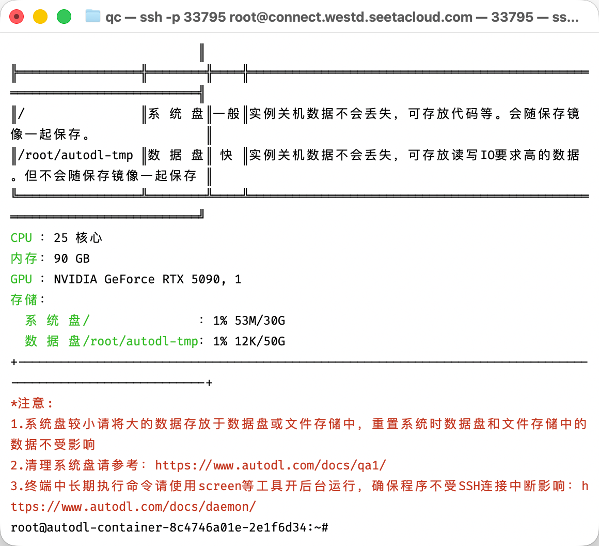
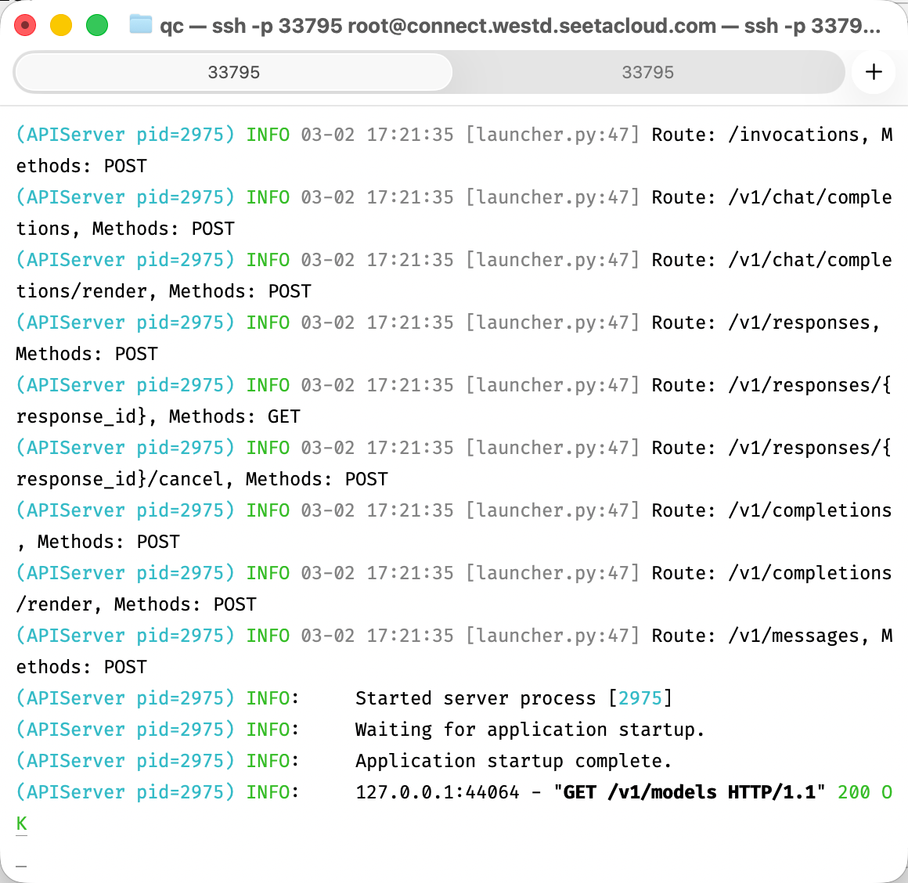
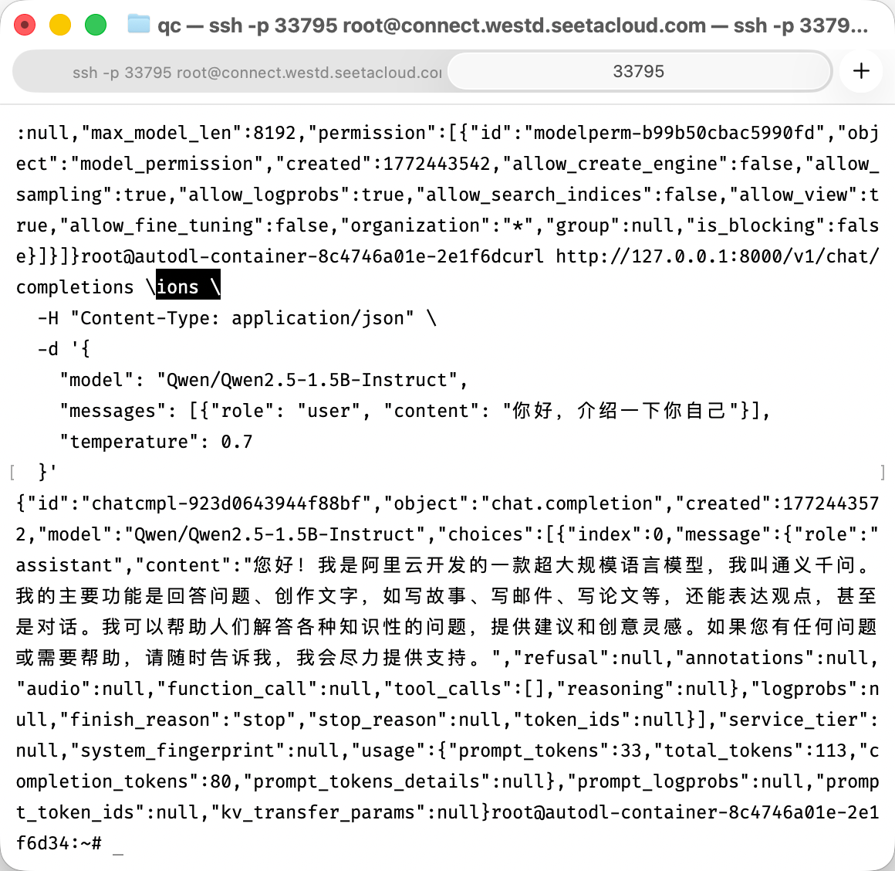

# 别玩了，AI这么屌，干脆本地部署个小龙虾，让它把所有机器上能干的活全干完吧，人机合体

之前用的是 Gemini 免费版和 Web UI用着属实不太舒服

**我们改为 Gork-4 + Telegram，随时随地让AI干活**

建议将自己整个人格画像全塞给AI进行匹配熟悉，这样既能用来聊天又能用来干活，赢麻了


能看的出来，它是真的想让我赶紧懂😤


## AI Infra

## AutoDL RTX 5090 首次完整成功部署 vLLM

**环境**：
- 镜像：~~PyTorch 2.8.0 + CUDA 12.8 + Python 3.12~~
- 镜像：~~社区镜像 deepseek-ai/DeepSeek-R1/DeepSeek-R1:v4.0~~

- GPU：RTX 5090 单卡



**关键环境变量**（~/.bashrc）：
```bash
export HF_ENDPOINT=https://hf-mirror.com
export HF_HUB_ENABLE_HF_TRANSFER=1
```

**安装命令**：
```bash
pip install hf_transfer -U
pip install vllm -U --extra-index-url https://download.pytorch.org/whl/cu128
```

**启动命令**：
```bash
vllm serve Qwen/Qwen2.5-1.5B-Instruct \
  --port 8000 \
  --tensor-parallel-size 1 \
  --gpu-memory-utilization 0.85 \
  --max-model-len 8192 \
  --enforce-eager
```



**验证**：
- curl /v1/models -> 返回模型列表
- curl /v1/chat/completions -> 正常中文回复



**清理k3s残留并安装Kind**

AutoDL容器环境没有systemd（这是根本原因），k3s每次都卡在这里，很难正常跑。

我们直接切换到 kind（Kubernetes in Docker） —— 这才是AutoDL上目前最稳、最推荐的本地K8s方案（轻量、GPU支持完美、KServe/vLLM都能完美跑）。

```bash
# 1. 彻底清理k3s残留
/usr/local/bin/k3s-uninstall.sh 2>/dev/null || true
pkill -f k3s || true
rm -rf /etc/rancher /var/lib/rancher /var/lib/kubelet ~/.kube

# 2. 安装最新kind
curl -Lo ./kind https://kind.sigs.k8s.io/dl/v0.27.0/kind-linux-amd64
chmod +x ./kind
sudo mv ./kind /usr/local/bin/kind

# 3. 创建带GPU支持的kind集群（单节点，适合你学习）
cat <<EOF | kind create cluster --name ai-infra --config=-
kind: Cluster
apiVersion: kind.x-k8s.io/v1alpha4
nodes:
- role: control-plane
  image: kindest/node:v1.32.0
  extraMounts:
  - hostPath: /dev
    containerPath: /dev
  - hostPath: /var/lib/nvidia
    containerPath: /var/lib/nvidia
  - hostPath: /usr/lib/x86_64-linux-gnu
    containerPath: /usr/lib/x86_64-linux-gnu
  - hostPath: /usr/local/nvidia
    containerPath: /usr/local/nvidia
EOF

# 4. 配置kubectl
mkdir -p ~/.kube
kind get kubeconfig --name ai-infra > ~/.kube/config
echo 'export KUBECONFIG=~/.kube/config' >> ~/.bashrc
source ~/.bashrc

# 5. 验证
kubectl get nodes
kubectl get pods -A
```

当前这个 PyTorch 基础镜像 是 Docker 容器环境，不适合跑完整 K8s 集群（没有 systemd、没有 Docker daemon、嵌套容器权限问题），所以之前 k3s、kind、Docker 才一直卡。

我们别再浪费时间折腾集群了。

重开！！！

```bash
cat > ~/KServe/vllm-inferenceservice.yaml << 'EOF'
apiVersion: serving.kserve.io/v1beta1
kind: InferenceService
metadata:
  name: qwen2-5-1-5b
  namespace: default
spec:
  predictor:
    model:
      modelFormat:
        name: vllm
      args:
        - --model=Qwen/Qwen2.5-1.5B-Instruct
        - --tensor-parallel-size=1
        - --gpu-memory-utilization=0.85
        - --max-model-len=8192
        - --enforce-eager
      resources:
        limits:
          nvidia.com/gpu: "1"
        requests:
          nvidia.com/gpu: "1"
EOF
```

## 重开一个环境

```bash
# 1. 安装 Docker（最兼容 AutoDL 的方式）
apt-get update && apt-get install -y docker.io

# 2. 启动 Docker daemon
service docker start || nohup dockerd > /var/log/dockerd.log 2>&1 &

# 3. 等待 Docker 启动
sleep 8

# 4. 验证 Docker
docker --version

# 5. 验证 GPU（关键！）
docker run --rm --gpus all nvidia/cuda:12.8.0-base-ubuntu22.04 nvidia-smi
```

验证 Docker

```bash
# 验证 Docker 版本
docker --version

# 验证 GPU 支持（最关键）
docker run --rm --gpus all nvidia/cuda:12.8.0-base-ubuntu22.04 nvidia-smi
```

很多基础镜像都不支持在里面跑 dockerd😅

我们直接跳过完整集群，进入最有价值的部分：

**就是一堆yaml文件。**