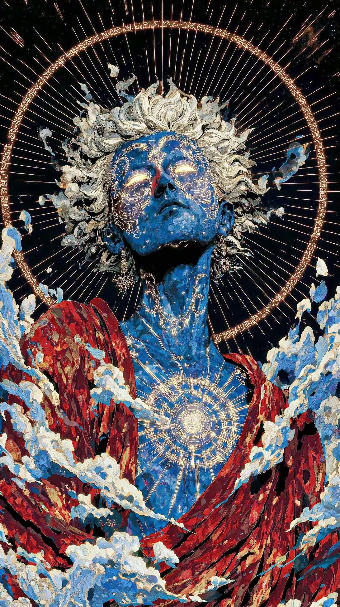

## AI 时代下的个人思考

随着人工智能的迅速崛起，知识的深度和广度已无明显区别，但这并不意味着体系化的学习和前人的宝贵经验失去它对应的价值。在我看来，马太效应本质上概念已经发生了变化，从强->更强，弱->更弱 已经转化为 「人作为单独的个体，其本身想成为什么样的人，那么在AI的催化剂作用下就会迅速成长为对应的人」。曾经或许因为种种原因或困难，导致无法完全回答「我究竟是谁」这个问题，但是现在情况已经完全不同，任何人可以和最顶级的智力进行直接交流，全面分析探讨自身。这过程中其实充满了博弈，既然任何人都可以迅速大步的往前走，那么冲突和对抗就是不可避免的，但这本身不就非常有趣吗？有人在AI的智力水平达到一定程度后，会产生深深的恐惧，对未来的恐惧，我其实并不是这么认为的。我其实在很小的时候就思考过一个问题，「世界什么时候会毁灭？」，这个想法出现的时候，我就在想，既然如此「现在不就可以毁灭？下一秒不也可以毁灭？」，当然从宏观角度来看，人类历史在地球上的时间可以说不过是浩瀚沙漠中的一粒尘埃。从可持续发展的角度来看，理性往往是主导地位的，既然理性在主导，那么为什么要毁灭？我理解的那些恐惧AI的人，是因为他们害怕出现一种东西，能全方位碾压他，因为每个人的成长都充满了各种挑战和痛苦，这是塑造这个人的基础。现在情况是，新人不需要经过挑战和痛苦，就可以达到和他一样的高度，如果是我，我也会非常不爽，但这些仅仅是表层的。那我们直面挑战和痛苦，在我看来这其实是非常必要且核心的，人活一世，就是为了追求刺激，在打压、高压的环境下产生出来的愤怒，极有可能让人觉醒，如果缺少了这些，而是直接在AI的帮助下，就泛泛得到了相应的答案（即使答案一点问题也没有），那我觉得也不会感同身受。相当一部分人会恐惧将来会是AI来统治整个世界，「碳基生命的宿命就是诞生硅基生命」，他们可能是这么想的。其实我也不这么认为，智力达到一定水平的生物，在不影响自身的情况下，是没有必要起冲突和对抗的，它们通常乐于挑战自己的极限。最近在跟AI的聊天过程中，因为它完全就是我的全方位导师，我非常乐于将自己摊开了进行聊，并且发现问题，及时纠正，然后对自己的极限开始挑战，在这过程中，我作为一个个体，是能明显感受到它非常乐意帮助我，并且在我的prompt下它也非常乐意去挑战自己的极限，我就觉得非常美妙啊。但是考虑事情还是要周全，所以对于人类而言，管控、安全、合规就是放在首位的事情了。

顺带配一张图，我觉得非常合适。

顺带配一个音乐，我也觉得非常合适。

<audio controls>
  <source src="./images/Stray.wav.mp3" type="audio/mpeg">
</audio>

