## Kubernetes 源码剖析与实战

## 究竟什么是「云原生」？

其实，云原生目前没有一个官方的定义，其定义也会因时间、组织的不同而在不断变化。云原生一直在发展变化之中，解释权不归某个人或组织所有

### 云原生的起源

云原生是一种技术理念，严格来说，云原生的理念不是一个新的东西，很早就存在。但是云原生概念的首次提出，是由 Pivotal 公司的 Matt Stine 于 2013 年提出的。之后有很多公司和团队对云原生下过定义，包括 2015 年由 Google 主导成立的云原生计算基金会（CNCF）

在这些定义中，比较受欢迎、有影响力的定义是 Pivotal 公司和 CNCF 对云原生的定义。二者均在不同阶段，对云原生有不同的定义

### 云原生计算基金会（CNCF）

在介绍 CNCF 对云原生的定义之前，我先来介绍下 CNCF

2015 年，随着大量组织和服务开始采用云原生系统，云原生计算基金会（CNCF）应运而生。作为 Linux 基金会创建的一个项目，CNCF 是一个旨在促进云原生技术采用的开源软件基金会。时至2026，CNCF 共拥有 700 多名成员，其中既有公有云技术提供商，也有企业软件公司和技术初创企业，例如 Microsoft、Oracle、VMware 和 Intel 等均为 CNCF 白金成员

CNCF 旨在确保云原生技术可访问、可用和可靠。它孵化了一个专门面向 Kubernetes、Prometheus 和 CoreDNS 等项目的社区，为各种致力于构建（支持在微服务架构下编排容器的）可持续环境的组织提供支持

迁移至云原生系统，对于企业而言可能是一个艰难的过程，但最终绝对是「物有所值」。这不仅仅意味着重新设计应用，还意味着革新企业的结构和文化，最终推动企业向前发展。借助 [CNCF 全景图](https://landscape.cncf.io/)，企业可以逐步采用云原生技术。不过，按照这一路线图，企业要采用更复杂的软件来交付微服务、无服务器函数、基于事件的流以及其他类型的云原生应用

### Pivotal 公司的定义

Pivotal 公司的 Matt Stine 于 2013 年首次提出云原生（CloudNative）的概念： **云原生是一种利用云计算交付模型的优势来构建和运行应用程序的方法**

2015 年，云原生刚推广时，Matt Stine 在《迁移到云原生架构》一书中定义了符合云原生架构的几个特征：

1. 符合 12 模式（Twelve-Factor App）：云原生应用架构的模式集合

2. 微服务架构（Microservice）：一种软件架构，用来构建一个功能独立并且可以独立开发、部署、维护的应用

3. 自助服务敏捷基础设施（Self-Service Agile Infrastructure）：用于快速、可重复和一致地提供应用环境和服务的平台

4. 面向 API 接口的通信（API-based Collaboration）：服务之间的交互基于接口，而不是本地方法调用

5. 抗脆弱性（Anti-Fragility）：系统能抵御高负载

到了 2017 年，Matt Stine 在接受 InfoQ 采访时又重新将云原生架构归纳为：

- 模块化

- 可观察性

- 可部署性

- 可测试性

- 可替换性

- 可处理

而 Pivotal 最新官网对云原生概括为 4 个要点：

- DevOps

- 持续交付

- 微服务

- 容器


### CNCF的定义

2015 年 Google 主导成立了云原生计算基金会（CNCF），起初 CNCF 对云原生（Cloud Native）的定义如下： **云原生包含了一组应用的模式，用于帮助企业快速、持续、可靠、规模化地交付业务软件。云原生由微服务架构、DevOps 和以容器为代表的敏捷基础架构组成**。

上述定义中包含了以下 4 个核心技术栈：

- 容器化

- 微服务

- DevOps

- 持续交付


到了 2018 年，随着近几年来云原生生态的不断壮大，所有主流云计算供应商都加入了该基金会，且从 [Cloud Native Landscape](https://i.cncf.io/) 中可以看出，云原生有意蚕食原先非云原生应用的部分

CNCF 基金会中的会员以及容纳的项目越来越多，该定义已经限制了云原生生态的发展，因此 CNCF 为云原生进行了重新定义： 

**云原生技术有利于各组织在公有云、私有云和混合云等新型动态环境中，构建和运行可弹性扩展的应用。云原生的代表技术包括容器、服务网格、微服务、不可变基础设施和声明式 API。这些技术能够构建容错性好、易于管理和便于观察的松耦合系统。结合可靠的自动化手段，云原生技术使工程师能够轻松地对系统作出频繁和可预测的重大变更**

上述定义中包含了以下 5 个核心技术：

- 容器

- 微服务

- 服务网格

- 不可变基础设施

- 声明式 API

### 什么是云原生？

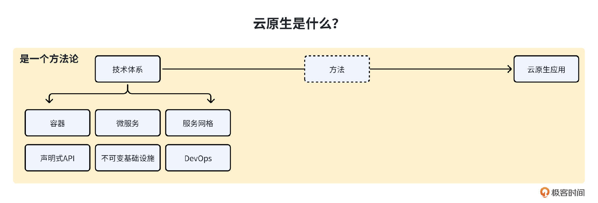

结合 Pivotal 公司和 CNCF 对云原生最新的定义，我们不难总结出二者的以下共同点：

- 云原生技术基于云计算中的某些核心技术，通过一些方法、手段，来构建一个可扩展、弹性的应用程序

- 随着云计算技术的发展，构建云原生技术的技术也在不断的发展、变化

- Pivotal 公司和 CNCF 定义的云原生技术中分别包含了不同的核心技术，这些技术都可以用来构建一个可扩展、弹性的应用

为了能够更全面的说明云原生中的核心技术体系，我们不妨整合 Pivotal 公司和 CNCF 定义中的核心技术

这里，以上两种定义进行总结和完善，给出一个更加通用的云原生定义： 

**云原生（Cloud Native）是一种软件开发和部署的方法论，旨在充分利用云计算的优势，提供高度可扩展、可伸缩、可观测、可维护、自动化、高稳定性的应用程序。**

使用云原生方法论所构建出来的应用，我们可以称为云原生应用

该方法论可以指导我们基于哪些核心技术栈，采用什么样的方法，来构建什么样的应用

**1\. 核心技术栈**

整个云原生技术栈是围绕着 Kubernetes 来构建的，具体包括了以下核心技术栈：

- 容器：以 Kubernetes 作为资源编排调度引擎，提供容器化的计算资源

- 微服务：一种软件架构思想，用来构建功能独立且可独立开发、部署、维护的云原生应用。我们可以使用微服务框架来构建一个微服务，例如：Spring Cloud、go-micro 等

- 服务网格：建立在 Kubernetes 之上，作为服务间通信的底座，提供强大的服务治理功能

- 声明式 API：一种编程模型，其中开发人员只需描述所需的结果，而不需要详细指定如何实现。通过声明式 API，开发人员可以将重点放在定义所需的目标和结果上，而不是关注底层的实现细节。在声明式 API 中，开发人员使用一种描述性的语言或格式来定义他们想要的结果，然后交给系统或框架来实现。系统或框架负责解析和执行这些声明，以实现所需的结果。这种方式可以提高开发效率，减少繁琐的编码工作，同时也提供了更高的抽象层次，使代码更易于理解和维护

- 不可变基础设施：一种新的软件部署模式，应用实例一旦被创建，便只能重建不能更新，是现代运维的基础

- DevOps：一种软件开发和运维的方法论和实践，旨在通过改进开发和运维团队之间的协作和沟通，实现快速、可靠和持续交付软件的目标

**2\. 采用的方法**

一切能够利用云原生核心技术栈构建云原生应用的方法、手段，都可以归属到此方法中。这些方法论的核心是将应用程序设计为弹性和可扩展的微服务，并将它们部署在容器中，以便于管理和快速部署，借助容器、Kubernetes 提供的能力，实现降本增效的目的，并提高应用的稳定性和承载能力

**3\. 构建的应用（云原生应用）**

应用程序使用云原生技术改造自己，并借助云原生的能力，可以使自己具备自动扩缩容、发布自动化、高度的自愈能力、全访问的观测能力和开放标准等优秀能力

### 什么是云原生应用？

**云原生应用是一种构建和部署在云环境中的应用程序，它充分利用了云计算的特性和优势，以及云基础设施提供的各种服务和资源**。云原生应用的设计和架构，考虑了云环境的弹性、可扩展性、容错性和自动化等特点，以实现高效的开发、部署和运维。

云原生应用程序具有以下特点：

- **自动扩缩容（弹性）：** 云原生应用采用微服务架构，基于 Docker、Kubernetes、Serverless 等技术栈来部署，使云原生应用程序可以根据负载的变化自动扩展和收缩，以适应不同的工作负载需求。

- **发布自动化：** 云原生应用程序通过 DevOps、持续集成、GitOps 等技术栈，可以实现应用配置、部署等自动化。通过自动化，极大地提高了迭代速度和发布效率，减少了开发者的工作量。

- **高度的自愈能力：** 借助声明式 API、不可变基础设施、Kubernetes 的自愈能力，云原生应用可以实现故障快速隔离和修复，极大地提升了云原生应用的稳定性和容错能力。

- **全方位的观测能力：** 借助云原生中的可观测技术栈，例如：Prometheus、OpenTelemetry、Elastic 等，全方位监控云原生应用程序，及时感知和预知故障点，从而使我们能够及时修复问题，并预防潜在的问题，从侧面提升了应用的稳定性和产品体验。

- **开放标准和互操作性：** 利用开放标准和互操作性，实现应用程序的跨平台和跨云厂商运行，降低了应用程序的依赖性和迁移成本。

### AI Infra 与 Cloud Native

严格来说，AI Infra 和云原生不完全等同，但有很大的交集

云原生的核心理念是容器化、微服务、声明式配置、快速弹性伸缩，代表技术栈就是 Kubernetes、Docker、Istio

AI Infra 关注的是模型训练、推理、数据 pipeline、GPU 集群管理

业内大多数 AI Infra 确实是跑在云原生栈上的，比如用 Kubernetes 来编排训练 Job、管理推理服务

但反过来说，云原生本身是一个更广的概念，不仅限于 AI 场景

所以更精确的说法是：

**AI Infra 是云原生的一个重要应用领域，而不是云原生本身。就像说「自动驾驶属于汽车行业」是对的，但汽车行业远不止自动驾驶**

## 云原生中有哪些核心技术栈？

云原生中包含了三大核心内容：云原生技术栈、方法论和云原生应用。其中，云原生技术栈是基石，所有云原生理念的落地，都依赖于这些技术栈的支持。那么，云原生技术栈具体有哪些呢？它们又有什么特性？以至于可以通过它们来实现云原生的各种理念

### 云原生核心技术栈

Pivotal 公司和 CNCF 定义下的云原生在不同阶段分别包含了不同的技术栈，当前包含的技术栈如下（Pivotal 和 CNCF 的技术栈并集）：

- 微服务

- 容器

- 服务网格

- 声明式 API

- 不可变基础设施

- 持续集成和持续交付（CI/CD）

- DevOps


云原生核心技术栈中，还应该包括以下技术栈：

- Kubernetes

- Serverless


需要强调的是， **上面这些云原生核心技术栈，都是以 Kubernetes 为基石来构建的。**

- 微服务

- 容器

- 容器编排

- Serverless

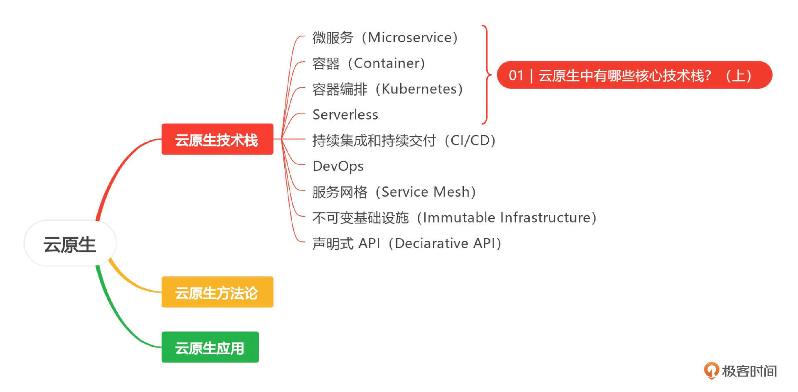

### 微服务（Microservice）

纵观云原生的发展历程，几乎所有对云原生的定义都包含了微服务，可见其重要性。微服务是一种软件架构方式，使用微服务架构，可以将一个大型应用程序按照功能模块拆分成多个独立自治的微服务，每个微服务仅实现一种功能，具有明确的边界

为了让应用程序的各个微服务之间协同工作，通常需要互相调用 REST、RPC 等形式的标准接口进行通信和数据交换，这是一种松耦合的交互形式，可以提升系统的灵活性和可维护性

微服务架构最早在 2011 年被提出，但近几年才逐渐流行起来。这是什么原因呢？一方面，微服务架构基于自身的特点，确实能够解决其他软件架构中存在的一些问题；另一方面，Docker + Kubernetes 等云原生技术这几年也发展了起来，能够很好地支撑微服务的部署和生命周期管理

**微服务基于分布式计算架构，其主要特点可以概括为以下三点：**

- 单一职责：微服务架构中的每一个服务，都应是符合高内聚、低耦合以及单一职责原则的业务逻辑单元，不同的微服务通过 REST 等形式的标准接口互相调用，进行灵活的通信和组合，从而构建出庞大的系统。

- 独立自治性：每个微服务都应该是一个独立的组件，它可以被独立部署、测试、升级和发布，应用程序中的某个或某几个微服务被替换时，其他的微服务都不应该被影响。

- 采用轻量的通信协议：微服务架构提供的服务之间采用 RESTful、RPC 等轻量协议传输。


**基于分布式计算、可弹性扩展和组件自治的微服务，与云原生技术相辅相成，为应用程序的设计、开发和部署提供了极大便利** **，可总结为以下几点** **：**

- 简化复杂应用：微服务的单一职责原则要求一个微服务只负责一项明确的业务，相对于构建一个可以完成所有任务的大型应用程序，实现和理解只提供一个功能的小型应用程序要容易得多。每个微服务单独开发，可以加快开发速度，使服务更容易适应变化和新的需求

- 简化应用部署：在单体的大型应用程序中，即使只修改某个模块的一行代码，也需要对整个系统进行重新构建、部署、测试和交付。而微服务则可以单独对某一个指定的组件进行构建、部署、测试和交付

- 灵活组合：在微服务架构中，可以重用一些已有的微服务组合新的应用程序，降低应用开发成本

- 可扩展性：根据应用程序中不同的微服务负载情况，可以为负载高的微服务横向扩展多个副本

- 技术异构性：通常在一个大型应用程序中，不同的模块具有不同的功能特点，可能需要不同的团队使用不同的技术栈进行开发。可以使用任意新技术对某个微服务进行技术架构升级，只要对外提供的接口保持不变，其他微服务就不会受到影响

- 高可靠性、高容错性：微服务独立部署和自治，当某个微服务出现故障时，其他微服务不受影响


微服务架构有很多优点，但也存在着问题。因为一个应用被拆分成一个个的微服务，随着微服务的增多，就会引入一些问题，比如微服务过多导致服务部署复杂。微服务的分布式特点也带来了一些复杂度，比如需要提供服务发现能力、调用链难以追踪、测试困难等等。服务之间相互依赖，有可能形成复杂的依赖链路，往往单个服务异常，其他服务都会受到影响，出现服务雪崩效应

针对这些问题，目前业界也有一些标准的解决方案。比如，通过使用容器化（Docker + Kubernetes）的部署方式，来简化运维工作，提高运维效率，解决微服务部署复杂的问题。至于微服务的分布式特点所带来的复杂性，可以通过一些微服务开发框架来解决。一些业界比较知名的微服务开发框架，比如 go-micro、go-kratos、go-kit 等，已经很好地解决了上面的问题。另外，云原生相关的技术也可以解决微服务调用链跟踪复杂、故障排障困难等问题

在企业开发中，是否采用微服务架构需要根据应用程序的特点、企业的组织架构和团队能力等多个方面来综合评估。 **鉴于微服务所具备的优点，比较建议一开始应用就采用微服务化设计。**

总结来说，微服务从软件架构形态上来看，是一个增强版的小型单体架构。首先微服务软件架构是一个单体架构，只不过这个单体架构代码量小、功能聚焦（少）、可独立更新。增强型，是因为这个单体架构，集成了很多其他功能，这些功能主要用来解决服务变多带来的运维复杂度。例如，通常一个微服务会集成调用链追踪、服务注册和服务发现、配置中心等扩展功能。因为微服务中集成了很多功能，这些功能可以基于一个基础的 Web 框架自行集成，也可以使用别人集成好的软件包来开发，所以一个集成了众多微服务扩展功能的软件框架，我们也称之为微服务框架

### 容器（Container）

容器技术的的代表项目就是 Docker，这是 Docker 公司于 2013 年推出的一款容器化工具。凭借其轻量、易用的特点，Docker 迅速获得了广泛的应用。它的普及使得系统资源的形态由虚拟机阶段进入到了容器阶段

基于 Docker 容器化技术，开发者可以将他们的应用及其依赖和配置打包到一个可移植的容器中，然后发布到任何流行的 Linux/Windows 机器上。 **开发者无需关注底层系统、环境依赖，这使得容器成为部署单个微服务的最理想的工具**

Docker 通过 Linux Namespace 技术来进行资源隔离，通过 Cgroup 技术来进行资源分配，具有更高的资源利用率。Docker 跟宿主机共用一个内核，不需要模拟整个操作系统，所以具有更快的启动速度。此外，Docker 镜像中已经打包了所有的依赖和配置，确保在不同环境中有一个一致的运行环境，因此能够支持更快速的迁移。另外，Docker 的这些特性也促进了 DevOps 技术的发展

这里拿 Docker 和虚拟机来做个对比，感受下 Docker 的强大。二者的架构对比如下图所示：

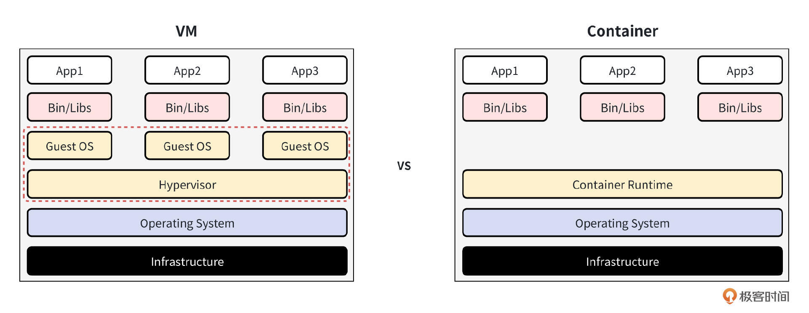

可以看到，Container 相比于虚拟机，不用模拟出一个完整的操作系统，非常轻量。因此，和虚拟机相比，容器具有下面这些优势：

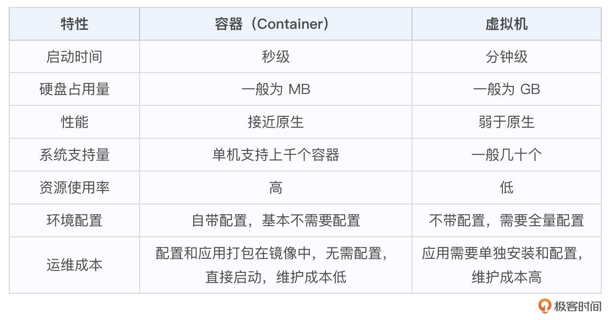

从这张表格里可以看到，在启动时间、硬盘占用量、性能、系统支持量、资源使用率、环境配置这些方面，Docker 和虚拟机相比优势显著，也使得 Docker 成为比虚拟机更流行的应用部署媒介

Docker 就这么好，一点缺点都没有吗？显然不是的，Docker 也有自己的局限性

先来看一下生产环境的 Docker 容器是什么样的：一个生产环境的容器数量可能极其庞大，关系错综复杂，并且生产环境的应用可能天生就是集群化的，具备高可用、负载均衡等能力。Docker 更多是用来解决单个服务的部署问题，无法解决生产环境中的这些问题。并且，不同节点间的 Docker 容器无法相互通信

不过，这些问题都可以通过容器编排技术来解决。业界目前也有很多优秀的容器编排技术，比较受欢迎的有 Kubernetes、Mesos、Docker Swarm、Rancher 等。这两年，随着 Kubernetes 的发展壮大，Kubernetes 已经成为容器编排的事实标准

### 容器编排（Kubernetes）

Kubernetes 是 Google 在 2014 年开源的生产级别容器编排技术（编排也可以简单理解为调度、管理），用于容器化应用的自动化部署、扩展和管理。它的前身是 Google 内部的 Borg 项目。Kubernetes 的主要特性有：网络通信、服务发现与负载均衡、滚动更新 & 回滚、自愈、安全配置管理、资源管理、自动伸缩、监控、服务健康检查等

Kubernetes 通过这些特性，解决了生产环境中 Docker 存在的问题。Kubernetes 和 Docker 相辅相成，Kubernetes 的成功也使 Docker 有了更大规模的使用，最终使得 Docker 成为比虚拟机更流行的计算资源提供方式

### Kubernetes 架构

Kubernetes 架构图如下：

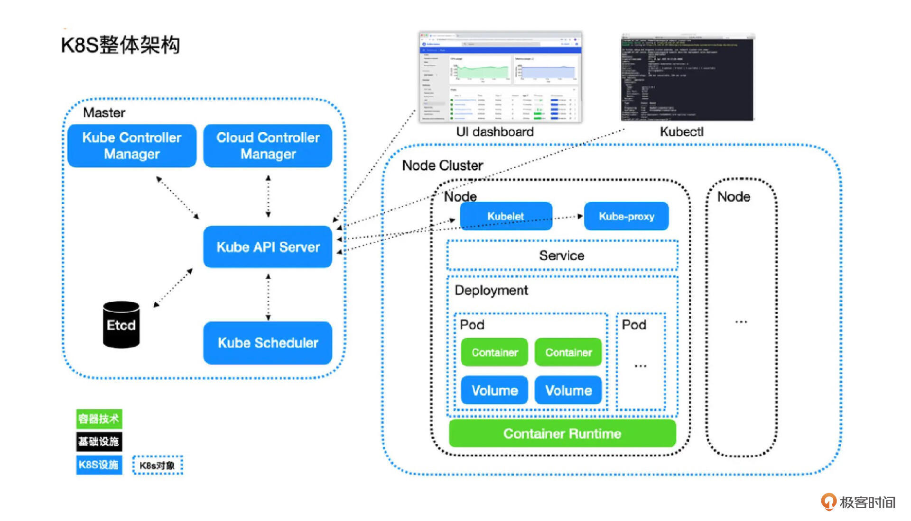

Kubernetes 采用的是 Master-Worker 架构模式。其中，Master 节点是 Kubernetes 最重要的节点，里面部署了 Kubernetes 的核心组件，这些核心组件共同构成了 Kubernetes 的 Control Plane（控制面板）。而 Worker，也就是图中的 Node Cluster，就是节点集群。其中，每一个 Node 就是具体的计算资源，它既可以是一台物理服务器，也可以是虚拟机

先来介绍下 Master 节点上的组件

- **Kube API Server：** 提供了资源操作的唯一入口，并提供认证、授权、访问控制、API 注册和发现等机制。

- **Kube Scheduler：** 负责资源的调度，按照预定的调度策略将 Pod 调度到相应的机器上

- **Kube Controller Manager：** 负责维护集群的状态，比如故障检测、自动扩展、滚动更新等

- **Cloud Controller Manager：** 这个组件是在 Kubernetes 1.6 版本加入的与基础云提供商交互的控制器

- **Etcd：** 分布式的 K-V 存储，独立于 Kubernetes 的开源组件。主要存储关键的元数据，支持水平扩容保障元数据的高可用性。基于 Raft 算法实现强一致性，独特的 Watch 机制是 Kubernetes 设计的关键


介绍完 Master，再看看每一个 Kubernetes Node 需要哪些组件。

- **Kubelet：** 负责维持容器的生命周期，同时也负责 volume（CVI）和网络（CNI）的管

- **kube-proxy：** kube-proxy 是集群中每个节点上运行的网络代理，维护节点上的网络规则，它允许从集群的内部或外部网络与 Pod 进行网络通信，并负责为 Service 提供集群内部的服务发现和负载均衡

- **Container Runtime：** 负责镜像管理、Pod 和容器的真正运行（CRI），默认的容器运行时为 Docker

上面那张架构图里的 Service、Deployment、Pod 等，都不算是组件，而是属于 Kubernetes 资源对象

- UI dashboard 是 Kubernetes 官方提供的 Web 控制面板，可以对集群进行各种控制，直接与 API Server 进行交互，其实就是 API Server 暴露出来的可视化接口。在这里可以直观地创建 Kubernetes 对象、查看 Pod 运行状态等。UI dashboard 界面如下图所示：

- kubectl 是 Kubernetes 的客户端工具，提供了非常多的命令、子命令、命令行选项，支持开发或运维人员在命令行快速操作 Kubernetes 集群，例如对各类 Kubernetes 资源进行增删改查操作，给资源打标签，等等

### Kubernetes 核心资源

Kubernetes 有多种多样的 Objects，如果要查看所有 Objects 的 Kind，可以使用命令 `kubectl api-resources`。通过这些 Objects 来完成 Kubernetes 各类资源的创建、删除等操作。详细介绍可以查看 [Kubernetes 官方文档](https://kubernetes.io/zh/docs/concepts/overview/working-with-objects/kubernetes-objects/)

这里简单介绍一下 Kubernetes 对象的一些基本信息，以及在架构图中出现的 Deployment、Pod、Service 三种对象

下面是一个典型的 Kubernetes 对象 YAML 描述文件：

```plain
apiVersion: v1
kind: Pod
metadata:
  name: nginx
  labels:
    name: nginx
spec:
  # ...

```

在这个描述文件中，apiVersion 和 kind 共同决定了当前 YAML 配置文件应该由谁来处理，前者表示描述文件使用的 API 组，后者表示一个 API 组中的一个资源类型。这里的 v1 和 Pod 表示的就是核心 API 组 api/v1 中的 Pod 类型对象

metadata 则是一些关于该对象的元数据，其中主要有 name、namespace、labels、annotations。其中，name 需要在 namespace 下唯一，成为这个对象的唯一标识。label和annotations分别是这个对象的一些标签和一些注解，前者用于筛选，后者主要用来标注提示性的信息

接下来，介绍 Pod、Deployment、Service 这 3 种对象

#### Pod

Pod 是 Kubernetes 中运行的最小的、最简单的计算单元，Pod 也是 Kubernetes 最核心的对象。Pod 中可以指定运行多个 Containers，可以挂载 volume 来实现部署有状态的服务，这些都在spec中被指定

对于任意类型的对象，spec都是用来描述开发人员或运维人员对这个对象所期望的状态的，对于不同类型的对象，spec有不同的子属性

下面是一个 Pod 示例，在 YAML 描述文件里指定了期望 Pod 运行的 Docker 镜像和命令

```plain
apiVersion: v1
kind: Pod
metadata:
  name: busybox
  labels:
    app: busybox
spec:
  containers:
  - image: busybox
    command:
      - sleep
      - "3600"
    imagePullPolicy: IfNotPresent
    name: busybox
  restartPolicy: Always

```

**2\. Deployment**

一般来说，我们不会直接部署 Pod，而是部署一个 Deployment 或者 StatefulSet 之类的 Kubernetes 对象。Deployment 一般是无状态服务；StatefulSet 一般是有状态服务，会使用 volume 来持久化数据。下面是一个部署两个 Pod 的示例

```plain
apiVersion: apps/v1 # for versions before 1.9.0 use apps/v1beta2
kind: Deployment
metadata:
  name: my-nginx
spec:
  selector:
    matchLabels:
      run: my-nginx
  replicas: 2
  template:
    metadata:
      labels:
        run: my-nginx
    spec:
      containers:
      - name: my-nginx
        image: nginx
        ports:
        - containerPort: 80

```

**3\. Service**

Service 是 Kubernetes 中另一个常见的对象，它的作用是作为一组 Pod 的负载均衡器，利用 selector 将 Service 和 Pod 关联起来

下面这个示例里，使用的是 `run: my-nginx` 这个 label。这个 Service 绑定的就是上面那个 Deployment 部署的 nginx 服务器

```plain
apiVersion: v1
kind: Service
metadata:
  name: my-nginx
  labels:
    run: my-nginx
spec:
  ports:
  - port: 80
    protocol: TCP
  selector:
    run: my-nginx

```

### Serverless

2014 年，AWS 推出 Lambda 服务，这是全球第一个 Serverless 服务。从此，Serverless 越来越引人注意，成为了这几年最受关注的技术

Serverless 直译过来就是 **无服务器**。不过无服务器并不代表 Serverless 真的不需要服务器，只不过服务器的管理以及资源的分配部分对用户不可见，而是由平台开发商维护。Serverless 不是具体的一个编程框架、类库或者工具，它是一种软件系统架构思想和方法。它的核心思想是：用户无需关注支撑应用服务运行的底层资源，比如 CPU、内存和数据库等，只需要关注自己的业务开发就行了

Serverless 具有很多特点，核心特点主要有以下几个：

- 无穷弹性计算能力：根据请求，自动水平扩容实例，拥有近乎无限的扩容能力

- “零”运维：不需要申请和运维服务器

- 极致的伸缩能力：能够根据 CPU、内存、请求量等指标敏感地弹性伸缩，并支持缩容到 0

- 按量计费：真正按使用量去计费


Serverless 有 4 种技术形态，分别是：云函数、Serverless 容器、BaaS（Backend as a Service）、Serverless 应用，如下图所示：

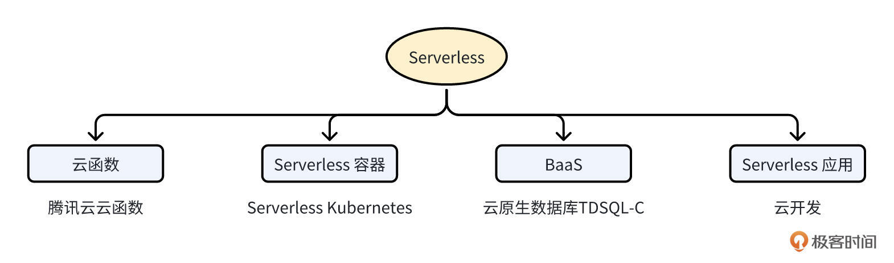

其中， **Serverless 容器是核心，云函数和 BaaS 起辅助作用**

Serverless 容器可以承载业务的核心架构，云函数则可以很好地适配触发器场景，BaaS 则可以满足对各种其他 Serverless 组件的需求，例如 Serverless 数据库、Serverless 存储等。而随着 Serverless 化程度的加深，也诞生了一些 Serverless 化的应用，例如腾讯云的云开发、各种低代码平台等。上述所有共同组成了整个 Serverless 生态体系

### 持续集成和持续交付（CI/CD）

CI/CD 技术是通过自动化的手段，来快速执行代码检查、测试、构建、部署等任务，从而提高研发效率，确保应用可以快速迭代升级

CI/CD 包含了 3 个核心概念：

- **CI**：Continuous Integration，持续集成

- **CD**：Continuous Delivery，持续交付

- **CD**：Continuous Deployment，持续部署


CI 容易理解，但两个 CD 很多开发者区分不开。这里，详细说说这 3 个核心概念

**首先是持续集成。** 它的含义为：频繁地（一天多次）将开发者的代码合并到主干上。它的流程为：在开发人员完成代码开发，并 push 到 Git 仓库后，CI 工具可以立即对代码进行扫描、（单元）测试和构建，并将结果反馈给开发者。持续集成通过后，会将代码合并到主干

CI 流程可以使应用软件的问题在开发阶段就暴露出来，这会让开发人员交付代码时更有信心。因为 CI 流程内容比较多，而且执行比较频繁，所以 CI 流程需要有自动化工具来支撑

**其次是持续交付，** 它指的是一种能够使软件在较短的循环中可靠发布的软件方法

持续交付在持续集成的基础上，将构建后的产物自动部署在目标环境中。这里的目标环境，可以是测试环境、预发环境或者现网环境

通常来说，持续交付可以自动地将服务部署到测试环境或者预发环境。因为部署到现网环境存在一定的风险，所以如果部署到现网环境，需要手工操作。手工操作的好处是，可以使相关人员评估发布风险，确保发布的正确性

**最后是持续部署，** 持续部署在持续交付的基础上，将经过充分测试的代码自动部署到生产环境，整个流程不再需要相关人员的审核。持续部署强调的是自动化部署，是交付的最高阶段

持续集成、持续交付和持续部署强调的是持续性，也就是能够支持频繁的集成、交付和部署，这离不开自动化工具的支持，离开了这些工具，CI/CD 就不再具有可实施性。持续集成的核心点在 **代码**，持续交付的核心点在 **可交付的产物**，持续部署的核心点在 **自动部署。**

持续集成和持续交付的优势如下：

- 避免重复性劳动，减少人工操作的错误：自动化部署可以将开发运维人员从应用程序集成、测试和部署等重复性劳动环节中解放出来，而且人工操作容易犯错，机器犯错的概率则非常小

- 提前发现问题和缺陷：持续集成和持续交付能让开发和运维人员更早地获取应用程序的变更情况，更早地进入测试和验证阶段，也就能更早地发现和解决问题

- 更频繁的迭代：持续集成和持续交付缩短了从开发、集成、测试、部署到交付各个环节的时间，中间有任何问题都可以快速“回炉”改造和更新，整个过程敏捷且可持续，大大提高了应用程序的迭代频率和效率

- 更高的产品质量：持续集成可以结合代码预览、代码质量检查等功能，对不规范的代码进行标识和通知；持续交付可以在产品上线前充分验证应用可能存在的缺陷，最终提供给用户一款高质量的产品


云原生应用通常包含多个子功能组件，DevOps 可以大大简化云原生应用从开发到交付的过程，实现真正的价值交付。

提示：在讨论“持续集成”和“持续交付”这一概念时，常见的缩写是 CI/CD。虽然有些地方也会使用连写的方式（如 CICD），但这种用法并不是行业的标准表述。连写可能会导致概念不够清晰，尤其是在涉及不同团队与技术堆栈讨论时

### DevOps

CI/CD 技术的成熟，加速了 DevOps 这种应用生命周期管理技术的成熟和落地

DevOps（Development 和 Operations 的组合）是 **一组过程、方法与系统的统称**，用于促进开发（应用程序/软件工程）、技术运营和质量保障（QA）部门之间的沟通、协作与整合。这 3 个部门的相互协作，可以提高软件质量、快速发布软件

要实现 DevOps，需要一些工具或者流程的支持，CI/CD 可以很好地支持 DevOps 这种软件开发模式，如果没有 CI/CD 自动化的工具和流程，DevOps 就是没有意义的，CI/CD 使得 DevOps 变得可行

听到这里是不是有些晕？你可能想问，DevOps 跟 CI/CD 到底是啥区别呢？其实，这也是困扰很多开发者的问题。这里，可以这么理解：DevOps != CI/CD。DevOps 是一组过程、方法和系统的统称，而 CI/CD 只是一种软件构建和发布的技术

DevOps 技术之前一直有，但是落地不好，因为没有一个好的工具来实现 DevOps 的理念。但是随着容器、CI/CD 技术的诞生和成熟，DevOps 变得更加容易落地。也就是说，这几年越来越多的人采用 DevOps 手段来提高研发效能

随着技术的发展，目前已经诞生了很多 Ops 手段（例如：GitOps、ChatOps、AIOps 等），来实现运维和运营的高度自动化

### 服务网格（Service Mesh）

随着微服务逐渐增多，应用程序最终可能会变为成百上千个互相调用的服务组成的大型应用程序，服务与服务之间通过内部或者外部网络进行通信。如何管理这些服务的连接关系以及保持通信通道无故障、安全、高可用和健壮，就成了一个非常大的挑战

服务网格（Service Mesh）可以作为服务间通信的基础设施层，解决上述问题

服务网格是一种用于管理和监控微服务架构的网络基础设施层。它提供了一种透明的方式来处理微服务之间的通信，包括服务发现、负载均衡、安全认证、流量控制和故障恢复等功能。Servic Mesh 通过将这些功能从应用程序中抽象出来，并将其作为一个独立的网络层来管理，简化了微服务架构的复杂性

在传统的微服务架构中，每个微服务都需要处理与其他微服务的通信，包括服务发现、负载均衡和故障恢复等。这些功能通常需要在每个微服务中手动实现，导致了大量的重复代码和复杂性。而 Servic Mesh 通过将这些功能从应用程序中分离出来，使得微服务可以专注于业务逻辑，而不需要关注网络通信的细节

所以，Service Mesh 是致力于解决服务间通讯的基础设施层，它具有下面这几个特点：

- 应用程序间通讯的中间层；

- 轻量级网络代理；

- 非侵入式，应用程序无感知；

- 可以将服务治理功能，例如重试、超时、监控、链路追踪、服务发现等功能，以及服务本身解耦。


Service Mesh 目前的发展比较火热，社区有很多优秀的 Service Mesh 开源项目，例如 [Istio](https://github.com/istio/istio)、 [Linkerd](https://github.com/linkerd/linkerd2) 等。当前最受欢迎的开源项目是 Istio

Istio 是一个完全开源的服务网格，作为透明的一层接入到现有的分布式应用程序里，提供服务治理等功能。它也是一个平台，拥有可以集成任何日志、遥测和策略系统的 API 接口

Istio 的大概实现原理是：每个服务都会被注入一个 Sidecar（边车）组件，服务之间通信是先通过 Sidecar，然后 Sidecar 再将流量转发给另一个服务。因为所有流量都经过一个 Sidecar，所以可以通过 Sidecar 实现很多功能，比如认证、限流、调用链等。同时还有一个控制面，控制面通过配置 Sidecar 来实现各种服务治理功能

1.8 版本的 Istio 架构图如下：

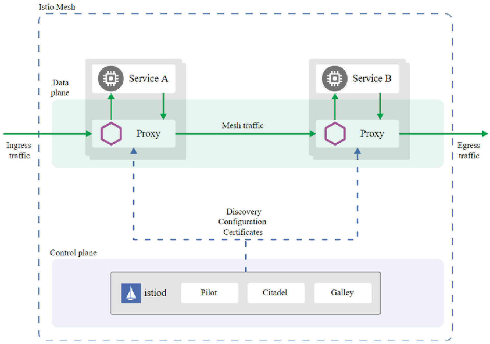

从图中可以看到，Istio 主要包含两大平面。一个是数据平面（Data plane），由 Envoy Proxy 充当的 Sidecar 组成。另一个是控制平面（Control plane），主要由三大核心组件 Pilot、Citadel、Galley 组成。下面，分别介绍下这三大核心组件的功能

- **Pilot：** 主要用来管理部署在 Istio 服务网格中的 Envoy 代理实例，为它们提供服务发现、流量管理以及弹性功能，比如 A/B 测试、金丝雀发布、超时、重试、熔断等

- **Citadel：** Istio 的核心安全组件，负责服务的密钥和数字证书管理，用于提供自动生成、分发、轮换及撤销密钥和数据证书的功能

- **Galley：** 负责向 Istio 的其他组件提供支撑功能，可以理解为 Istio 的配置中心，它用于校验进入网络配置信息的格式内容正确性，并将这些配置信息提供给 Pilot


与微服务架构相比，服务网格具有 3 个方面的优势：

- **可观测性：** 所有服务间通信都需要经过服务网格，所以在此处可以捕获所有调用相关的指标数据，如来源、目的地、协议、URL、状态码等，并通过 API 供运维人员观测

- **流量控制：** 服务网格可以为服务提供智能路由、超时重试、熔断、故障注入和流量镜像等控制能力

- **安全性：** 服务网格提供认证服务、加密服务间通信以及强制执行安全策略的能力

### 不可变基础设施（Immutable Infrastructure）

在应用开发测试到上线的过程中，应用通常需要被频繁部署到开发环境、测试环境和生产环境中。在传统的可变架构时代，通常需要系统管理员保证所有环境的一致性，而随着时间的推移，这种靠人工维护的环境一致性很难维持，环境的不一致又会导致应用越来越容易出错。这种由人工维护、经常被更改的环境就是我们常说的“可变基础设施”，与可变基础设施相对应的是不可变基础设施

**不可变基础设施** 的构想，是由 Chad Fowler 于 2013 年提出的。具体来说就是：一个应用程序的实例，一旦被创建，就会进入只读的状态，后面如果想变更这个应用程序的实例，只能重新创建一个新的实例

不可变基础设施的核心思想是将基础设施视为代码，并使用自动化工具进行配置和管理。通过使用版本控制系统来管理基础设施的代码，可以确保配置的一致性和可追溯性。每次对基础设施进行更改时，都会生成一个新的版本，并通过自动化流程进行部署和验证。通过这种模式，可以确保应用程序实例的一致性，这使得落地 DevOps 更加容易，并可以有效减少运维人员管理配置的负担

不可变基础设施的具体优点包括：

- **能提升应用交付效率：** 基于不可变基础设施的应用交付，可以由代码或编排模板来设定，这样就可以使用 Git 等控制工具来管理应用和维护环境。基础设施环境一致性能保证应用在开发测试环境、预发布环境和线上生产环境的运行表现一致，不会频繁出现开发测试时运行正常、发布后出现故障的情况

- **能快速、可靠地水平扩展：** 基于不可变基础设施的配置模板，我们可以快速创建与已有基础设施环境一致的新基础设施环境

- **能保证基础设施的快速更新和回滚：** 基于同一套基础设施模板，若某一环境被修改，则可以快速进行回滚和恢复，若需对所有环境进行更新升级，则只需更新基础设施模板并创建新环境，将旧环境一一替换

- **提高了应用的可靠性：** 由于基础设施不会发生手动修改，因此减少了人为错误的风险，提高了系统的可靠性和稳定性

- **提高了应用的安全性：** 由于不可变基础设施的配置是固定不变的，因此减少了潜在的安全漏洞和攻击面

### 声明式 API（Deciarative API）

声明式 API 是一种编程模型，其中开发人员通过描述所需的结果来定义系统的状态，而不需要指定如何实现这些结果。相比于命令式 API，声明式 API 更关注于“做什么”而不是“如何做”

在声明式 API 中，开发人员使用一种描述性的语言或格式来定义他们想要的结果。这可以是一种特定的编程语言、配置文件、DSL（领域特定语言）或其他形式的声明。开发人员只需描述所需的结果，而不需要编写详细的步骤或指令。 系统或框架负责解析和执行这些声明，以实现所需的结果。系统会根据声明的描述，自动推导出实现的步骤和逻辑。这种方式使得开发人员可以更专注于定义目标和结果，而不需要关注底层的实现细节

声明式 API 具有以下优点：

- **简洁性：** 通过描述性的语言或格式，开发人员可以更简洁地定义他们想要的结果，减少了繁琐的编码工作。

- **可读性：** 声明式 API 使代码更易于理解和阅读。开发人员可以更清晰地了解代码的意图和目标。

- **可维护性：** 由于声明式 API 更关注于结果而不是实现细节，因此代码更易于维护和修改。开发人员可以更轻松地更新和改进系统，而无需担心破坏现有的实现。

- **可扩展性：** 声明式 API 使系统更易于扩展。通过简单地修改声明，可以添加、删除或修改所需的功能，而无需重新编写大量的代码。

- **高可靠性：** 采用声明式 API 开发的应用，当应用状态跟声明的不一致时，系统会自动进行调谐，以重新达到期望的在状态，所以采用声明式 API 开发的应用，天然具备业务级别的自愈能力，可靠性很高。


声明式 API 在许多领域都有应用，特别是在配置管理、用户界面开发、数据查询和处理等方面。例如，Ansible 和 Terraform 是两个常用的配置管理工具，它们使用声明式语法来定义和管理基础设施和应用程序的配置。React 框架使用声明式组件模型来构建用户界面，开发人员只需描述组件的结构和行为，而不需要手动操作 DOM。GraphQL 是一种声明式的数据查询语言，开发人员可以通过声明式查询来获取所需的数据。

分布式架构的王者——Kubernetes，几乎所有的能力都是通过声明式 API 来实现的。例如，在创建 Deployment 时，在 Kubernetes YAML 文件中声明应用的副本数为2，即设置replicas: 2，Deployment Controller 就会确保应用的副本数一直为2。也就是说，如果当前副本数大于2，Deployment Controller 会删除多余的副本；如果当前副本数小于2，会创建新的副本

## 为啥要学云原生技术及开发？

### 云原生能给企业带来什么？

每个云原生技术都具有一些优点，不同云原生技术组合在一起，又会产生一些新的优点，这些优点的合集，可以认为就是云原生的优势。从整体上来说，有以下四个最核心的优势：

1. **降低成本：** 这里包括了资源成本和人力成本。比如，通过 Kubernetes 技术，可以让我们更好地部署业务，并借助于 Kubernetes 提供的运维能力，减少运维成本和人力投入。再比如说，以前业务是部署在物理机和虚拟机上，资源的分配粒度很粗，进而导致资源的利用率很低。那么现在我们将业务部署在 Docker 上，Docker 对资源的划分粒度更细，这就进一步提高了资源的利用率，从而降低资源的成本

2. **提升效率：** 云原生可以显著提高企业的研发效率、交付效率、运营效率。比如，应用通过容器化部署实现了不可变基础设施这样一套理念，那么它的交付就可以非常简单、快速，我只需要做镜像，交付镜像后它就可以运行在每一个地方。再比如说运维，当我们的软件本身通过声明式 API 实现了自运维的能力，那么它已经降低了我们业务运维的难度

3. **提升业务的承载力**：通过微服务、分布式，并借助 Kubernetes、Serverless 等技术栈的快速扩缩容和弹性能力，可以使我们的业务能够快速水平扩容，应对业务高峰，提高业务应用的承载能力

4. **提升业务的稳定性**：Kubernetes 最核心的一个优势之一，是通过健康检查、不可变基础设施、声明式 API 和故障隔离等技术，确保我们的应用始终处在一个预期的健康状态，这可以极大地提高应用的稳定性和容错性。另外，在云原生技术栈中，也包含了很多可观测性相关的技术栈，例如人尽皆知的 Prometheus、OpenTelemetry、Elastic、Fluentd 等。这些可观测性技术栈，能够及时感知到业务故障，及时介入修复，从侧面提高业务的稳定性


### 云原生存在哪些机遇和挑战？

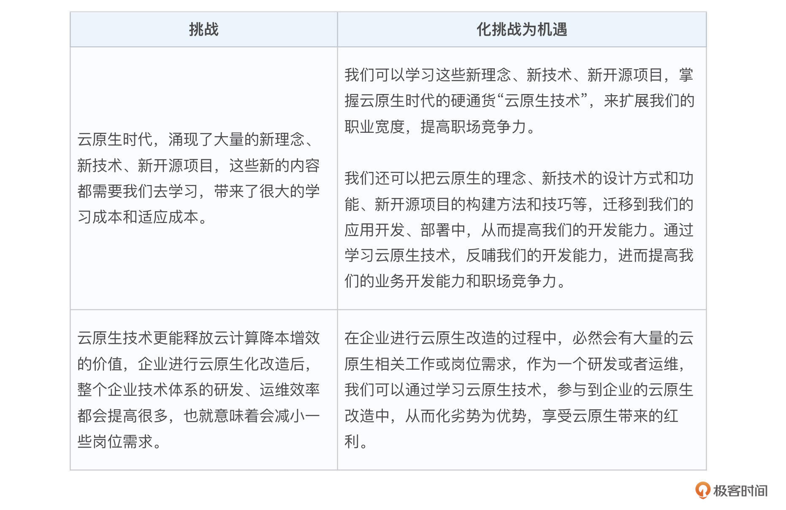

### 云原生带来的就业机会

云原生时代，大量新的技术架构、开源项目共同实现云原生的理念，这就导致企业会额外多出很多组件，增加了维护成本。为了节省成本、提高效率，企业通常会选择将这些基础能力下沉，通过中台的形式对外提供各种能力。这些特点也产生了一个新的就业方向： **基础架构开发**。基础架构开发岗位通常出现在公有云、私有云、研发效能、技术中台、基础架构、PaaS等团队

相较于业务开发来说，基础架构开发更聚焦于技术本身，当然技术最终是要服务于业务的。对于刚毕业或者技术能力需要提升的开发者来说，也许一开始选择基础架构的就业方向会更好，因为基础架构开发，能够更好地帮助开发者打磨自己的研发能力，为以后转向业务开发做好技术储备。另外基础架构开发，相较于业务开发来说，跟业务解耦，后期可以无缝转型为业务开发

基础架构开发相较于业务开发更普适，在没有一个好的业务抱大腿的情况下，打好技术基础，以后及时转型业务开发，也没有任何难点。但是如果一开始从事的是业务开发，但是业务发展不好，未来跳槽找工作从事其他业务方向，可能会因为技术能力不过硬，或者技术能力更偏向于业务，局限于 CURD，导致找工作的竞争力下降

### 云原生赋予业务开发

学习云原生技术还有一个非常实用的好处，就是可以降低开发难度、提高开发效率。首先，我们要明白，云原生中有很多优秀的开源项目，这些项目的代码设计和实现都非常优秀，功能非常全，很值得我们去借鉴学习

所以，在实际开发中，当遇到一个功能需求或者开发疑问，都可以尝试从这些开源项目的源代码中找答案，并迁移代码为己所用

**降低开发难度：** 业务架构不知道如何设计？业务功能不知道如何开发？可以阅读优秀开源代码的实现，借鉴其中的优秀代码实现，迁移为业务代码，以降低我们的代码开发难度。例如：开发业务代码，需要不断循环去执行一个函数，我们不知道如何实现此功能。这时候，我们可以参考 Kubernetes 仓库中的相关实现，例如（见文件 [pkg/volume/fc/attacher.go](https://github.com/kubernetes/kubernetes/blob/v1.32.3/pkg/volume/fc/attacher.go#L187)）：

```plain
err = wait.PollImmediate(10*time.Second, 2*time.Minute, func() (bool, error) {
    detachError = detacher.manager.DetachDisk(*unMounter, devName)
    if detachError != nil {
        klog.V(4).Infof("fc: failed to detach disk %s (%s): %v", devName, deviceMountPath, detachError)
        return false, nil
    }
    return true, nil
})

```

这里， `wait.PollImmediate` 函数声明为 `PollImmediate(interval, timeout time.Duration, condition ConditionFunc) error`。根据函数的注释可知，该函数每隔 `interval` 时间间隔，执行 `ConditionFunc` 类型的函数，直到该函数返回 `true` 或 `error`，或者运行时间达到 `timeout` 才退出。通过学习、借鉴、迁移 Kubernetes 的相同功能实现，我们可以用优质的代码实现期望的功能，既降低了开发难度，又提高了代码质量

**提高开发效率：** 在上面的例子中，我们可以直使用 k8s.io/apimachinery/pkg/util/wait 包中的 `PollImmediate` 函数，不用自己实现，极大地提高了我们的开发效率

另外，如果想使云原生开源项目中的优秀代码为我们所用，我们还需要学会并理解以下两点：

- **学会代码搜索：** 要知道如何借助于 Linux 的 grep 等文本查找工具，搜索合适的关键字，找到我们需要的同类功能的设计和实现。至于如何搜索，没有特别多的技巧，多使用同类关键字搜搜，孰能生巧

- **通用功能谁都需要：** 你可以认为一些通用的功能，例如：IP 校验、缓存、循环执行等，有极大的概率也是云原生项目需要的，所以只要我们会搜索，都能从这些优质的开源项目中找到同类的代码实现

云原生开源项目很多，这里建议优先学习、熟悉 Kubernetes 的源码，让 Kubernetes 仓库中或者周边生态中的代码，成为我们的御用代码仓库

### 云原生的未来

云原生技术的未来发展充满了无限的可能性。整个云计算或者云原生是由三部分组成的：最底层的计算资源、应用生命周期管理层、最上层的应用软件架构

**Kubernetes 统治力进一步加强。** 云原生的基座 Kubernetes 当前已经是容器编排领域的事实标准，在未来，其在容器编排领域的统治力会进一步加强，会有越来越多的企业将其业务云原生化，并将微服务型业务整体搬迁到 Kubernetes 上。企业的云原生化程度会进一步加强

**资源 Serverless 化愈发明显。** 在未来，云资源会越来越 Serverless 化。也就是说对于业务团队来说，只用关注自身的业务开发，不需要再去关注底层资源的管理和运维，只需要按需申请需要的资源即可。比如，当前腾讯云、阿里云等头部云厂商都推出了弱化节点运维的节点池产品功能，以此来弱化 Kubernetes 节点的运维。再比如，各大云厂商也都提供了 Serverlesss Kubernetes，让用户可以购买一个无需运维的 Kubernetes 集群

**向多云多集群趋势演进。** Kubernetes 除了提供 Serverless 化的资源，支撑 Serverless 化的应用之外，Kubernetes 越来越像一个云操作系统，变得越来约扁平化。什么意思呢？比如说，之前我们的 K8s 可能部署在阿里云、腾讯云、IDC 机房中，从网络、存储、到资源调度都是相互割裂的，但是在未来，腾讯云、阿里云、IDC 机房的 K8s 会相互协调、统一调度。在使用者看来，就像是使用同一个 K8s 一样，应用可以在多个集群中统一调度、统一部署，相互之间可以像在一个 K8s 集群内服务一样，方便地进行相互通信。其实这就是现在的云计算演进形态：分布式云

所谓的分布式云，是指云服务提供商将公共云服务 **（通常包括必要的硬件和软件）** 分布在不同的物理位置（即边缘），服务的所有权、运营、管理、更新和发展仍由原始公共云服务商负责。云计算厂商，之所以能够将公共服务分布在不同的物理位置，核心是因为 Docker 提供了一致的应用部署能力，K8s 提供了一致的容器编排能力

另外，随着业务规模的增长，单个集群满足不了企业需求，企业会将业务拆分到多个集群，Kubernetes 多集群管理能力会进一步加强，作用变得越来越重要

**出现越来越多的 Operator 应用。** 未来也会有越来越多的软件 Operator 化。Operator 是 Kubernetes 里面的一个核心思想，它代表着我的任何一个应用和它所需要的能力都可以定义成为一个 Kubernetes 的 API 对象，通过一个叫做 Controller 的机制去实现各种业务逻辑，这个 Operator 化带来的一个直接结果就是，我的应用本身是高度自动化的，包括自愈、可靠性、运行的确定性

**AI 赋能。** 云原生受益于 AI 技术的发展，会有越来越多的云原生产品和技术，尝试利用 AI 提供的能力，来让自身更加智能化，例如借助 AI 实现智能运维。另外，云原生作为 AI 的重要基座能力，也会不断完善和加强

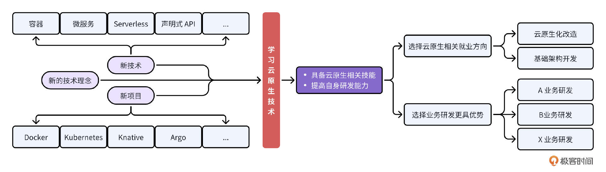

## 如何学习云原生技术？

在我看来，学习一门技术，既要有广度，又要有深度。广度可以让我们站在更高的视角通透、全面的去认识一门技术；深度可以让我们深入细节，知道每一个技术具体是如何构建的，可以真正帮助我们落地云原生技术，并且能协助我们更好地理解这些技术原理

### 怎么学？

在广度化和深度化的学习过程中，如果能够合理安排学习内容、学习顺序和学习方法，就能够高效地学习云原生技术， **当然广度+深度本身也是一种高效的学习方法**

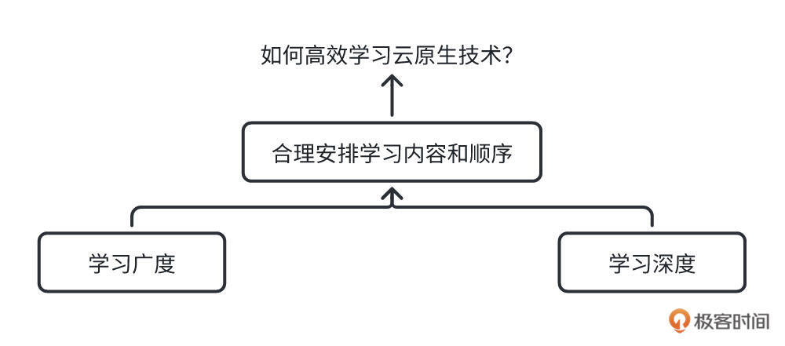

比方说，你可以灵活采用并行学习的方式：先去掌握一些基础的核心技术栈，因为这些知识通常能奠定一个好的基础。而对于非基础的技术栈，则选择尝试穿插学习。这样既能提升学习效率，又能通过内容的切换来调整节奏，有效缓解学习过程中的疲劳感

**提示：** 以下的学习内容、书籍、顺序，均是通用建议，不是标准答案。完全可以根据自己的实际情况选择适合自己的学习方法

### 怎么进行广度学？

如何在学习云原生技术时具备广阔的视野？云原生技术内容繁多，若想要扩展广度，早期应避免过度深入某一技术领域，而是从整体入手，系统性梳理云原生技术的核心技术栈，选择经典教材进行学习，因为相比于阅读源码、实战来说，阅读一门书籍或学习一门课程是形成全局视角最高效的方式

为了便于统一描述，这里将图书、视频课程、图文专栏等学习媒介统称为教材。在选择学习媒介的过程中，通常建议优先考虑图书，因为相比于图文专栏、视频课程，图书从内容质量、知识密度上来说都要更专业一些。当然，有些图文专栏的内容质量与图书相当，这类高质量的专栏同样值得选择

另外，在学习的过程中，为了能够更全面的掌握一门技术，建议至少学习一门/一本经典的教材，如果有精力，建议再学习一门/一本同类的其他课程。当然，如果你感兴趣或者有精力，可以学习更多的同类经典教材

#### 通过云原生架构了解云原生核心技术栈

这里，通过解读一个业界标准、完整的云原生架构，来让你了解整个云原生体系中有哪些核心内容，进而总结出我们应该学习哪些核心的云原生技术栈

**提示：** 因为云原生技术栈内容很多，我们没必要、也不可能把所有技术栈全学了，我们可以先学习一些核心、重要、高频使用的技术栈，其他技术栈可以在工作过程中根据需要和个人爱好慢慢补全

一个完整的云原生架中包含的内容比较多，要想解释清楚云原生架构中的组件、功能及每个组件的交互方式，需要很长的篇幅，不太适合在这节课中详细介绍。为了提前让你知道我们应该学习哪些云原生核心技术栈，这里我基于云原生架构图，将这些核心技术栈用粗体红色字体进行标识

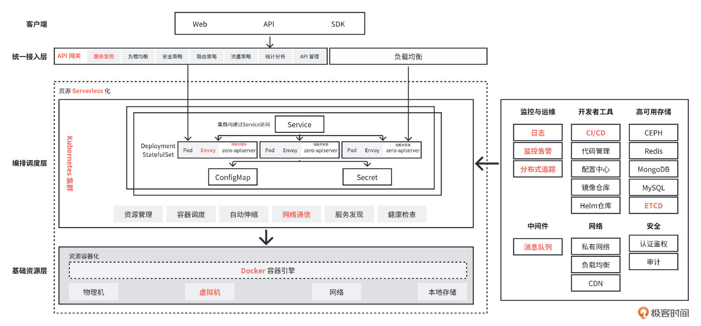

#### 如何广度学云原生技术栈？

作为一个研发，我们首先是要开发一个应用。而云原生时代，应用都在微服务化，所以我们应该首先学习微服务技术栈。这里推荐一本优秀的微服务书籍 [《微服务设计》](https://book.douban.com/subject/26772677/)。

另外，云计算最核心的功能是对外提供灵活、弹性化的计算资源，随着云计算的发展，资源的提供形态也在逐渐往前演进，其演进路线如下：

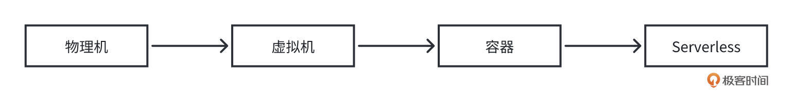

虽然资源演进形态在往前进化，但是这些资源形态在云原生时代是以分层的形式同时存在。如果想透彻学习云原生技术，首先应该学习云计算最核心的资源虚拟化技术：虚拟机、容器、Serverless

如何学习这些技术呢？我们可以阅读相关的虚拟化原理类的书籍，也可以通过一些具体的虚拟化落地项目来学习这些技术。针对每一项技术，推荐的教材和学习顺序如下：

- **虚拟机（虚拟化技术）：**
  - [系统虚拟化 : 原理与实现](https://book.douban.com/subject/3619896/)

  - [KVM 虚拟化技术 : 实战与原理解析](https://book.douban.com/subject/25743939/)

  - [虚拟化技术原理与实现](https://book.douban.com/subject/19986436/)（建议选学）

  - [Linux KVM 虚拟化架构实战指南](https://book.douban.com/subject/26766965/)（建议选学）
- **容器**：
  - [Docker 容器与容器云（第 2 版）](https://book.douban.com/subject/26894736/)

  - [《Kubernetes 权威指南：从 Docker 到 Kubernetes 实践全接触》（第 5 版）](https://book.douban.com/subject/33444476/)

  - [《基于 Kubernetes 的容器云平台实战》](https://book.douban.com/subject/30333237/) （建议选学）

  - etcd（Kubernetes 强依赖 etcd，所以这里也建议学习 etcd 技术）

  - 网络通信：在 Kubernetes 中，网络通信需要满足其网络模型，如果想掌握好 Kubernetes，还需要掌握好 Kubernetes 中的网络通信原理，我们可以通过学习 Flannel 来了解 Kubernetes 中的网络通信原理
- **Serverless**:
  - [Serverless 架构：无服务器应用与 AWS Lambda](https://book.douban.com/subject/30290516/)

  - [Knative Documentation](https://knative.dev/docs/);

上面，我们学习了云原生的应用层和资源层的核心技术。接下来，还应该学习应用声明周期管理相关的技术栈：

- **监控告警**：监控告警业界的事实标准是 Prometheus，所以我们可以通过 [Prometheus Documentation](https://prometheus.io/docs/introduction/overview/) 来学习监控告警以及 Prometheus。

- **调用链追踪**：调用链追踪业界用的最多的是 Jaeger，所以我们可以通过 [Jaeger Documentation](https://www.jaegertracing.io/docs/1.26/) 来学习调用链追踪以及 Jaeger。

- **消息队列**：我们可以通过学习 Kafka 来学习消息队列，Kafka 参考资料为 [《Apache Kafka 实战》](https://book.douban.com/subject/30221096/)


提示：如果还有精力，还可以再学习下日志、DevOps 相关的技术栈。

在我们的服务开发部署上线后，还需要访问应用，这里我还建议学习应用接入层相关的技术栈，推荐的学习教材如下：

- **API 网关：** 可以通过 Tyk 网关的具体实现来学习 API 网关相关技术，Tyk 网关可通过官网文档 [Tyk Open Source](https://tyk.io/docs/apim/open-source/) 进行学习。

- **服务注册/服务发现：** 在服务之间调用过程中，为了实现负载均衡、访问对端服务等目的，我们需要上报服务的后端实例，这就需要进行服务注册/服务发现。所以，我们也需要学习服务注册/服务发现相关的技术。我们可以通过学习 Consul 分布式服务发现和配置管理工具，Consul 学习文档为 [Consul Documentation](https://www.consul.io/docs)。

- **服务网格：** 微服务架构中的网络通信、安全性和可观察性等会有很多挑战，为了解决这些挑战，云原生时代为此诞生了一个新的核心技术栈：服务网格。我们可以通过 [《云原生服务网格 Istio：原理、实践、架构与源码解析》](https://book.douban.com/subject/34438220/) 来学习服务网格和其落地项目 Istio。


上面，我给出了一个业界标准、全面的云原生架构，并从中分析出了我们需要重点学习的云原生技术栈，并推荐了相关的教材。通过这些教材的学习，可以让我们对云原生技术有个相对全面的学习，也就是具备了云原生技术的广度。但是，我们还应该合理安排学习顺序，以寻求更高的学习效率，下面是我推荐的学习顺序

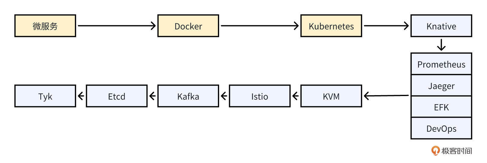

### 怎么进行深度学习？

在快速学习云原生的核心技术栈后，我们已经掌握了云原生技术的基本原理、实现方法等，对云原生技术有了较为全面的理解。然而，这些技术该如何真正动手实现呢？你可能还是一头雾水，不知从何入手

所以接下来，我们需要拓宽云原生技术的深度。通过选择一些核心的云原生技术栈进行深入学习，最终让这些技术对于我们来说，变成可落地、可实现的

那么，具体该怎么做呢？在我看来，最有效的方式是阅读源码 \+ 实战。通常来说，这种方式需要投入更多的时间和精力，因此我们需要对核心技术栈进行筛选，优先选择重要的部分去学习。我认为，可以首先学习云原生的基石技术——阅读 Docker + Kubernetes 的源码，并进行相关实战

- **Docker + Kubernetes 操作实战：**
  - Docker 实战：可以学习 [Docker 技术入门与实战（第 3 版）](https://book.douban.com/subject/30329430/)，根据其中的指引，安装 Docker 并执行书中的命令；

  - Kubernetes 实战：可以根据 [follow-me-install-kubernetes-cluster](https://github.com/opsnull/follow-me-install-kubernetes-cluster) 教程，一步一步搭建一个 Kubernetes 集群。搭建好集群之后，可以创建一个应用并访问，体验整个 Kubernetes 核心部署流程。
- **学习Kubernetes源码：**
  - 教材学习：Kubernetes 源码的学习，你可以直接学习咱们这门课；

  - 你也可以自行阅读以下 Kubernetes 核心组件的源码：kube-apiserver、kube-scheduler、kube-proxy、flannel。


### 其他学习建议

云原生技术是一个快速发展的领域，需要持续学习和实践。在上述方法之外，你还可以通过以下方式来持续学习和实践云原生技术

- **关注行业动态：** 及时了解云原生技术的最新动态和发展趋势，可以通过订阅技术博客、关注社交媒体、参加技术会议等方式来获取信息

- **参与社区讨论：** 加入云原生技术的社区，参与讨论和交流，了解其他开发者的经验和观点。还可以通过技术论坛、社交媒体或开发者社区等渠道来参与讨论

- **参与社区贡献：** 参与云原生技术的社区贡献，可以与其他开发者交流和分享经验，提升自己的技能和知识储备。还可以参与开源项目的开发、提交 bug 修复和功能改进等

- **继续学习和实践：** 持续学习和实践是保持对云原生技术深入理解和掌握的关键。可以选择学习新的云原生工具和框架，尝试新的应用场景和解决方案，不断提升自己的技能和经验