## etcd 记录

## 认证与授权
- 添加用户 root `etcdctl user add root:root`
- 给予root用户root权限(必须) `etcdctl user grant-role root root`
- 开启认证 `etcdctl auth enable`
之后每次使用etcdctl都需要通过 --user name:password 来指定用户，匿名用户无法访问

etcd server 之后收到请求的时候，在提交到Raft模块前，会从请求的上下文中获取当前的用户身份信息。如果未通过认证，那么在状态机应用put命令的时候，检查身份权限的时候发现是空，就会返回错误给client

鉴权模块收到一个通过root用户添加一个新用户alice:alice的命令时，它会使用 bcrpt 库的 blowfish 算法，基于明文密码、随机分配的salt、自定义的cost、迭代多次计算得到一个hash值，并将加密算法版本、salt值、cost、hash值组成一个字符串，作为加密后的密码

鉴权模块将用户名作为key，加密后的密码作为value，存储到boltdb的authUsers bucket里面，完成一个账号的创建

验证密码的过程就是 根据明文再算一次跟 boltdb中的密码对应

### 认证

身份验证这个过程开销机器昂贵，需要保证性能， simple token 和 jwt token

### Simple Token & JWT Token

**Simple Token**

核心原理就是当一个用户身份验证通过之后，生成一个随机的字符串值Token返回给client，并在内存中使用map存储用户和token之间的映射关系。每个Token都有expire，过期后需要再次验证身份

**JWT Token**

JWT 是 Json Web Token的缩写，基于JSON开放标准定义的一种 紧凑、独立的格式，用于在身份提供者和服务提供者间，传递被认证的用户身份信息。
由 Header、Payload、Signature三个对象组成，每个对象都是一个JSON结构体。

**Header**
```json
{
	"alg": "RS245",
	"typ": "JWT"
}
```

**Payload**
```json
{
	"username": name,
	"revision": revision,
	"exp":		time.Now().Add(t.ttl).Unix(),
}
```

**Signature**

其将header、payload使用base64 url编码，之后将编码后的字符串使用 . 连接在一起，最后使用 签名算法，比如RSA系列的私钥对其计算签名，输出结果就是Signature

也就是 `base64UrlEncode(header).base64UrlEncode(payload).signature`组成
### Cert认证
这是etcd的另外一种高性能、更安全的鉴权方案，x509证书认证

密码认证一般使用在client和server基于HTTP协议通信的内网场景中。当对安全有更高要求的时候，需要使用HTTPS协议加密通信数据，防止中间人工具和数据被篡改等安全风险。

HTTPS是利用非对称加密实现身份认证和密钥协商，因此使用HTTPS协议的时候，需要使用CA证书给client生成证书才能访问。

可以使用下面的命令来查看client证书的内容
```sh
openssl x509 -noout -text -in client.pem
```
证书中一般都含有证书版本、序列号、签名算法、签发者、有效性、主体名等信息，重点需要关注**主体名的中的CN字段**

在etcd中，如果使用了HTTPS协议并启用了client证书认证(`-client-cert-auth`)，它会取**CN**字段作为用户名

证书认证在稳定性、性能上都优于密码认证

稳定性上，它不存在Token过期、使用更加方便，避免了不少Token失效而触发的Bug

性能上，证书认证不需要像密码认证一样调用昂贵的密码认证操作

## 授权

开启鉴权之后，put请求命令在应用到状态机前，etcd还会发出对此请求的用户进行权限检查，判断其是否有权限操作请求的数据。

常用的权限控制方法有ACL（Access Control List）、ABAC（Attribute-based access control）、RBAC（Role—based access control），etcd使用的RBAC

**RBAC(基于角色权限的控制系统)**

其由，**User**, **Role**, **Permission** 三部分组成。
- User: 表示用户
- Role: 表示角色
- Permission: 表示具体权限明细，比如赋予 Role 对 key范围在[key, keyEnd]数据有什么权限，目前支持三种权限，分别是**READ**, **WRITE**, **READWRITE**

```bash
# 创建一个admin role
etcdctl role add admin --user root:root
# 分配一个可读写[hello,helly]范围数据的权限给admin role
etcdctl role grant-permission admin readwrite hello helly --user root:root
# 将用户alice和admin role关联起来，赋予admin权限给user
etcdctl user grant-role alice admin --user root:root
```
之后使用用户alice去put或者get hello命令时，鉴权模块会从 boltdb 查询alice用户对应的权限列表

有可能一个用户拥有成百上千个权限列表，etcd为了提升权限检查的性能，引入了区间树，检查用户操作的key是否在已经授权的区间，时间复杂度仅为 O(logN)

## Lease
etcd默认的Lease最小值是1s

## MVCC
从名字上理解，它是一个基于多版本技术实现的一种并发控制机制

常见的并发控制机制有 悲观锁、读写锁、互斥锁、两阶段锁等

**MVCC机制是基于多版本技术实现的一种乐观锁机制**

在MVCC数据库中，更新一个key-value数据的时候，不会去覆盖原来的数据，而是新增一个版本来存储新的数据，每个数据都有一个版本号，删除数据的时候，实际上也是新增一条带删除标识的数据记录

修改前的详细信息
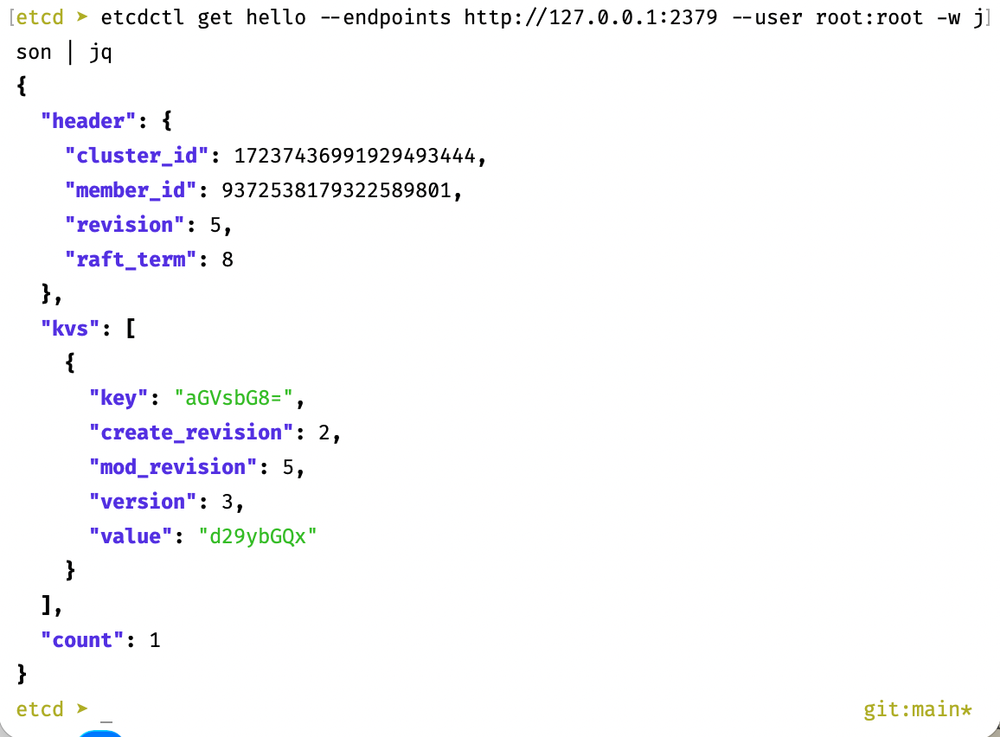

修改后的详细信息
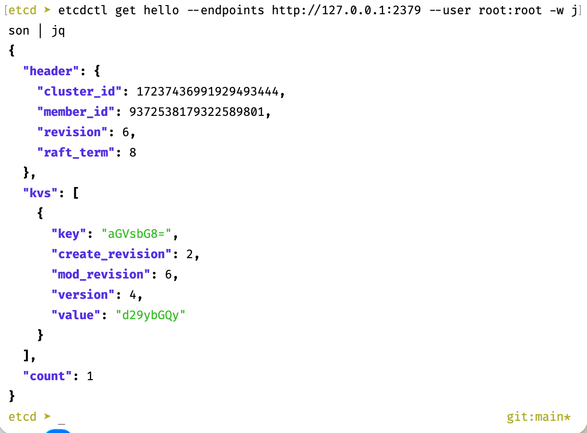

对比修改前后，可以发现：
- 修改后 revision + 1
- kvs中的 mod_vision 和 version 都 + 1， 这里 key 和 value 都经过了 base64 处理

**示例**

如果不指定endpoints，其默认值就是 http://127.0.0.1:2379，其参数顺序也是有要求的，global flags **必须要放在子命令前面**，下面命令能正常执行，是因为 etcdctl 基于Cobra库，全局选项**理论上**必须放在子命令（get/put/txn）之前，但在get/put/del等简单子命令中，Cobra解释器对persistent flags有一定「宽容度」

`etcdctl get hello --rev=2 --endpoints=http://127.0.0.1:2379 --user root:root -w json | jq`

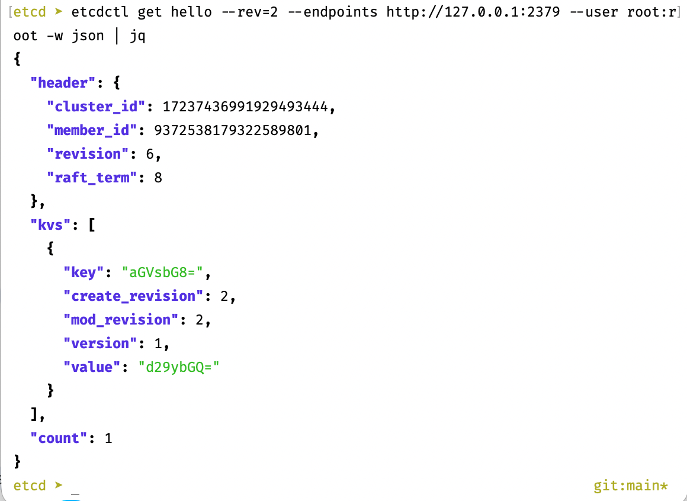

对上面的信息需要进行一些解释，`header` 中的 `revision` 反映的「现在」，而 `kvs` 中的 `revision` 反映的是「过去」

- `create_revision` 表示这个key是在全局版本号为2的时候被创建的
- `mod_revision` 表示这个key最近一次被修改，是在全局版本号为2的时候

`--rev`这个选项既不是专门「创建版本」也不是找「修改版本」，而是找**快照版本**，本质上就是 <= mod_revision最大的那个

删除这个key之后，依然可以根据revision来找到相应的value，除非etcd执行了**压缩(Compaction)**操作时，带有旧Value的历史版本会真正从磁盘上被物理清理掉

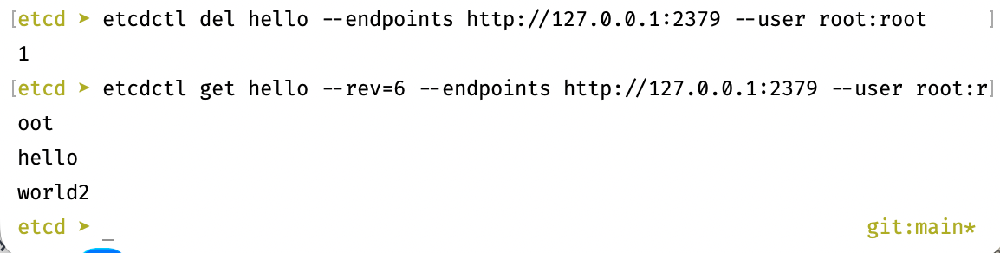

强烈推荐使用环境变量彻底摆脱顺序烦恼
```zsh
export ETCDCTL_ENDPOINTS=http://127.0.0.1:2379
export ETCDCTL_USER=root
export ETCDCTL_PASSWORD=root
etcdctl get hello --rev=2 -w json | jq
```

### 整体架构
整个MVCC特性由treeIndex、boltdb组层

Apply模块通过MVCC模块来执行put请求，持久化key-value数据。MVCC模块将请求划分为两个类别，分别是读事务(ReadTxn)和写事务(WriteTxn)。读事务负责处理range请求，写事务负责put/delete请求。读写事务基于treeIndex、Backend(boltdb)提供的能力实现对key-value的增删改查功能

treeIndex模块基于内存版的 B-tree实现key索引管理，其保存了用户key与版本号(所有mod_revision)的映射关系等信息。不添加`--rev`选项时，treeIndex模块会根据用户输入的key，在内存中查找对应的版本号(最新的mod_revision)，然后根据版本号去Backend模块中查找对应的value

Backend模块负责etcd的key-value持久化存储，主要由ReadTx、BatchTx、Buffer组成，ReadTx定义了抽象的读事务接口，BatchTx在ReadTx之上定义了抽象的写事务接口，Buffer是数据缓冲区

etcd设计上支持多种Backend实现，目前实现的Backend是boltdb，其是一个基于B+tree实现的、支持事务的key-value嵌入式数据库

### treeIndex原理
treeIndex出现的原因就是v2版本的etcd直接会将新的value覆盖旧的value，无法支持保存key的历史版本，其可以提供稳定的Watch机制和实物隔离等能力

功能上，etcd支持范围查询，因此保存索引的数据结构也必须支持范围查询，哈希表不适合，B-tree支持范围查询

性能上，平衡二叉树内个节点只能容纳一个数据、树的高度比较高，B-tree每个节点可以容纳多个数据，树的高度更低、更扁平，涉及的查找次数更少，具有优越的增删改查性能

在一个**度**为 **d** 的B-tree中，节点保存的最大key数量为 **2d - 1**，最多的子节点数量是 **2d**，etcd treeIndex模块中，创建的最大度是32，也就是说内部节点最多可以保存63个key，最多可以有64个子节点

在TreeIndex中，每个节点的key是一个keyIndex结构，etcd就是通过它保存了用户 key 与 版本号的映射关系

```go
type keyIndex struct {
	key				[]byte		// 用户key名称
	modified 		revision	// 用户key最近一次修改的全局版本号，即mod_revision
	generations		[]generation// 用户key的多个版本号，即所有create_revision
}
type generation struct {
	version			int64		// 表示此key的修改次数
	created			revision	// 表示generation结构创建时的版本号
	revs			[]revision	// 每次修改key时的revision追加到此数组
}
type revision struct {
	main			int64		// 全局递增的主版本号，随put/txn/delete事务递增，一个事务内的key main版本号是一致的
	sub				int64		// 一个事务内的子版本号，从0开始随事务内put/delete操作递增
}
```
generation结构体中包含此key的修改次数、generation创建时的版本号、对此key的修改版本号记录列表

revision包含main和sub两个字段，main是全局递增的版本号，它是etcd逻辑时钟，随着put/txn/delete等事务递增。sub是一个事务内的子版本号，从0开始随事务内的put/delete操作递增

### MVCC更新key原理

在put写事务中，先从treeIndex查key的keyIndex索引信息，keyIndex中存储了key的创建版本号、修改的次数等信息，这些信息在事务中发挥着重要作用，会存储在boltdb的value中

1. 获取key的keyIndex信息(包含Ver，CreatedVer信息)
2. key:revision{txid, 0}, Value: KeyValue写入新的key-value到boltdb和buffer中
3. 创建/更新keyIndex，更新keyIndex到treeIndex
4. backend异步事务提交goroutine

boltdb的value是**mvccpb.KeyValue**结构体，它是由 key、value、 create_revision、 mod_revision、 lease组成。填充好boltdb的KeyValue结构体后，这时就可以通过Backend的写事务batchTx接口将 key{revision, 0}, value为 mvccpb.KeyValue 保存到boltdb的缓存中，并同步更新buffer

此时存储到boltdb中的key、value数据如下

```
	command						boltdb key				boltdb value/mvccpb.KeyValue
etcdctl put hello world1		key{2, 0}			value{key: base64(hello), value: base64(world1), create_revision: 1, mod_revision: 1, lease: 0}
```

**Version** 和 **ModRevision**
- **Version** 指的是修改的次数
- **ModRevision** 指的是根据revision(全局)来设定的

此时数据还未持久化，为了提升etcd的写吞吐量、性能，一般情况下（默认堆积的写事务数大于1万才在写事务结束时同步持久化），数据持久化由Backend的异步goroutine完成，通过事务批量提交，定时将boltdb页缓存中的脏数据提交到持久化存储磁盘中

### MVCC查询key原理
完成put hello为world操作后，这时需要通过etcdctl发起一个get hello操作，MVCC模块首先会创建一个读实物对象(TxnRead)，在etcd 3.4中Backend实现了ConcurrentReadTx，并发读特性

并发读特性的核心原理是创建读事务对象时，会全量拷贝当前写事务未提交的buffer数据，并发的读写事务不再阻塞在一个buffer资源锁上，实现了全并发读

先去treeIndex找key(keyIndex对象,匹配有效的generation,获取的是key{mod_revision, 0})，之后去buffer里找，未命中就去boltdb里找

指定版本号读取历史记录的实现方法: 如果后续再通过 put hello worldx 修改操作时，key hello对应的keyIndex结果如下所示， keyIndex.modified字段更新为<3,0>，generation的revision数组追加最新的版本号<3, 0>，ver修改为2。boltdb会插入一个新的key revision{3, 0}，指定版本号之后treeIndex模块会遍历generation内的历史版本号，返回小于等于mod_revision最大历史版本号

### MVCC删除key原理
etcd实现的是标记延期删除模式，原理与key更新类似

生成的boltdb key版本号为 key{x, 0, t}追加了删除标识(tombstone,简写t)，boltdb value变成只含用户key的KeyValue结构体。treeIndex模块也会给此key hello对应的keyIndex对象添加一个generation结构体，表示此索引对应的key被删除了

etcdctl delete hello 操作后的keyIndex结果如下面所示

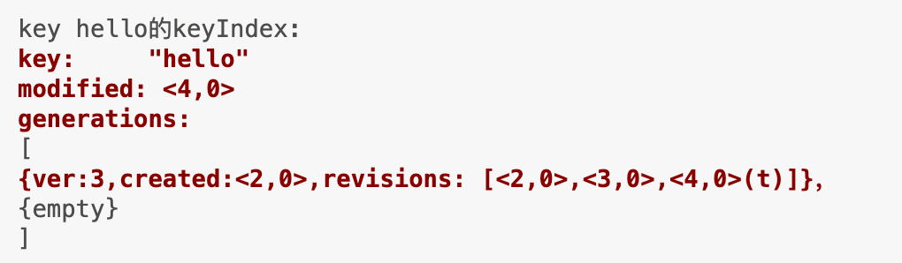

boltdb 中的 key-value 数据如下图所示

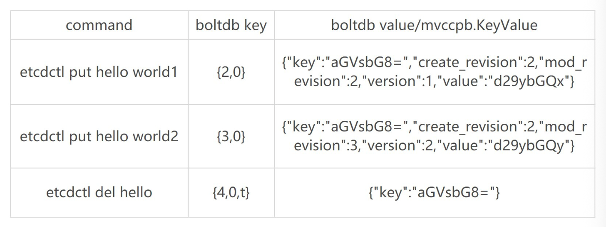

删除key时会生成events，Watch模块根据key的删除标识，会生成对应的Delete事件。重启etcd，遍历boltdb中的key构建treeIndex内存树时，需要知道哪些key是已经被删除的，并为对应的key索引生成tombstone标识

真正删除treeIndex中的索引对象、boltdb中的key是通过(compactor)组件异步完成

## Watch机制
高效获取数据变化通知

etcd的Watch特性是Kubernetes控制器的工作基础

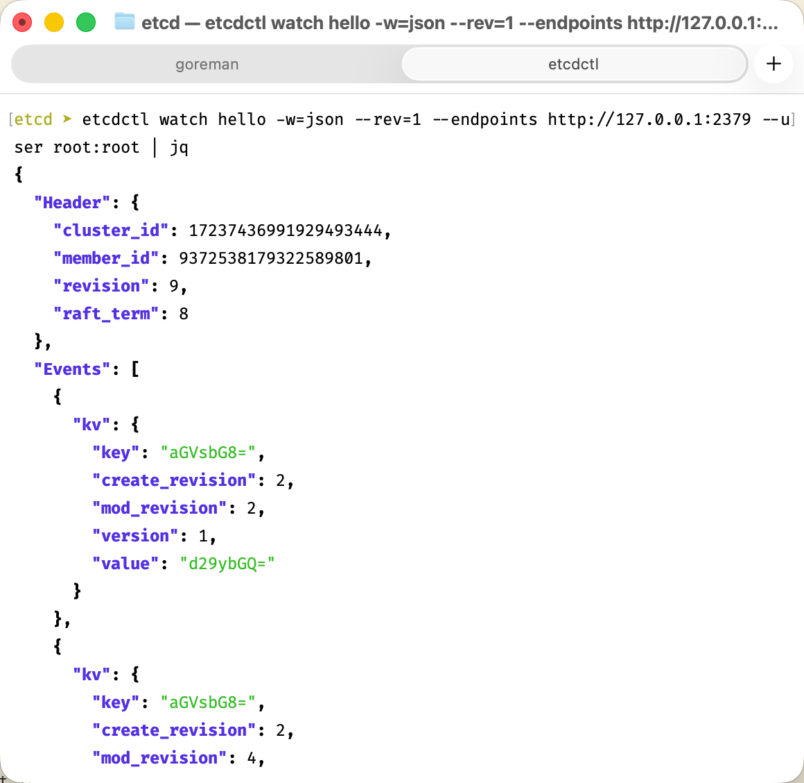

1. client获取事件的机制，etcd是使用轮训模式还是推送模式呢？两者各有什么优缺点？

2. 事件是如何存储的？会保留多长时间？watch命令中的版本号具体有什么作用呢？

3. 当client和server端出现短暂网络波动等异常因素后，导致事件堆积时，etcd是如何根据变化的key快速找到监听它的watcher呢？

4. 如果创建了上万个watcher监听key变化，当server端收到一个写请求后，etcd是如何根据变化的key快速找到监听它的watcher呢？

### 轮询 & 流式推送
轮询v2，流式推送v3

etcd v3中，使用基于HTTP/2的gRPC协议，双向流的Watch API设计，实现了连接多路复用

在HTTP/2协议中，HTTP消息会被分解成独立的帧(Frame)，交错发送，帧是最小的数据单位。每个帧会标识属于哪个流(Stream)，留由多个数据帧组成，每个流拥有一个唯一的ID，这个数据流对应一个请求或响应包。HTTP/2可基于帧的流ID将并行、交错发送的帧重新组装成完整的消息。

基于HTTP/2的多路复用机制，实现一个client/TCP连接支持多gRPC Stream，一个gRPC Stream又支持多个watcher。事件通知模式从v2的client轮训优化成server流式推送，极大降低了server端socket、内存等资源

在clientv3库中，Watch特性被被抽象成Watch、Close、RequeestProgress三个简单API提供给开发者使用，屏蔽了client与gRPC WatchServer交互的复杂细节，实现了一个client支持多个gRPC Stream，一个gRPC Stream支持多个watcher，显著降低了开发复杂度

当watch连接的节点故障，clientv3库支持自动重连到健康节点，并使用之前已接收的最大版本号创建新的watcher，避免旧事件回放等

### 滑动窗口 & MVCC
上面问题2的本质是**历史版本存储**，etcd经历了从 滑动窗口 到 MVCC 机制的演变

etcd v2是使用一个简单的环形数组来存储历史事件版本，当key被修改后，相关事件就会被添加到数组中来。若超过eventQueue的容量，则淘汰最旧的事件。v2中eventQueue的容量固定是1000，不会占用大量内存导致OOM
```go
type EventHistory struct {
	Queue			eventQueue
	StartIndex		uint64
	LastIndex		uint64
	Rev				sync.RWMutex
}
```
其缺陷是显而易见的，固定的事件窗口只能保存有线的历史事件版本，是不可靠的。当写请求较多的时候、client与server网络出现波动等异常时，很容易导致事件丢失，client不得不触发大量的expensive查询操作，以获取最新的数据以及版本号，才能持续监听数据

对于重度依赖Watch机制的Kubernetes而言，无法接受，因为会导致控制器等组件频繁的发起expensive List Pod等资源操作，导致APIServer/etcd出现高负载、OOM等，对稳定性会造成严重影响

MVCC机制就是为了解决v2 watch机制不可靠诞生的。v3将一个key的历史修改版本保存在boltdb里面。boltdb是一个基于磁盘文件的持久化存储，不会丢失数据

revision是etcd的逻辑时钟，当client因为网络等异常出现连接闪断后，通过revison就可以从server端的boltdb中获取错过的历史事件，而无需全量同步，其是etcd watch机制数据增量同步的核心

### 可靠的事件推送机制

当通过etcdctl或API发起一个watch key请求的时候，etcd的gRPCWatchServer收到watch请求后，会创建一个serverWatchStream，它负责接收client的gRPC Stream的create/cancel watcher请求(recvLoop goroutine)，并将从MVCC模块接收到的Watch时间转发给client(sendLoop goroutine)

当serverWatchStream收到create watcher请求后，serverWatchstream会调用MVCC模块的WatchStream子模块分配一个watcher id，并将watcher注册到MVCC的WatchableKV模块

在etcd启动时，watchableKV模块会运行syncWatchersLoop和syncVictimsLoop goroutine，分别负责不同场景下的事件推送

etcd在面对各类异常，实现可靠事件推送的机制是 **复杂度管理，问题拆分**

etcd根据不同场景，对问题进行了分解，将watcher按场景分类，实现了轻重分离、低耦合

**synced watcher** 表示此类watcher监听的数据都已经同步完成，在等待新的变更

**unsynced watcher** 表示此类watcher监听的数据还未同步完成，落后于当前最新数据变更，正在追赶

### 最新时间推送机制
当etcd收到一个写请求，key-value发生变化时，处于syncedGroup中的watcher，是如何获取到最新变化事件并推送给client的呢？

当创建完成watcher后，执行put hello修改操作时，请求会经过 KVServer、Raft模块后Apply到状态机时，在MVCC的put事务中，它会将本次修改后的mvccpb.KeyValue保存到一个changes数组中，put事务结束的时候，会将KeyValue转换成Event事件，回调watchableStore.notify函数，notify会匹配出监听此key并处于synced watcherGroup中的watcher，同时事件中的版本号要大于等于watcher监听的最小版本号，才能将事件发送到此watcher，watcherStream.notify会把event打包成WatchResponse，最终push到watcherStream的sendCh channel中，serverWatchStream的sendLoop goroutine监听到channel消息后，读出消息立即推送给client。至此，完成一个最新修改事件推送

etcd MVCC层用于构建watch事件的核心逻辑如下
```go
// changes 是一组内部表示的KeyValue变化记录
// evs 是最终要提供给 watch 客户端的事件数组
evs := make([]mvccpb.Event, len(changes))
// 循环，将每个 changes[i] 转换成 evs[i]
for i, change := range changes {
	// 将 KeyValue 放入 event 中
	evs[i].Kv = &changes[i]
	// 核心逻辑，如果 CreateRevision 为0，则视为删除
	if change.CreateRevision == 0 {
		evs[i].Type = mvccpb.DELETE
		// 不会真正删除，还要写条数据，revison改成当前 rev
		evs[i].Kv.ModRevision = rev
	} else { // 不是 DELETE 就是 PUT（合并创建与修改）
		evs[i].Type = mvccpb.PUT
	}
}
// 向 watcher 推送事件
// tw 是 wathcer 对象（订阅者） （非 gRPC watcher，是内部watch触发器的 watcher）， .s 是 watcher 持有的 store 对象，类型是 *watchableStore， notify是 watchableStore 的方法
tw.s.notify(rev, evs)
```

watch事件channel的buffer容量默认是1024，buffer满了事件会丢失吗？

### 异常场景重试机制
如果出现channel buffer满了，etcd为了保证Watch事件的高可靠性，并不会丢弃它，而是将此watcher从synced watcherGroup中删除，然后将此watcher和事件列表保存到一个名为受害者victim的watcherBatch结构中，通过**异步机制重试**保证事件的可靠性，notify操作它是在修改事务结束时同步调用的，必须是轻量级、高性能、无阻塞的，负责会严重影响集群写性能

WatchableKV模块会启动两个异步goroutine，其中一个是syncVictimsLoop，正是它负责slower watcher的堆积的事件推送

其工作原理就是，遍历victim watcherBatch数据结构，尝试将堆积的事件再次推送到watcher的接收channel中。如果推送失败，则再加入到victim watcherBatch数据结构中等待下次重试

如果推送成功，watcher监听的最小版本号(minRev)小于等于server当前版本号(currentRev)，说明可能还有历史事件未推送，需加入到unsynced watcherGroup中，由历史事件推送机制，推送minRev到currentRev之间的事件

如果watcher的最小版本号大于server当前版本号，则加入到synced watcher集合中，进入最新事件通知机制

### 历史事件推送机制
WatchableKV模块的另外一个goroutine，syncWatchersLoop，正是负责unsynced watcherGroup中的watcher历史事件推送

syncWatchersLoop，会遍历处于unsynced watcherGroup中的每个watcher，为了优化性能，它会选择一批unsynced watcher批量同步，找出这一批unsynced watcher中监听的最小版本号

boltdb的key是按照版本号存储的，可以通过指定查询的key范围的最小版本号作为开始区间，当前server最大版本号作为结束区间，遍历boltdb获得所有历史数据

将KeyValue结构转换成事件，匹配出监听过事件中key的watcher后，将事件发送给对应的watcher事件接收channel即可。发送完成之后，watcher从unsynced watcherGroup中移除、添加到synced watcherGroup中

如果watcher监听的版本号已经小于当前etcd server压缩的版本号，历史变更数据就可能已经丢失，因此etcd server会返回ErrCompacted错误给client（想看的部分旧历史没有了，重新先使用GET获取当前最新的revision，再watch）

### 高效的事件匹配
一个个遍历watcher是最简单的方法，但性能较差，在watcher数量较多的场景下，会导致性能出现瓶颈。更何况etcd是在执行一个写事务结束时，同步触发事件通知流程的，若匹配watcher开销较大，将严重印象etcd性能

~~etcd使用map记录监听单个key的watcher，但是watch特性不仅仅是可以监听单key，它还可以指定监听key范围、key前缀，因此etcd还使用了如下区间数~~
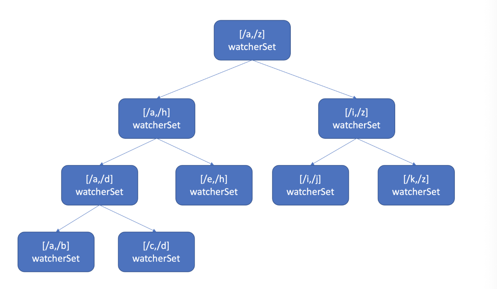

key空间被简化成了字母 a - z（实际上etcd的key是[]byte，按字典序比较，空间无限大，但是原理一样）
- 每个节点包含三个东西
	- 一个区间 `[low, high)`
	- 一个watcherSet: 所有精准监听这个区间的客户端的watcher集合
- 树是层次分割的
	- 根节点覆盖**最大可能范围**
	- 子节点范围是父节点的**严格子集**，并且子节点区间**互不重叠**，他们的并集等于父节点区间
	- 分割方式类似二分
- 这是一种**动态段树思想在区间上的实现**，或者叫**中心点区间树**。树会保持大致平衡（高度O(LogU)， U 是key的 宇宙大小（key可能取值的全集范围），或实际端点数）

当收到创建watcher请求的时候，会把watcher监听的key范围插入到上面的区间树中，区间的值保存了监听同样key范围的watcher集合/watcherSet

当产生一个事件时，etcd首先需要从map查找是否有watcher监听了单个key，其次还需要从区间树找出与此key相交的所有区间，然后从区间的值获取监听的watcher集合

区间树支持快速查找一个key是否在某个区间内，时间复杂度为O(LogN)，因此etcd基于map和区间数实现了watcher与事件快速匹配，具备良好的扩展性

其实上面的美好设计，并内有真正被采纳（etcd从v3到现在并没有使用区间树来管理范围watcher）

实际上etcd的notify中使用了for range来遍历synced watcher（synced watcher数量通常几十到几百，k8s一个etcd实例服务多个namespace，但总watcher可控）

如果 watcher 爆炸，那么官方推荐：使用多个etcd集群隔离、客户端聚合watcher、避免宽范围前缀

## 事务
etcd v2的时候，etcd提供了CAS（Compare and swap），然而其只支持单key，不支持多key，因此无法满足类似转账场景的需求

etcd v3为了解决多key的原子操作问题，提供了全新迷你事务API，同时基于MVCC版本号，实现了各种隔离级别的事务

`clientv3.Txn(ctx).If(cmp1, cmp2, ...).Then(op1, op2. ...,).Else(op1, op2, ...)`

事务API由If语句、Then语句、Else语句组成

基本原理是，在If语句中，可以添加一系列的条件表达式，若条件表达式全部通过检查，则执行Then语句的get/put/delete操作，否则执行Else中的get/put/delete等操作

If语句中，支持检查项有如下几条
1. key的最近一次修改版本号mod_revision，简称mod
2. key的创建版本号create_revision，简称create
3. key的修改次数version
4. key的value值

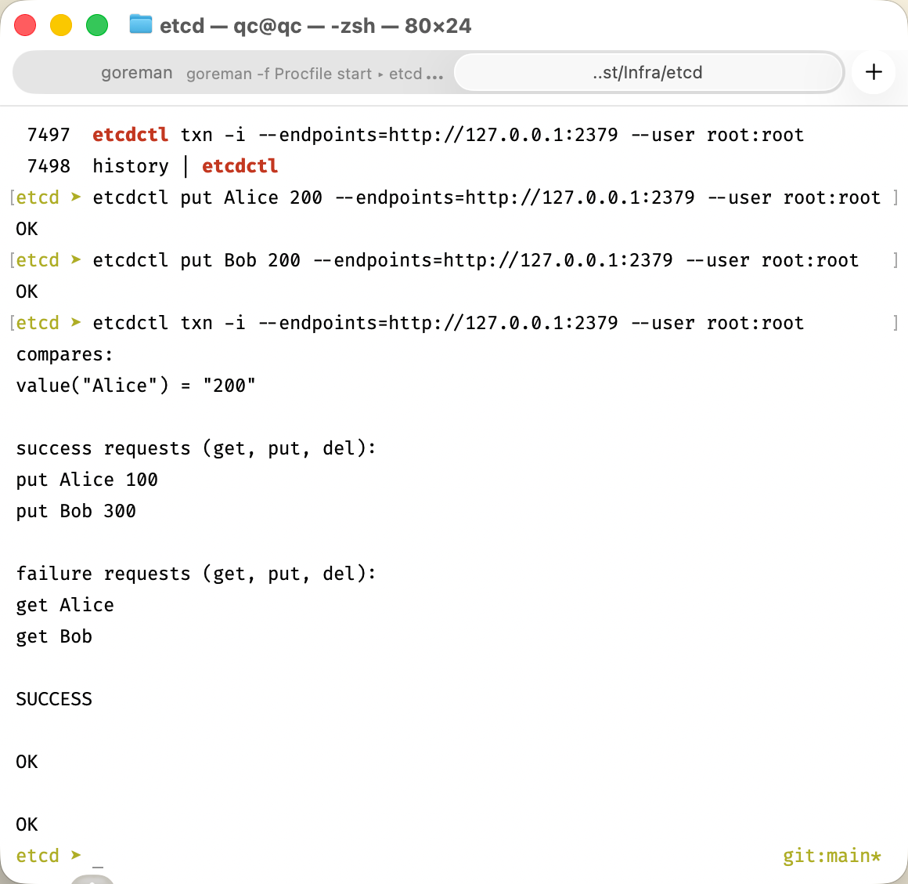

当通过client发起一个txn转账事务操作时，通过gRPC KV Server、Raft模块处理后，在Apply模块执行此事务的时候，它首先对你的事务的If语句进行检查，也就是ApplyComares操作，如果通过此操作，则执行ApplyTxn/Then语句，否则执行ApplyTxn/Else语句

在执行过程中，会根据事务是否只读、可写，通过MVCC层的读写事务对象，执行事务中的get/put/delete各操作

### 事务ACID特性
ACID是衡量事务的四个特性，由原子性（Atomicity）、一致性（Consistency）、隔离性（Isolation）、持久性（Durability）组成

### 原子性与持久性
原子性（Atomicity）是指在一个事务中，所有请求要么同时成功，要么同时失败

持久性（Durability）是指事务一旦提交，其所做的修改会永久保存在数据库中

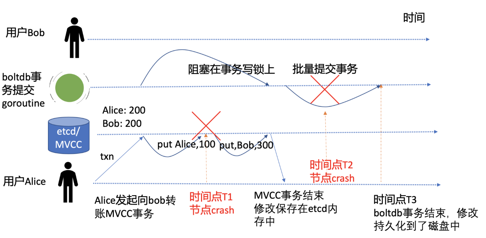

**T1时间点**

Alice扣款100元完成时，Bob账号资金还未成功增加时突然发生了crash

此时MVCC写事务持有boltdb写锁，仅是将修改提交到了内存中，保证幂等性、防止日志条目重复执行的一致性索引consistent index也并未更新。同时，负责boltdb事务提交的goroutine因无法持有写锁，也并未将事务提交到持久化存储中

T1时间点发生crash异常后，事务并未成功执行和持久化任意数据到磁盘上。在节点重启时，etcd server会重放WAL中的已提交的日志条目，再次执行以上转账事务

**T2时间点**

MVCC写事务完成转账，server返回给client转账成功后，boltdb的事务提交goroutine，批量将事务持久化到磁盘中时发生了crash

一致性索引consistent index字段值是和key-value数据在一个boltdb事务里同时持久化到磁盘中的。如果在boltdb事务提交过程中发生了crash，简单情况是consistent index和key-value数据（一次事务中多个KV对应一个consistent index）都更新失败。当节点重启，etcd server重放WAL中已提交日志条目时，同样会再次应用转账事务到状态机中，因此事务的原子性和持久性依然能得到保证

### 一致性
其实在不同场景下，其含义是不一样的

1. 分布式系统中多副本数据一致性，是指各个副本之间的数据是否一致，比如Redis的主备是异步复制的，那么它的一致性就是最终一致性的
2. CAP原理中的一致性是指可线性化。核心原理是最燃整个系统是由多副本组成，但是通过线性化能力支持，对client而言就如一个副本，应用程序无需关心系统有多少个副本
3. 一致性哈希，是一种分布式系统中的数据分片算法，具备良好的分散性、平衡性
4. 事务中一致性，是指事务变更前后，数据库必须满足若干恒等条件的状态约束，一致性往往是由数据库和业务程序两方面来保障的

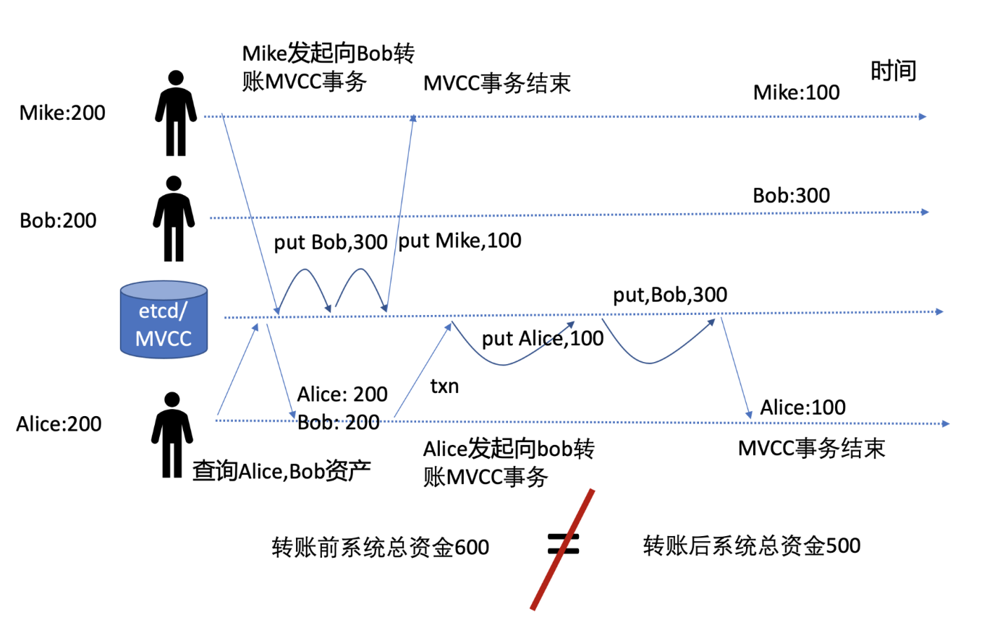

为了确保事务的一致性，一方面，业务程序在转账逻辑里面，需检查转账者资产大于等于转账金额。在提交事务时，通过账号资产的版本号，确保双方账号资产未被其他事务修改。如果双方账号资产被其他事务修改，账号资产版本号会检查失败，这时业务可以通过获取最新的资产和版本号，发起新的转账事务流程解决

另一方米，etcd会通过WAL日志和consistent index、boltdb事务特性，去确保事务的原子性，因此不会有部分成功失败的操作，导致资金凭空消失、新增

### 隔离性
常见的事务隔离级别有如下四种
1. **未提交读（Read Uncommitted）**: 一个client能读取到未提交的事务。比如转账事务过程中，Alice账号资金扣除后，Bob账号上资金还未增加，这时如果其他client读取到这种中间状态，它会发现系统总金额钱减少了，破坏了事务一致性的约束
2. **已提交读（Read Committed）**: 指只能读取到已经提交的事务数据，但存在不可重复读的问题。比如事务开始时，你读取了Alice和Bob资金，这时其他事务修改Alice和Bob账号上的资金，你在事务中再次读取时会读取到最新资金，导致两次读取结果不一样。
3. **可重复读（Repeated Read）**: 它是指在一个事务中，同一个读操作get Alice/Bob在事务的任意时刻都能得到同样的结果，其他修改事务提交后也不会影响你本事务所看到的结果。
4. **串行化（Serializable）**: 最高级别的事务隔离，读写相互阻塞，通过牺牲并发能力、串行化来解决事务并发更新过程中的隔离问题。对于串行化我要和你特别补充一点，很多人认为它都是通过读写锁，来实现事务一个个串行提交的，其实这只是在基于锁的并发控制数据库系统实现而已。**为了优化性能，在基于MVCC机制实现的各个数据库系统中，提供了一个名为“可串行化的快照隔离”级别，相比悲观锁而言，它是一种乐观并发控制，通过快照技术实现的类似串行化的效果，事务提交时能检查是否冲突**

通过MVCC快照读，或者参考etcd的事务框架STM实现，其在事务中维护一个读缓存，优先从读缓存中查找，不存在则从etcd查询并更新到缓存中，确保了可重复读

**串行化快照隔离**

指在事务刚开始的时候，首先获取etcd当前的版本号rev，事务中后续发出的读请求都带上这个版本号rev，告诉etcd你需要获取那个时间点的快照数据，etcd的MVCC机制就能确保事务中能读取到同一时刻的数据

同时，它还要确保事务提交时，读写的数据都是最新的，未被其他人修改，业绩就是要增加冲突检测机制（MVCC的版本号），事务提交出现冲突的时候依赖client重试解决，安全的实现多key原子更新

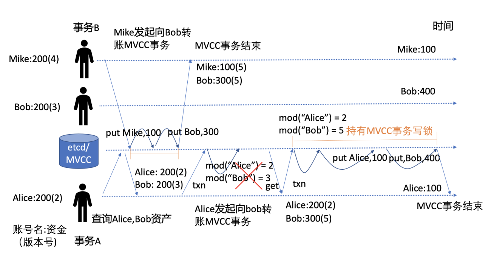

事务A，Alice往Bob转账100，事务B，Mike向Bob转账100，两个事务同时发起转账操作

一开始，Mike版本号（mod_revision）是4，Bob版本号是3，Alice版本号是2，资产各自200。为了防止并发写事务冲突，etcd在一个写事务开始时，会独占一个MVCC读写锁

事务A和B会先去etcd查询当前Alice和Bob的资产版本号，用于在事务提交时做冲突检测。在事务A和B查询后，事务B加入先获得MVCC写锁并完成转账事务，Mike和Bob账号资产分别为100,300，版本号都是5（图里是5，我这里是12）

事务B完成后，事务A获得写锁，开始执行事务

事务A，期望的Alice版本号应该为2，Bob为3，但是实际上是5，那就重新获取Alice和Bob的资产版本号，再次执行事务，直到成功为止

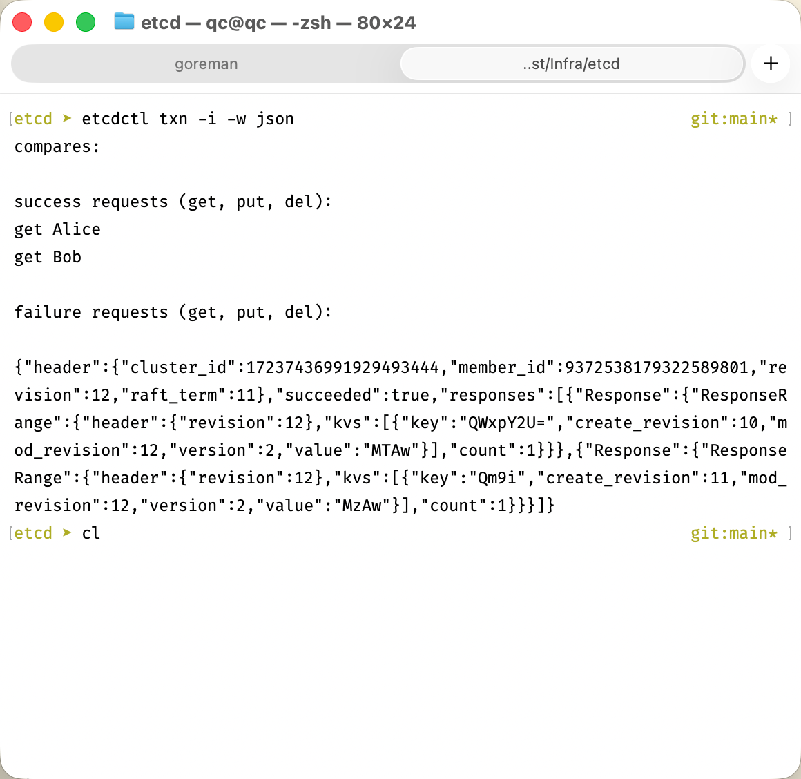

输出不够美观，搞个终端函数

```zsh
etcdtxn() {
  local raw
  raw=$(etcdctl txn -i -w json 2>&1)

  # 提取最后以 { 开头的纯 JSON 行（忽略所有提示文本）
  local json
  json=$(echo "$raw" | grep -E '^\{' | tail -n 1)

  if [ -n "$json" ]; then
    echo "$json" | jq -r '
      "Succeeded: \(.succeeded)",
      "Revision: \(.header.revision)",
      if .succeeded then
        if (.responses | length) > 0 then
          .responses[]
          | .Response.ResponseRange.kvs // empty
          | .[]
          | "\(.key | @base64d): \(.value | @base64d) (mod: \(.mod_revision), ver: \(.version))"
        else
          "No results in success branch (e.g., only put/del)"
        end
      else
        "Transaction failed (check compares)"
      end
    '
  else
    # 万一没提取到 JSON，直接显示原始输出（极少发生）
    echo "=== No JSON detected (possible error) ==="
    echo "$raw"
    echo "=== end raw ==="
  fi
}
```
美化后的效果图
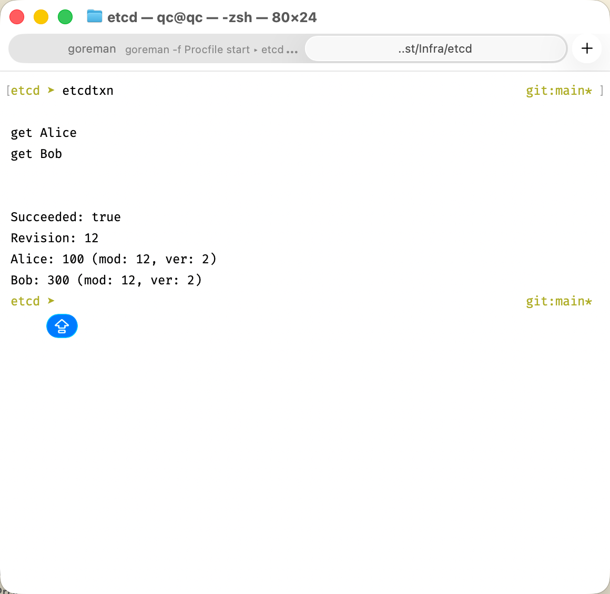

事务A完成后，B事务查找Compares会失败

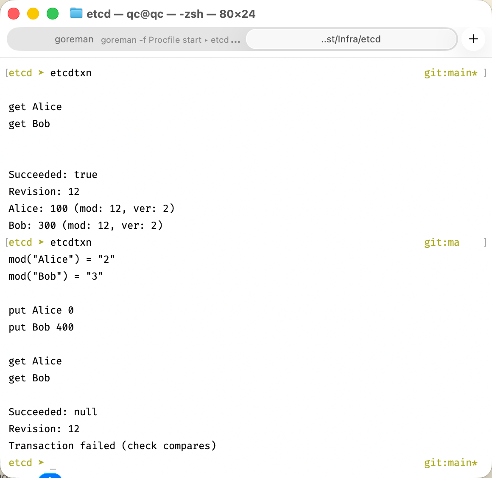

重新查找得到mod_revision为12，然后直接用12来执行

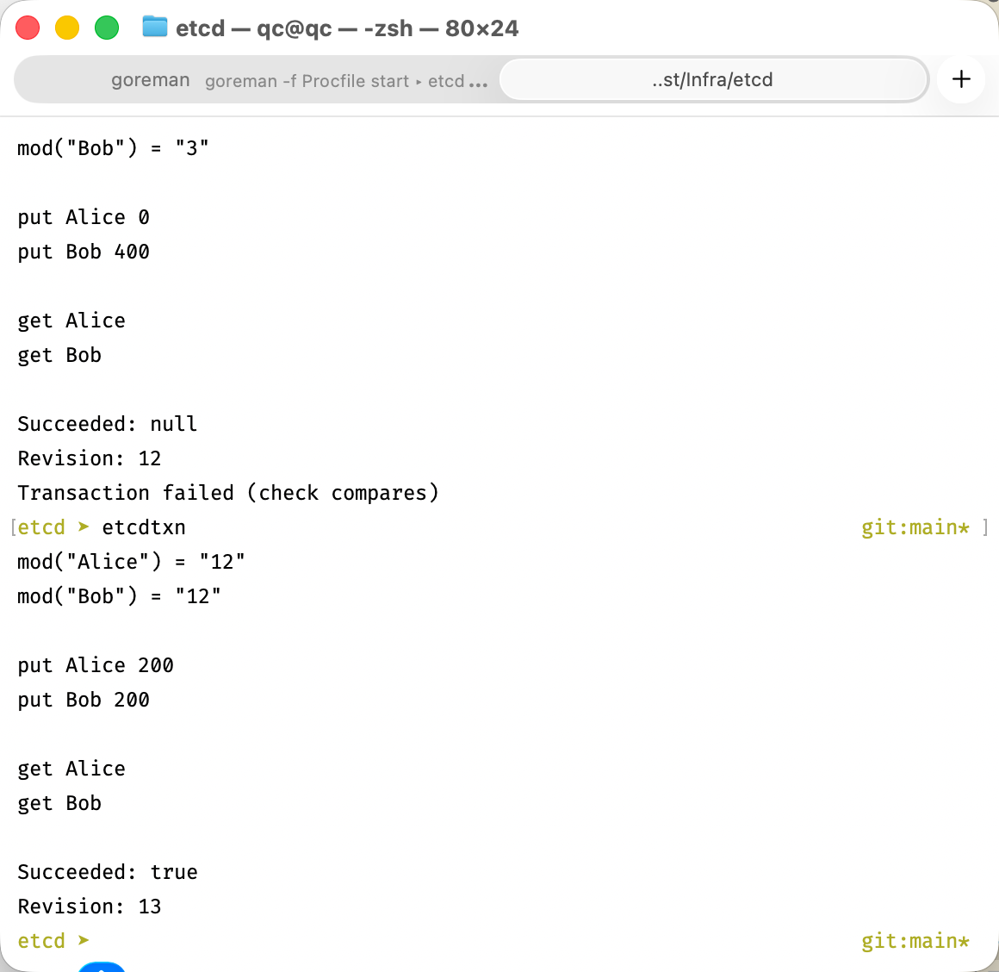

## boltdb
etcd数据存储在boltdb上，boltdb是一个用Go语言编写的，基于B+树实现的，一个简单的、嵌入式的、持久化的KV数据库

### boltdb磁盘布局
boltdb文件指的是在etcd数据目录下的member/snap/db的文件，etcd的key-value、lease、meta、member、cluster、auth等所有数据存储在里面。etcd启动的时候，会通过mmap机制将db文件映射到内存，后续可从内存中快速读取文件中的数据。写请求通过fwrite和fdatasync来写入、持久化到磁盘中

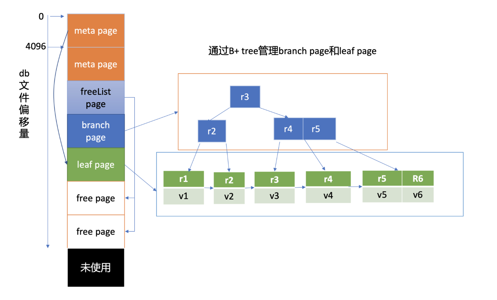

文件的内容由若干个page组成，一般情况下page size为4KB

page按照功能可分为元数据页（meta page）、B+ tree索引节点页（branch page）、B+ tree叶子节点（leaf page）、空闲页管理页（freelist page）、空闲页（free page）

文件最开头的两个page是固定的db元数据meta page，空闲页管理页记录了db中哪些页是空闲的、可使用的。索引节点页保存了B+ tree的内部节点，他们记录了key值，叶子节点页记录了B+ tree中的key-value和bucket数据

boltdb逻辑上是通过B+ tree来管理branch/leaf page，实现快速查找、写入key-value数据

### boltdb API
boltdb提供了非常简单的API给上层业务使用，当我们执行一个put hello为world命令时，boltdb实际写入的key是版本号，value为mvccpb.KeyValue结构体

假设往key bucket写入一个key为r94，value为world的字符串，其核心代码如下:
```go
// 打开boltdb文件，获取db对象
db,err := bolt.Open("db"， 0600， nil)
if err != nil {
   log.Fatal(err)
}
defer db.Close()
// 参数true表示创建一个写事务，false读事务
tx,err := db.Begin(true)
if err != nil {
   return err
}
defer tx.Rollback()
// 使用事务对象创建key bucket
b,err := tx.CreatebucketIfNotExists([]byte("key"))
if err != nil {
   return err
}
// 使用bucket对象更新一个key
if err := b.Put([]byte("r94"),[]byte("world")); err != nil {
   return err
}
// 提交事务
if err := tx.Commit(); err != nil {
   return err
}
```

### 核心数据结构介绍
boltdb整个文件是由一个个page组成。最开头的两个page描述db元数据信息，而它正是在client调用boltdb Open API时被填充的

boltdb本身自带了一个工具bbolt，它可以按页打印出db文件的十六机制内容

`go install go.etcd.io/bbolt/cmd/bbolt@latest`

`bbolt dump ./infra1.etcd/member/snap/db 0`

相关结果
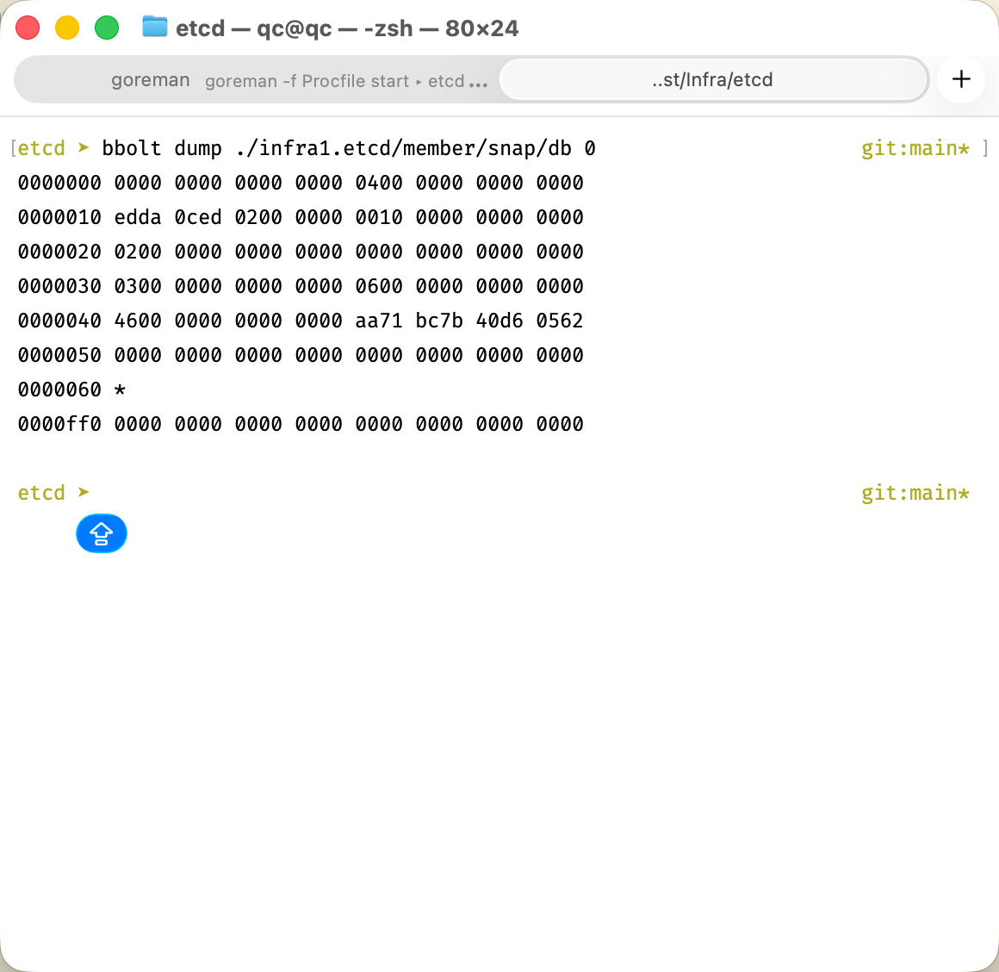

解释说明
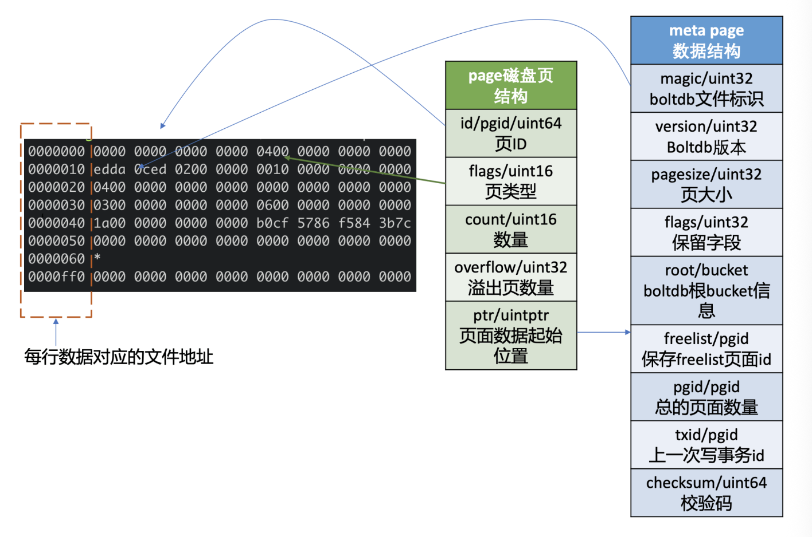

### page磁盘页结构
其由页ID（id）、页类型（flags）、数量（count）、溢出页数量（overflow）、页面数据起始位置（ptr）字段组成

页类型目前有如下四种:
1. 0x01: branch page
2. 0x02: leaf page
3. 0x04: meta page
4. 0x10: freelist page
数量字段仅在页类型为leaf和branch时生效，溢出页数量是指当前页面数据放不下的时候，需要向后再申请overflow个连续页面使用，页面数据起始位置指向page的载体数据，比如meta page、branch/leaf等page的内容

### meta page数据结构
前两页是固定存储db元数据的页（meta page），其由boltdb的文件标识（magic）、版本号（version）、页大小（pagesize）、boltdb的根bucket信息（root bucket）、freelist页面ID（freelist）、总的页面数量（pgid）、上一次写事务（txid）、校验码（checksum）组成

### bucket数据结构
可以使用bbolt buckets命令，输出一个db文件的bucket列表。执行完此命令后，可以看到auth、lease、meta等熟悉的bucket，它们都是etcd默认创建的

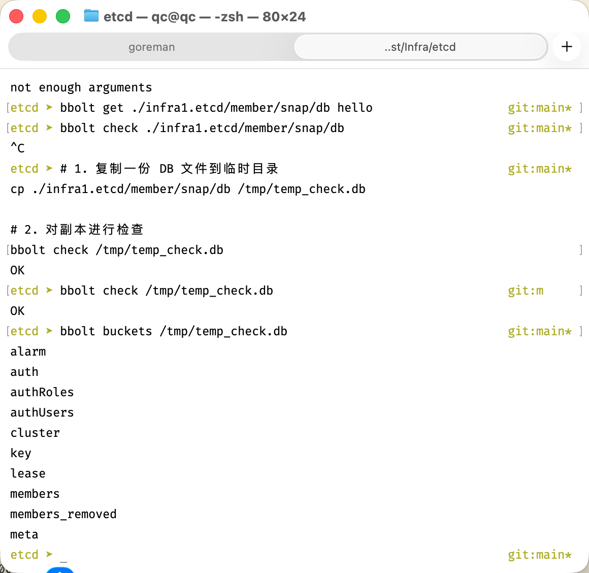

meta page中，有一个名为root、类型bucket的重要数据结构，由root和sequence两个字段组成，root标识该bucket根节点的page id

meta page中的bucket.root字段，存储的是db的root bucket页面信息，上面看到的key、lease、auth等bucket都是root bucket的子bucket

```go
type bucket struct {
	root pgid // 根节点的page id
	sequence uint64 // 序列号
}
```

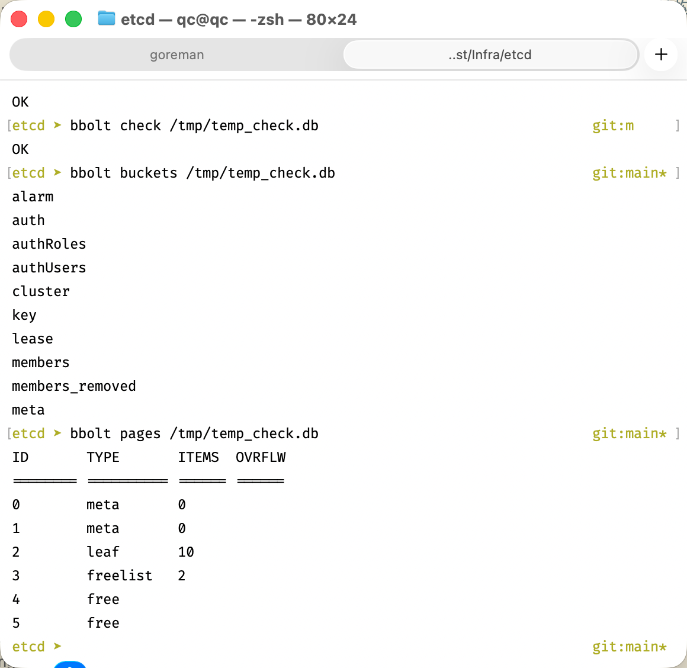

meta page十六进制图中，第三行就是描述root bucket信息，其指向的page id为4，从上图可以知道是 leaf page，当bucket比较少时，子bucket数据可直接从meta page里指向的leaf page中找到

### leaf page
leaf page的磁盘布局如下图所示，前半部分是leafPageElement数组，后半部分是key-value数据

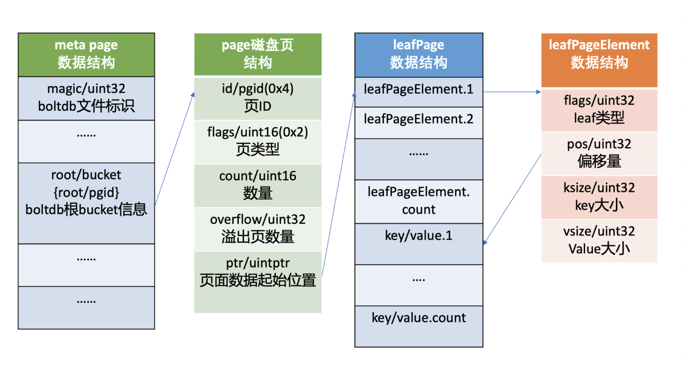

leafPageElement包含leaf page的类型flags，通过它可以区分存储的是bucket名称还是key-value数据

当flag是bucketLeafFlag（0x01）时，表示存储的是bucket数据，否则存储的是key-value数据，leafPageElement还含有key-value的读取变异量，key-value大小，根据偏移量和key-value大小，就可以方便地从leaf page中解析出所有key-value对

当存储的是bucket数据的时候，key是bucket的名称，value是bucket结构信息。bucket结构信息含有root page信息，通过root page（基于B+ tree查找算法），可以快速找到存储在这个bucket下面的key-value数据所在页面

boltdb还实现了inline bucket，在满足一些条件限制的情况下，可以将小的子bucket内嵌在它的父叶子结点上，友好的支持了大量小bucket

### branch page
boltdb采用了B+ Tree来高效管理所有bucket和key-value数据，因此它可以支持大量的bucket和key-value，只不过B+ tree的根节点不再直接指向leaf page，而是branch page索引节点页。branch page flags为0x01

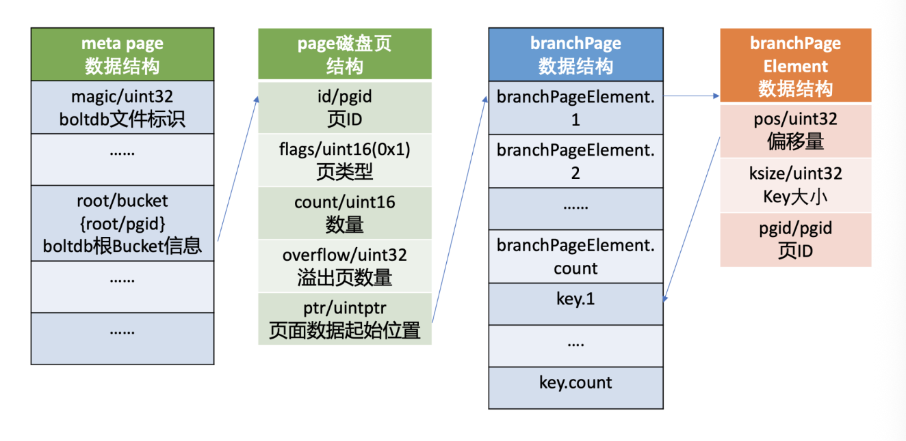

branchPageElement包含key的读取偏移量、key大小、子节点的page id，根据偏移量和key大小，就可以方便的从branch page中解析出所有key，然后二分搜索匹配key，获取其子节点page id，递归搜索，直到从bucketLeafFlag类型的leaf page中找到目的bucket name

boltdb在内存中使用了一个名为 node 的数据结构，来保存page反序列化的结果
```go
func (n *node) read(p *page) {
   n.pgid = p.id
   n.isLeaf = ((p.flags & leafPageFlag) != 0)
   n.inodes = make(inodes, int(p.count))

   for i := 0; i < int(p.count); i++ {
      inode := &n.inodes[i]
      if n.isLeaf {
         elem := p.leafPageElement(uint16(i))
         inode.flags = elem.flags
         inode.key = elem.key()
         inode.value = elem.value()
      } else {
         elem := p.branchPageElement(uint16(i))
         inode.pgid = elem.pgid
         inode.key = elem.key()
      }
   }
```

### freelist
boltdb通过meta page中的freelist来管理页面的分配，freelist page中记录了哪些页是空闲的。当在boltdb中删除大量数据时，其对应的page就会被释放，页id存储到freelist所指向的空闲页中，写数据的时候，可以直接从空闲页中申请页面使用

之前的图中 第四行 就是描述freelist信息，page id为3，通过bbolt page命令查看3号page内容，它会记录空闲页（4，5）相关信息

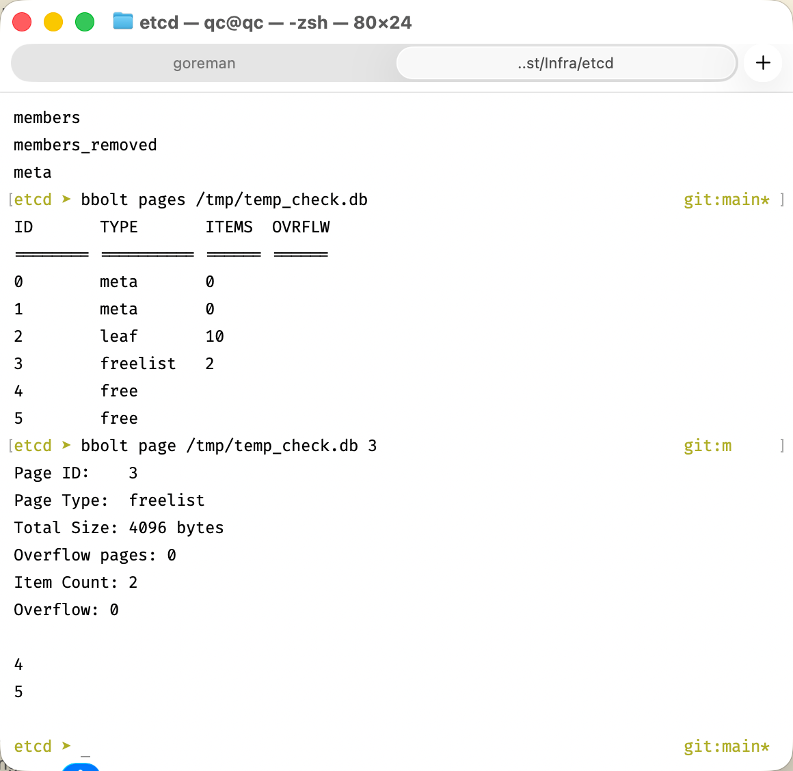

freelist page存储结构如下所示，pageflags为0x10，表示freelist类型的页，ptr指向空闲页id数组，其实在boltdb中支持通过多种数据结构（数组和hashmap）来管理free page，这里是数组

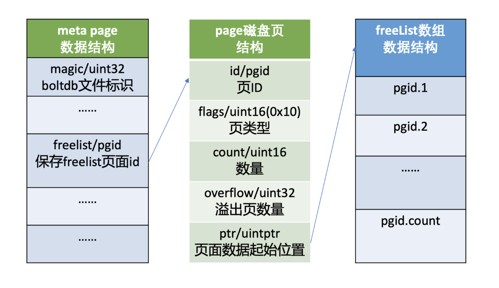

### Open原理
boltdb Open API首先会打开db文件并对其增加文件锁，目的是防止其他进程也以读写模式打开它后，操作meta和fre page，导致db文件损坏

boltdb会通过mmap将db文件映射到内存中，并读取两个meta page到db对象实例中，然后校验meta page的magic、version、checksum是否有效，若两个meta page都无效，那么db文件就出现了损坏，导致异常退出

### Put原理

根据我们上面介绍的bucket的核心原理，它首先是根据meta page中记录root bucket的root page，按照B+ tree的查找算法，从root page递归搜索到对应的叶子节点page面，返回key名称、leaf类型

如果leaf类型为bucketLeafFlag，且key相等，那么说明已经创建过，不允许bucket重复创建，结束请求。否则往B+ tree中添加一个flag为bucketLeafFlag的key，key名称为bucket name，value为bucket的结构

创建完bucket后，就可以通过bucket的Put API发起一个Put请求更新数据。它的核心原理跟bucket类似，根据子bucket的root page，从root page递归搜索此key到leaf page，如果没有找到，则在返回的位置处插入新key和value

boltdb在内存中通过node数据结构来存储page磁盘页内容，它记录了key-value数据、page id、parent及children的node、B+ tree是否需要进行重平衡和分裂操作等信息。因此，当我们执行完一个put请求时，它只是将值更新到boltdb的内存node数据结构里，并未持久化到磁盘中。

### 事务提交原理

当代码执行tx.Commit API时，boltdb才会将上面保存的node内存数据结构中的数据，持久化到boltdb中

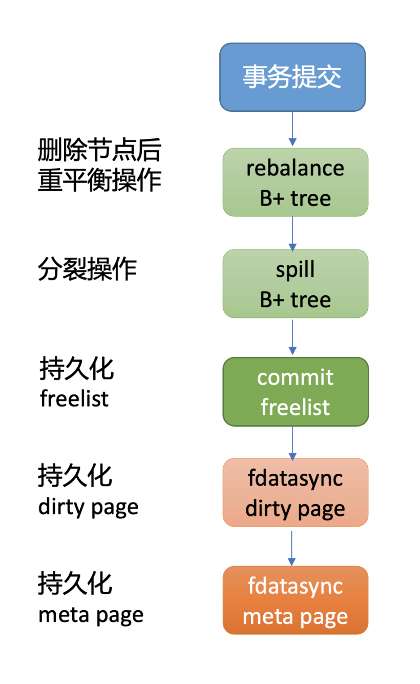

插入了一个新的元素在B+ tree的叶子节点，它可能已不满足B+ tree的特性，因此事务提交时，第一步首先要调整B+ tree，进行重平衡、分裂操作，使其满足B+ tree树的特性。

在重平衡、分裂过程中可能会申请、释放free page，freelist所管理的free page也发生了变化。因此事务提交的第二步，就是持久化freelist。

注意，在etcd v3.4.9中，为了优化写性能等，freelist持久化功能是关闭的。etcd启动获取boltdb db对象的时候，boltdb会遍历所有page，构建空闲页列表。

事务提交的第三步就是将client更新操作产生的dirty page通过fdatasync系统调用，持久化存储到磁盘中。

最后，在执行写事务过程中，meta page的txid、freelist等字段会发生变化，因此事务的最后一步就是持久化meta page。

**事务提交过程中若持久化key-value数据到磁盘成功了，此时突然掉电，元数据还未持久化到磁盘，那么db文件会损坏吗？数据会丢失吗？ 为什么boltdb有两个meta page呢？**

1. boltbd采用的是 Copy-On-Write(COW)机制，写数据不会覆盖原来的，新找一块新的空闲页写入。如果写元数据meta还没开始或没写完掉电时，磁盘上确实会多一些新的KV数据页，但旧的Meta Page依然指向旧的 B+ Tree根节点；当数据库重启时，会读取旧的MetaPage
2. 两个Meta Page就是为了应对最极端的风险: 写 Meta Page那一瞬间掉电。BoltDB在文件头的第0页和第1页各放了一个Meta Page，事务ID为N是写0，N+1时写1，每个Meta Page都有一个校验位。当启动时，boltdb会同时读取这两个Meta Page，如果都有效，那就选择 Transaction ID 更大的那个，如果其中一个因为掉电导致写入受损，会自动回滚使用另一个**旧但完整的Meta Page**

## Compact

etcd中的每一次更新、删除key操作，treeIndex的keyIndex索引中都会追加一个版本号，在boltdb中会生成一个新版本boltdb key和value。也就是随着不停更新、删除，etcd进程内存占用和db文件就会越来越大。很显然，这会导致etcd OOM和db大小增长到最大配额，最终不可写

### 整体架构

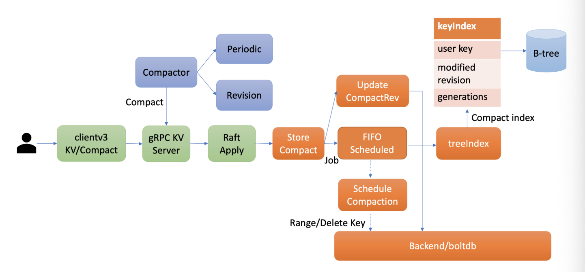

首先可以通过client API发起人工的压缩（Compact）操作，也可以配置自动压缩策略。在自动压缩策略中，可以根据业务场景选择合适的压缩模式。目前etcd支持两种压缩模式，分别是时间周期性压缩和版本号压缩

当通过API发起一个Compact请求后，KV Server收到Compact请求提交到Raft模块处理，在Raft模块中提交后，Apply模块就会通过MVCC模块的Compact接口执行此压缩任务

Compact接口首先会更新当前server已压缩的版本号，并将耗时昂贵的压缩任务保存到FIFO队列中异步执行。压缩任务执行时，它首先会压缩treeIndex模块中的keyIndex索引，其次会遍历boltdb中的key，删除已废弃的key

### 压缩特性初体验
在使用etcd过程中，当遇到「etcdserver: mvcc: database space exceeded」错误时，如果你未开启压缩策略导致db大小达到配额，这时可以使用etcdctl compact命令来主动触发压缩操作，回收历史版本

```sh
# 获取etcd当前版本号revision
rev = $(etcdctl endpoint status --write-out="json" | egrep -o '"revision":[0-9]*' | egrep -o '[0-9].*')
echo $rev

# 执行压缩操作，指定压缩的版本号为当前版本号
etcdctl compact $rev

# 压缩一个☝🏻已经压缩的版本号
etcdctl compact $rev

# 压缩一个比当前版本号大的版本号
etcdctl compact $((rev + 1))
```

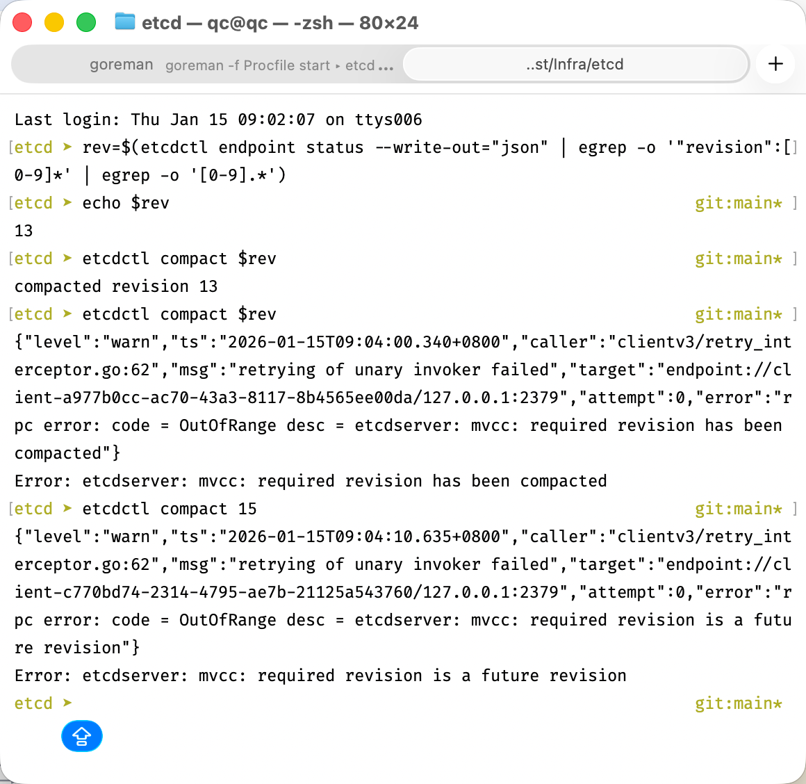

如果压缩命令传递的版本号小于等于当前etcd server记录的压缩版本号，etcd server会返回已压缩错误「mvcc: required revision has been compacted」给client。如果版本号大于当前etcd server最新的版本号，etcd server则会返回一个未来版本号错误给client「mvcc: required revision is a future revision」

这里压缩的本质是**回收历史版本**，目标对象仅是**历史版本**，不包括一个key-value数据的最新版本，因此可以放心执行压缩命令，不会删除最新的数据。但是Watch特性中的历史版本数据同步，依赖于MVCC中是否还保存了相关数据，所以不建议每次简单粗暴地回收所有历史版本

在生产环境中，建议精细化的控制历史版本数

1. 使用etcd server自带的自动压缩机制，根据业务场景，配置合适的压缩策略即可

2. 基于etcd的Compact API，在业务逻辑代码中、或定时任务中主动触发压缩操作，但是dev需要确保发起Compact操作的程序高可用，压缩的频率、保留的历史版本在合理范围内，并最终能使etcd的 db 大小保持平稳

建议使用etcd自带的压缩机制，它支持两种模式，分别是按时间周期性压缩和保留版本号的压缩，配置相应策略后，etcd节点会自动化的发起Compact操作

### 周期性压缩

etcd server 提供了配置压缩模式和保留时间的参数
```sh
--auto-compaction-retention '0'
Auto compaction retention length. 0 means disable auto Compaction.
--auto-compaction-mode 'periodic'
Interpret 'auto-Compaction-retention' one of: periodic|revision.
```

auto-compaction-mode为periodic时，它表示启用时间周期性压缩，auto-compaction-retention为保留的时间的周期，比如1h

auto-compaction-mode为revision时，它表示启用版本号压缩模式，auto-compaction-retention为保留的历史版本号数，比如10000

如果 etcd server 的 auto-compaction-retention为「0」，将关闭自动压缩策略

etcd server启动后，根据配置的模式periodic，会创建periodic Compactor，它会异步的获取、记录过去一段时间的版本号。periodic Compactor组件获取设置的压缩间隔参数1h，并将其划分成10个区间，也就是每个区间6分钟。每隔6分钟，它会通过etcd MVCC模块的接口获取当前的server版本号，追加到rev数组中

因为只需要保留过去1小时的历史版本，periodic Compactor组件会通过当前时间减去上一次成功执行Compact操作的时间，如果间隔大于1小时，它就会取出rev数组的首元素，通过etcd server的Compact接口，发起压缩操作

### 版本号压缩

当请求比较多，可能产生比较多的历史版本导致db增长时，或者不确定配置periodic周期为多少才是最佳的时候，可以通过设置压缩模式为revision，指定保留的历史版本号数。如果希望etcd尽量只保存1万个历史版本，那么可以指定compaction-mode为revision，auto-compaction-retention为10000

etcd启动后会根据压缩模式revision，创建revision Compactor。revision Compactor会根据设置的保留版本号数，每隔5分钟定时获取当前server的最大版本号，减去想保留的历史版本数，然后通过etcd server的Compact接口发起压缩操作即可

```go
# 获取当前版本号，减去保留的版本号数
rev := rc.rg.Rev() - rc.retention
# 调用server的Compact接口压缩
_，err := rc.c.Compact(rc.ctx，&pb.CompactionRequest{Revision: rev})
```

### 压缩原理
MVCC模块的Compact接口首先会检查Compact请求的版本号rev是否已被压缩过，若是则返回ErrCompacted错误给client。其次会检查rev是否大于当前etcd server的最大版本号，若是则返回ErrFutureRev给client

通过检查后，Compact接口会通过boltdb的API在meta bucket中更新当前已调度的压缩版本号(scheduledCompactedRev)号，然后将压缩任务追加到FIFO Scheduled中，异步调度执行。

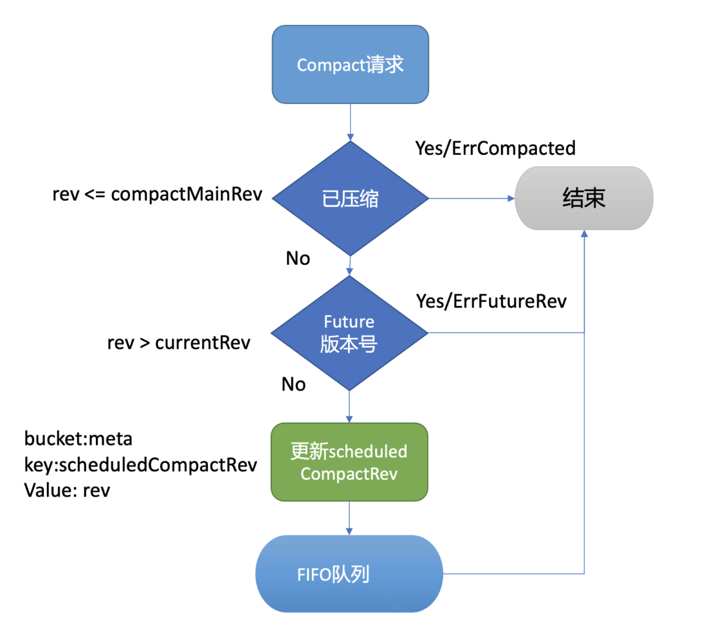

Compact接口需要持久化鵆当前已调度的压缩版本号到boltdb中，因为如果不保存，etcd在异步执行Compact任务过程中crash了，那么异常节点重启后，各个节点数据就会不一致。因此，etcd通过持久化存储scheduledCompactedRev，节点Crash重启后，会重新向FIFO Scheduled中添加压缩任务，保证各个节点间的数据一致性

treeIndex索引模块，是etcd支持保存历史版本的核心模块，每个key在treeIndex模块中都有一个keyIndex数据结构，记录其历史版本号信息

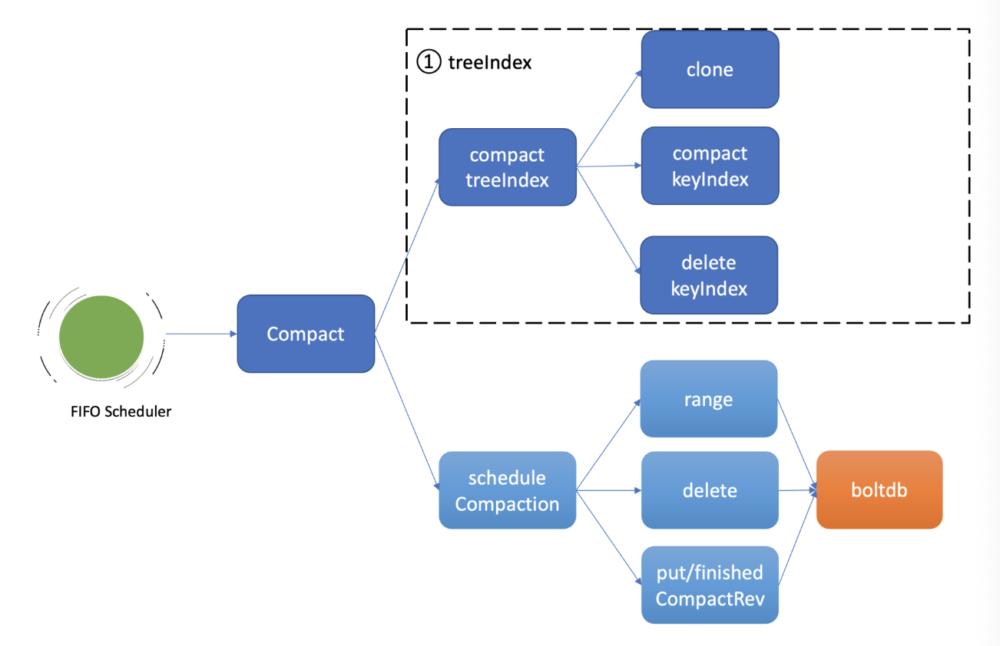

异步压缩任务的第一项工作，就是**压缩treeIndex模块中的各key的历史版本**、已删除的版本。为了避免压缩工作影响读写性能，首先会克隆一个B-tree，然后通过克隆后的B-tree遍历每一个keyIndex对象，压缩历史版本号、清理已删除的版本

假设当前压缩的版本号是CompactedRev，它会保留keyIndex中最大的版本号，移除小于等于CompactedRev的版本号，并通过一个map记录treeIndex中有效的版本号返回给boltdb模块使用。这里因为最大版本号是这个key的最新版本，移除了会导致key丢失。而Compact的目的是回收旧版本。如果keyIndex中的最大版本号被打了删除标记（tombstone），就会从treeIndex中删除这个keyIndex，否则会出现内存泄露

Compact任务执行完索引压缩后，它通过遍历B-tree、keyIndex中的所有generation获得当前内存索引模块中有效的版本号，这些信息将帮助etcd清理boltdb中的废弃历史版本

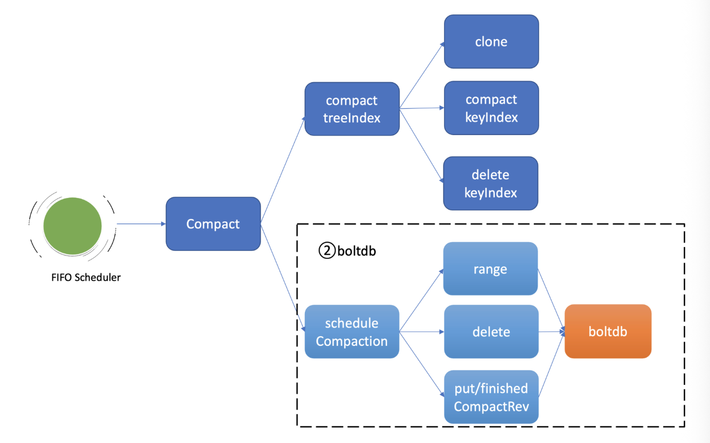

压缩任务的第二项工作，就是**清理boltdb中的废弃历史版本**。scheduleCompaction任务会根据key区间，从0到CompactedRev遍历boltdb中的所有key，通过treeIndex模块返回的有效索引信息，判断这个key是否有效，无效则调用boltdb的delete接口将key-value删除

在这过程中，scheduleCompaciton任务还会更新当前etcd已经完成的压缩版本号（finishedCompactRev），将其保存到boltdb的meta bucket中

scheduleCompaction任务遍历、删除key的过程可能会对boltdb造成压力，为了不影响读写请求，在执行过程中会通过参数控制每次遍历、删除的key数（默认为100，每批间隔10ms），分批完成boltdb key的删除操作

### 为什么压缩后db大小不减少？
boltdb将db文件划分成若干个page页，page页又有四种类型，分别是meta page、branch page、leaf page以及freelist page。branch page保存B+ tree的非叶子节点key数据，leaf page保存bucket和key-value数据，freelist会记录哪些页是空闲的

当我们通过boltdb删除大量的key，在事务提交后B+ tree经过分裂、平衡，会释放出若干branch/leaf page页面，然而boltdb并不会将其释放给磁盘，调整db大小操作是昂贵的，会对性能有较大的损害

boltdb是通过freelist page记录这些空闲页的分布位置，当收到新的写请求时，优先从空闲页数组中申请若干连续页使用，实现高性能的读写（而不是直接扩大db大小）。当连续空闲页申请无法得到满足的时候，boltdb才会通过增大db大小来补充空闲页

一般情况下，压缩操作释放的空闲页就能满足后续新增写请求的空闲页需求，db大小会趋于整体稳定

## 为啥基于Raft实现的etcd还会出现数据不一致？
现象: 用户在更新Kubernetes集群中的Deployment资源镜像后，无法创建出新Pod，Deployment控制器莫名其妙不工作了。更诡异的是，部分Node莫名奇妙消失了（其实Node在）

### 消失的Node
排查思路: APIServer -> ControllerManager -> Scheduler 等组件，之后查看 etcd 集群各节点状态，发现都没有问题

结果: 基于Raft实现的强一致性存储竟然出现不一致、数据丢失（其实并非Raft本身设计缺陷，而是实现层面的bug、边缘场景或运维问题）

备注: 上面的issue在旧版本（尤其是v3.5之前）确实存在此问题。但是最新版本已基本解决

根据etcd写流程，来排查问题
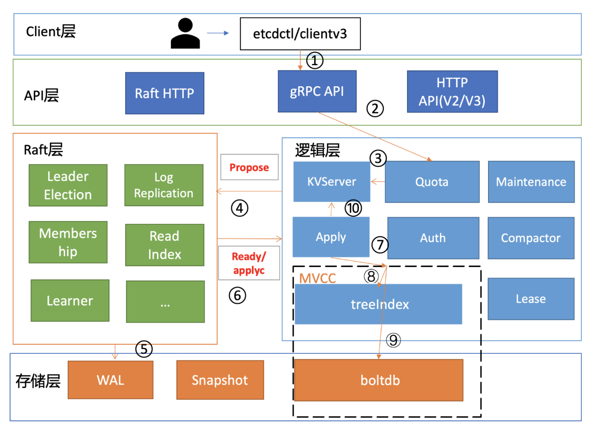

猜测:

1. etcd集群出现分裂，三个节点分裂成两个集群。APIServer配置的后端etcd server地址是三个节点，APIServer并不会检查各节点集群ID是否一致，因此如果分裂，有可能会出现数据「消失」现象

2. Raft日志同步异常，其他两个节点会不会因为Raft模块存在特殊Bug导致未收到相关日志条目？这种情况可以通过etcd自带的WAL工具来判断，其可以显示WAL日志中收到的命令（4，5，6）

3. 如果日志同步没有问题，那么是不是Apply模块出现了问题，导致日志条目未被应用到MVCC模块？（7）

4. 如果Apply模块执行了相关日志条目到MVCC模块，MVCC模块的treeIndex子模块会不会出现了特殊Bug？导致更新流程失败？（8）

5. 如果MVCC模块的treeIndex模块无异常，写请求到了boltdb存储模块，有没有可能boltdb出现了极端异常导致丢失数据呢？（9）

开始不断抽丝剥茧、明察秋毫、一步一步探寻真相

首先从故障定位第一工具「日志」开始。查看etcd节点日志没发现任何异常日志，但是当查看APIServer日志的时候，发现持续出现「required revision has been compacted」错误，原因一般是「APIServer请求etcd版本号被压缩」

通过如下命令查看etcd节点的详细状态信息

```sh
etcdctl endpoint status --cluster -w json | jq
```

1. 判断集群是否分裂，集群中的所有节点 cluster id 是否一致

2. 初步判断集群Raft日志条目同步正常，raftIndex表示Raft日志索引号，raftAppliedIndex表示当前状态机应用的日志索引号（这里我本机的因为没问题，所以每个节点的raftIndex和raftAppliedIndex相同，但是三个节点的raftIndex和raftAppliedIndex不同）这两个核心字段显示三个节点相差很小，考虑到正在写入，未偏离正常范围，Raft同步Bug导致数据丢失也大概率可以排除，最好还是用WAL工具验证下现在日志条目同步和写入WAL是否正常

验证Raft日志同步正常

首先写入一个值，然后马上在各个节点上用WAL工具etcd-dump-logs搜索
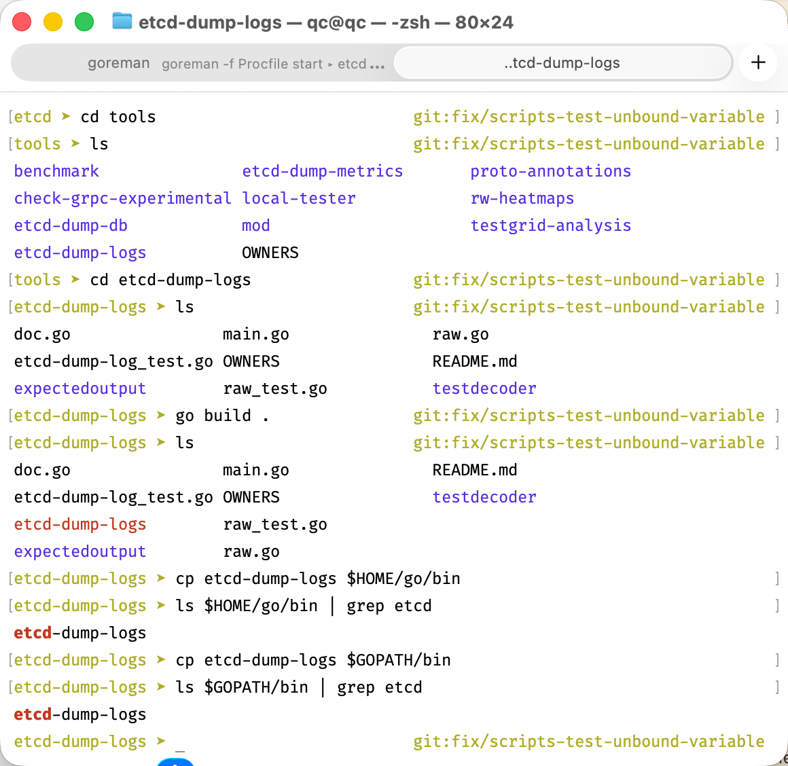

```sh
etcdctl put hello_ world_

etcd-dump-logs ./infra1.etcd/ | grep hello_

etcd-dump-logs ./infra2.etcd/ | grep hello_

etcd-dump-logs ./infra3.etcd/ | grep hello_
```

如果都能找到，那么说明日志条目同步正常

3. 观察三个节点的revision值（我本机都相同），相互之间最大差距如果过大，有明显偏离标准值

源码面前了无秘密🤫，etcd更新raftAppliedIndex核心代码如下所示。Apply流程出现逻辑错误时，并没有重试机制。etcd无论Apply流程是成功还是失败，都会更新raftAppliedIndex值。也就是说一个请求在Apply或MVCC模块即便执行失败了，都依然会更新raftAppliedIndex

```go
// ApplyEntryNormal apples an EntryNormal type Raftpb request to the EtcdServer
func （s *EtcdServer） ApplyEntryNormal（e *Raftpb.Entry） {
   shouldApplyV3 := false
   if e.Index > s.consistIndex.ConsistentIndex（） {
      // set the consistent index of current executing entry
      s.consistIndex.setConsistentIndex（e.Index）
      shouldApplyV3 = true
   }
   defer s.setAppliedIndex（e.Index）
   ....
}
```

最新版本的代码如下所示

```go
// applyEntryNormal applies an EntryNormal type raftpb request to the EtcdServer
func (s *EtcdServer) applyEntryNormal(e *raftpb.Entry, shouldApplyV3 membership.ShouldApplyV3) {
	if shouldApplyV3 {
		defer func() {
			// The txPostLockInsideApplyHook will not get called in some cases,
			// in which we should move the consistent index forward directly.
			newIndex := s.consistIndex.ConsistentIndex()
			if newIndex < e.Index {
				s.consistIndex.SetConsistentIndex(e.Index, e.Term)
			}
		}()
	}

	// raft state machine may generate noop entry when leader confirmation.
	// skip it in advance to avoid some potential bug in the future
	if len(e.Data) == 0 {
		s.firstCommitInTerm.Notify()

		// promote lessor when the local member is leader and finished
		// applying all entries from the last term.
		if s.isLeader() {
			s.lessor.Promote(s.Cfg.ElectionTimeout())
		}
		return
	}

	ar, id := apply.Apply(s.lg, e, s.uberApply, s.w, shouldApplyV3)

	// do not re-toApply applied entries.
	if !shouldApplyV3 {
		return
	}

	if ar == nil {
		return
	}

	if !errorspkg.Is(ar.Err, errors.ErrNoSpace) || len(s.alarmStore.Get(pb.AlarmType_NOSPACE)) > 0 {
		s.w.Trigger(id, ar)
		return
	}

	lg := s.Logger()
	lg.Warn(
		"message exceeded backend quota; raising alarm",
		zap.Int64("quota-size-bytes", s.Cfg.QuotaBackendBytes),
		zap.String("quota-size", humanize.Bytes(uint64(s.Cfg.QuotaBackendBytes))),
		zap.Error(ar.Err),
	)

	s.GoAttach(func() {
		a := &pb.AlarmRequest{
			MemberID: uint64(s.MemberID()),
			Action:   pb.AlarmRequest_ACTIVATE,
			Alarm:    pb.AlarmType_NOSPACE,
		}
		s.raftRequest(s.ctx, pb.InternalRaftRequest{Alarm: a})
		s.w.Trigger(id, ar)
	})
}
```

对比一下可以发现
   
   1. 重构 shouldApplyV3 的决定逻辑，更精细的控制，避免内部硬编码判断，修复了旧版本中的逻辑缺陷
   2. Consistent Index前进更加安全
   3. 更好的边缘case处理
   4. Quota报警处理更健壮

三个节点revision差异偏离标准值，恰好又说明异常etcd节点可能未成功应用日志条目到MVCC模块。所以可以通过查看MVCC的相关metrics来判断（etcd_mvcc_put_totol），来排除请求是否到了MVCC模块，事实是丢数据节点的metrics指标值的确远远落后于正常节点

所以真凶在Apply流程上，所以在Apply流程未向MVCC模块提交请求前以及可能提前返回的地方，都加上日志，然后再走一遍流程，马上出现一条错误日志「auth: revision in header is old」

写入成功还跟client连接的节点有关，连接不同节点会出现不同的写入结果

数据不一致是因为鉴权版本号不一致导致的，节点在Apply流程的时候，会判断Raft日志条目中的请求鉴权版本号是否小于当前鉴权版本号，如果小于就拒绝写入

那就得去看可能修改鉴权版本号的源码分析了🧐，只有鉴权相关的接口才会修改它，要解决就再次复现😅

要基于混沌工程，不断模拟真实业务场景、访问鉴权接口、注入故障（停止etcd进程等）

真相大白: 当无意间重启etcd的时候，如果最后一条命令是鉴权相关的，它并不会持久化consistent index（KV接口会持久化）consistent key具有幂等作用，可防止命令重复执行，consistent index的未持久化最终导致鉴权命令重复执行。恰好鉴权模块的RoleGrantPermission接口未实现幂等，重复执行会修改鉴权版本号。一连串的Bug最终导致鉴权号出现不一致，最后又放大成MVCC模块的key-value数据不一致，导致严重的数据损坏。etcd v3.3.21和v3.4.8后的版本已经修复此Bug。

### 为什么会不一致
etcd各个节点数据一致性是基于raft算法的日志复制实现的，etcd是个基于复制状态机实现的分布式系统。下图是分布式复制状态机原理架构，核心由三个组件组成，一致性模块、日志、状态机，其工作流程如下：

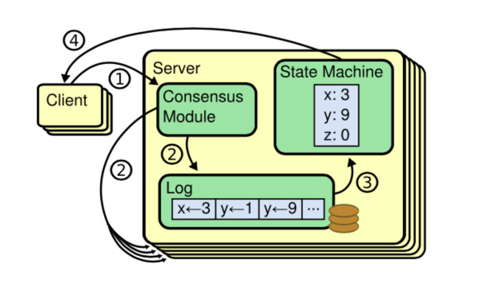

1. client发起一个写请求（put x = 3）

2. server向一致性模块（假设是Raft）提交请求，一致性模块生成一个写提案日志条目。如果server是Leader，把日志条目广播给其他节点，并持久化日志条目到WAL中

3. 当一半以上的节点持久化日志条目后，Leader的一致性模块将此日志条目标记为已提交（committed），并通知其他节点提交

4. server从一致性模块获取已经提交的日志条目，异步应用到状态机持久化存储中（boltdb等），然后返回给client

在基于复制状态机实现的分布式存储系统中，Raft等一致性算法只能确保各个节点的日志一致性，也就是流程2

对于流程3来说，server从日志里面获取已经提交的日志条目，将其应用到状态机的过程，跟Raft算法本身无关，属于server本身的数据存储逻辑

也就是说可能存在「server应用日志到状态机失败，进而导致各个节点出现数据不一致」的情况，但是这个不一致并非Raft模块导致的，它已超过Raft模块的功能界限

Node莫名奇妙消失，就是应用日志条目到状态机流程中，出现逻辑错误，导致key-value数据未能持久化存储到boltdb中

### 其他典型不一致Bug

这个故障对外的表现也是令人摸不着头脑，有服务不调度的、有service下的endpoint不更新的。最终我经过一番排查发现，原来数据不一致是由于etcd 3.2和3.3版本Lease模块的Revoke Lease行为不一致造成

etcd 3.2版本的RevokeLease接口不需要鉴权，而etcd 3.3 RevokeLease接口增加了鉴权，因此当你升级etcd集群的时候，如果etcd 3.3版本收到了来自3.2版本的RevokeLease接口，就会导致因为没权限出现Apply失败，进而导致数据不一致，引发各种诡异现象

除了重启etcd、升级etcd可能会导致数据不一致，defrag操作也可能会导致不一致

对一个defrag碎片整理来说，它是如何触发数据不一致的呢？ 触发的条件是defrag未正常结束时会生成db.tmp临时文件。这个文件可能包含部分上一次defrag写入的部分key/value数据，而etcd下次defrag时并不会清理它，复用后就可能会出现各种异常场景，如重启后key增多、删除的用户数据key再次出现、删除user/role再次出现等

etcd 3.2.29、etcd 3.3.19、etcd 3.4.4后的版本都已经修复这个Bug。建议根据自己实际情况进行升级，否则踩坑后，数据不一致的修复工作是非常棘手的，风险度极高。

「**算法一致性不代表一个庞大的分布式系统工程实现中一定能保障一致性，工程实现上充满着各种挑战，从不可靠的网络环境到时钟、再到人为错误、各模块间的复杂交互等，几乎没有一个存储系统能保证任意分支逻辑能被测试用例100%覆盖。**」🤯

复制状态机在给我们带来数据同步的便利基础上，也给上层逻辑开发提出了高要求。也就是说任何接口逻辑变更etcd需要保证兼容性，否则就很容易出现Apply流程失败，导致数据不一致

### 最佳实践

#### 开启etcd的数据毁坏检测功能

etcd不仅支持在启动的时候，通过–experimental-initial-corrupt-check参数检查各个节点数据是否一致，也支持在运行过程通过指定–experimental-corrupt-check-time参数每隔一定时间检查数据一致性

其实无非就是想确定boltdb文件里面的内容跟其他节点内容是否一致。因此我们可以枚举所有key value，然后比较即可

etcd的实现也就是通过遍历treeIndex模块中的所有key获取到版本号，然后再根据版本号从boltdb里面获取key的value，使用crc32 hash算法，将bucket name、key、value组合起来计算它的hash值

如果开启了–experimental-initial-corrupt-check，启动的时候每个节点都会去获取peer节点的boltdb hash值，然后相互对比，如果不相等就会无法启动

而定时检测是指Leader节点获取它当前最新的版本号，并通过Raft模块的ReadIndex机制确认Leader身份。当确认完成后，获取各个节点的revision和boltdb hash值，若出现Follower节点的revision大于Leader等异常情况时，就可以认为不一致，发送corrupt告警，触发集群corruption保护，拒绝读写

### 应用层的数据一致性检测

数据不一致在MVCC、boltdb会出现很多种情况，比如说key数量不一致、etcd逻辑时钟版本号不一致、MVCC模块收到的put操作metrics指标值不一致等等。因此我们的应用层检测方法就是基于它们的差异进行巡检

首先针对key数量不一致的情况，我们可以实现巡检功能，定时去统计各个节点的key数，这样可以快速地发现数据不一致，从而及时介入，控制数据不一致影响，降低风险

统计节点key数时，记得查询的时候带上WithCountOnly参数。etcd从treeIndex模块获取到key数后就及时返回了，无需访问boltdb模块。如果数据量非常大（涉及到百万级别），那即便是从treeIndex模块返回也会有一定的内存开销，因为它会把key追加到一个数组里面返回

而在WithCountOnly场景中，我们只需要统计key数即可。对百万级别的key来说，WithCountOnly时内存开销从数G到几乎零开销，性能也提升数十倍

其次我们可以基于endpoint各个节点的revision信息做一致性监控。一般情况下，各个节点的差异是极小的

我们还可以基于etcd MVCC的metrics指标来监控。比如上面提到的mvcc_put_total，理论上每个节点这些MVCC指标是一致的，不会出现偏离太多

### 定时数据备份

etcd数据不一致的修复工作极其棘手。发生数据不一致后，各个节点可能都包含部分最新数据和脏数据。如果最终无法修复，那就只能使用备份数据来恢复了

因此备份特别重要，备份可以保障我们在极端场景下，能有保底的机制去恢复业务。请记住，在做任何重要变更前一定先备份数据，以及在生产环境中建议增加定期的数据备份机制（比如每隔30分钟备份一次数据）

可以使用开源的etcd-operator中的backup-operator去实现定时数据备份，它可以将etcd快照保存在各个公有云的对象存储服务里面

### 良好的运维规范

首先是确保集群中各节点etcd版本一致。若各个节点的版本不一致，因各版本逻辑存在差异性，这就会增大触发不一致Bug的概率

其次是优先使用较新稳定版本的etcd。像上面提到的3个不一致Bug，在最新的etcd版本中都得到了修复。可以根据自己情况进行升级，以避免下次踩坑。同时可根据实际业务场景以及安全风险，来评估是否有必要开启鉴权，开启鉴权后涉及的逻辑更复杂，有可能增大触发数据不一致Bug的概率

最后是在升级etcd版本的时候，需要多查看change log，评估是否存在可能有不兼容的特性。在你升级集群的时候注意先在测试环境多验证，生产环境务必先灰度、再全量。

## 为啥etcd社区建议boltdb大小不超过8G?

1. **启动耗时**: etcd启动的时候，需要打开boltdb db文件，读取db文件中所有key-value数据，用于重构内存treeIndex模块。因此在大量key导致db文件过大的场景中，会导致etcd启动较慢

2. **节点内存配置**: etcd在启动时会通过mmap将db文件映射到内存中，如果节点可用内存不足，小于db文件大小时，可能会出现缺页中断，导致服务稳定性、性能下降

3. **treeIndex索引性能**: 因etcd不支持数据分片，内存中的treeIndex如果保存了几十万到上千万的key，这户增加查询、修改操作的整体延迟

4. **boltdb性能**: 大db文件场景会导致事务提交耗时增长、抖动

5. **集群稳定性**: 大db文件场景下，无论是百万级别小key还是上千个大value场景，一旦出现expensive request后，很容易出现etcd OOM、节点带宽满而丢包

6. **快照**: 当Follower节点落后Leader较多数据的时候，会触发Leader生成快照重建发送给Follower节点，Follower基于它进行还原重建操作。较大的db文件会导致Leader发送快照需要消耗较多的CPU、网络带宽资源，同时Follower节点重建还原满

### 构建大集群
首先通过一些列 benchmark 命令，向一个8核32G的3节点的集群写入120万左右key。key大小为32，value大小为10k

```bash
./benchmark put --key-size 32 --val-size 10240 --total 1000000 --key-space-size 2000000 --clients 50 --conns 50
```

执行完上面benchmark命令后，db size大概可以达到14G，总key数可以达到120万

### 启动耗时
通过对etcd启动流程增加耗时统计，核心瓶颈主要在于打开db文件和重建内存treeIndex模块

treeIndex模块维护了用户key与boltdb key的映射关系，boltdb的key、value又包含了构建treeIndex的所需的数据。etcd启动的时候，会启动不同角色的goroutine并发完成treeIndex构建

**首先是主goroutine**。它的职责是遍历boltdb，获取所有key-value数据，并将其反序列化成etcd的mvccpb.KeyValue结构。核心原理是基于etcd存储在boltdb中的key数据有序性，按版本号从1开始批量遍历，每次查询10000条key-value记录，直到查询数据为空

**其次是构建treeIndex索引的goroutine**。它从主goroutine获取mvccpb.KeyValue数据，基于key、版本号、是否带删除标识等信息，构建keyIndex对象，插入到treeIndex模块的B-tree中

因可能存在多个goroutine并发操作treeIndex，treeIndex的Insert函数会加全局锁。etcd启动时只有一个**构建treeIndex索引的goroutine**，因此key多时，会比较慢

```go
func (ti *treeIndex) Insert(ki *keyIndex) {
	ti.Lock()
	defer ti.Unlock()
	ti.tree.ReplaceOrInsert(ki)
}
```

### 节点内存配置
etcd进程重启完成后，在没有任何读写QPS情况下，有可能出现etcd所消耗内存比db大小还大一点的情况

etcd在启动的时候，会通过boltdb的Open API获取数据库对象，而Open API它会通过mmap机制将db文件映射到内存中

由于etcd调用boltdb Open API的时候，设置了mmap的MAP_POPULATE flag，它会告诉Linux内核预读文件，将db文件全部从磁盘加载到物理内存中

在内存充足的情况下，启动后会看到etcd占用内存，一般是db文件大小与内存treeIndex之和。client后续发起对etcd的读操作，可直接通过内存获取boltdb的key-value数据，不会产生任何磁盘IO，具备良好的读性能、稳定性

而当db文件大小超过节点内存配置时，如果查询的key所相关的branch page、leaf page不在内存中，就会触发缺页中断，导致读延迟抖动、QPS下降

所以，为了保证etcd集群的稳定性，需要etcd节点内存规格要大于etcd db文件大小

### treeIndex

当往集群不停写入数据之后，再读取一个key范围操作的延时会出现一定程度上升。通过trace特性，来定位、分析请求耗时过长问题。主要原因大概就是此次查询设计的key数较多

### boltdb性能

当 DB 文件大小持续增长到 16G 以及更大后，在较老的 etcd 版本（例如 3.4 及更早）中，从 etcd 事务提交监控 metrics 可能会观察到，boltdb 在提交事务时偶尔出现较高延时

事务提交延时抖动的原因主要是在 B+ tree 树的重平衡和分裂过程中，它需要从 freelist 中申请若干连续的 page 存储数据，或释放空闲的 page 到 freelist

freelist 后端实现在早期 BoltDB 中是 array。当申请一个连续的 n 个 page 存储数据时，它会遍历 BoltDB 中所有的空闲页，直到找到连续的 n 个 page。因此它的时间复杂度是 O(N)。若 DB 文件较大，又存在大量的碎片空闲页，很可能导致较高延时

同时事务提交过程中，也可能会释放若干个 page 给 freelist，因此需要合并到 freelist 的数组中，此操作时间复杂度是 O(N log N)

假设我们 DB 大小 16G，page size 4KB，则有 400 万个 page。经过各种修改、压缩后，若存在一半零散分布的碎片空闲页，在最坏的场景下，etcd 每次事务提交需要遍历 200 万个 page 才能找到连续的 n 个 page，同时还需要持久化 freelist 到磁盘

为了优化 BoltDB 事务提交的性能，etcd 社区在 bbolt 项目（BoltDB 的 fork）中，实现了基于 hashmap 来管理 freelist。通过引入了如下的三个 map 数据结构（freemaps 的 key 是连续的页数，value 是以空闲页的起始页 pgid 集合，forwardmap 和 backmap 用于释放的时候快速合并页），将申请和释放时间复杂度降低到了 O(1)

freelist 后端实现可以通过 bbolt 的 FreeListType 参数来控制，支持 array 和 hashmap。从 etcd 3.5 版本（2021 年发布）开始，默认已切换为 hashmap 类型，且该实现已稳定成熟。在当前的 etcd 最新版本（2026 年为 v3.6.x 或更高）中，默认继续使用 hashmap freelist，大幅降低了大规模 DB 下的提交延时抖动问题

```go
freemaps		map[uint64]pidSet
forwordMap		map[pgid]uint64
backwardMap		map[pgid]uint64
```

### 集群稳定性

db文件增大后，另外一个非常大的隐患是用户client发起的expensive request，容易导致集群出现各种稳定性问题

本质原因就是etcd不支持数据分片，各个节点保存了所有key-value数据，同时他们又存储在boltdb的一个bucket里面，当集群含有百万级以上key的时候，任意一种expensive read请求都可能导致etcd出现OOM、丢包等情况发生

1. count only查询。当想通过API来统计一个集群内有多少个key时，如果key较多，则有可能导致内存突增和较大的延时

2. limit查询。当只想查询若干条数据的时候，如果key较多，也会导致类似count only查询的性能、稳定性问题

3. 大包查询。当未分页批量遍历key-value数据或单key-value数据较大的时候，随着QPS增大，etcd OOM、节点出现带宽瓶颈导致丢包的风险会越来越大

第一，etcd需要遍历treeIndex获取key列表。若未分页，一次查询万级key，显然会消耗大量内存并且高延时

第二，获取到key列表、版本号后，etcd需要遍历boltdb，将key-value保存到查询结果数据结构中。一个请求可能在遍历boltdb时花费很长时间，同时可能会消耗几百M甚至数G的内存。随着请求QPS增大，极易出现OOM、丢包等

### 快照

大db文件会影响db备份文件生成速度、Leader发送快照给Follower节点的资源开销、Follower节点通过快照重建恢复的速度。

etcd提供了快照功能，帮助通过API即可备份etcd数据。当etcd收到snapshot请求的时候，它会通过boltdb接口创建一个只读事务Tx，随后通过事务的WriteTo接口，将meta page和data page拷贝到buffer即可

但是随着db文件增大，快照事务执行的时间也会越来越长，而长事务则会导致db文件大小发生显著增加

也就是说当db大时，生成快照不仅慢，生成快照时可能还会触发db文件大小持续增长，最终达到配额限制

快照的另一大作用是当Follower节点异常的时候，Leader生成快照发送给Follower节点，Follower使用快照重建并追赶上Leader。此过程涉及到一定的CPU、内存、网络带宽等资源开销

同时，若快照和集群写QPS较大，Leader发送快照给Follower和Follower应用快照到状态机的流程会耗费较长的时间，这可能会导致基于快照重建后的Follower依然无法通过正常的日志复制模式来追赶Leader，只能继续触发Leader生成快照，进而进入死循环，Follower一直处于异常中

## 为啥etcd请求会出现超时？

知己知彼，方能百战不殆，定位问题也是类似。首先要弄清楚产生问题的原理、流程，其次是熟练掌握相关工具

Leader收到一个写请求，将一条日志条目复制到集群多数节点并应用到存储状态机的流程，如下图所示，可以根据这个图来判断写流程上那些地方可能导致请求超时

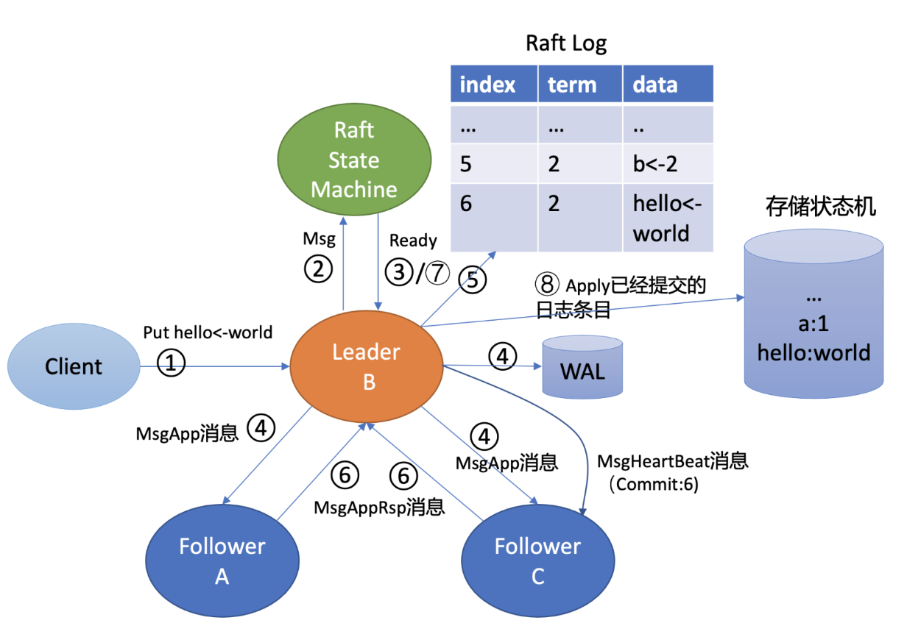

首先是流程四，一方面，Leader需要并行将消息通过网络发送给各Follower节点，依赖网络性能。另一方面，Leader需要持久化日志条目到WAL，依赖磁盘IO顺序写入性能

其次是流程八，应用日志条目到存储状态机时，etcd后端key-value存储引擎是boltdb。它是一个基于B+ tree实现的存储引擎，当写入数据，提交事务时，它会将dirty page持久化存储到磁盘中。在这过程中boltdb会产生磁盘随机IO写入，因此事务提交性能依赖磁盘IO随机写入性能

最后在整个写流程中，etcd节点的CPU、内存、网络带宽资源应充足，否则肯定也会影响性能

etcd问题定位过程中常用的工具如下图所示

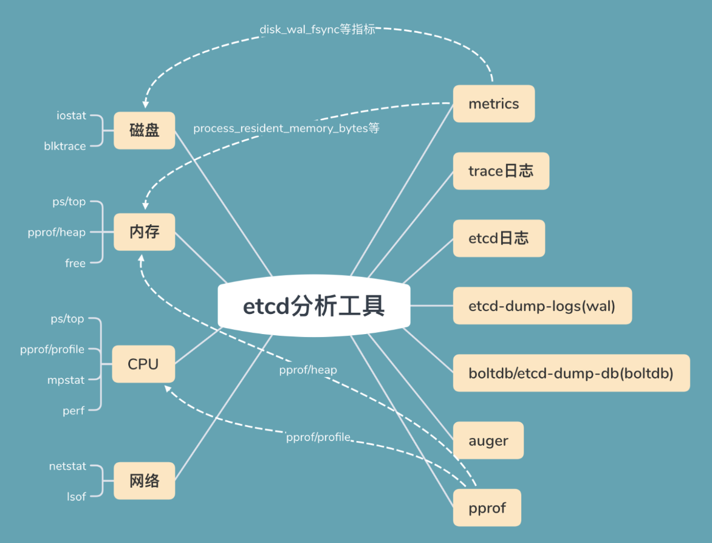

### 网络

在etcd中，各个节点之间需要通过2380端口相互通信，以完成Leader选举、日志同步等功能，因此底层网络质量（吞吐量、延时、稳定性）对上层etcd服务的性能有显著影响

网络资源出现异常的常见表现是连接闪断、延时抖动、丢包等

一方面，可以使用常规的ping/traceroute/mtr、ethtool、ifconfig/ip、netstat、tcpdump网络分析工具等命令，测试网络的连通性、延时，查看网卡的速率是否存在丢包等错误，确认etcd进程的连接状态及数量是否合理，抓取etcd报文分析等

另一方面，etcd应用层提供了节点之间网络统计的metrics指标，分别如下：

- etcd_network_active_peer，表示peer之间活跃的连接数；

- etcd_network_peer_round_trip_time_seconds，表示peer之间RTT延时；

- etcd_network_peer_sent_failures_total，表示发送给peer的失败消息数；

- etcd_network_client_grpc_sent_bytes_total，表示server发送给client的总字节数，通过这个指标我们可以监控etcd出流量；

- etcd_network_client_grpc_received_bytes_total，表示server收到client发送的总字节数，通过这个指标可以监控etcd入流量

etcd metrics指标名由namespace和subsystem、name组成。namespace为etcd，subsystem是模块名（比如network、name具体的指标名）可以在Prometheus里搜索etcd_network找到所有network相关的metrics指标名

一方面，expensive request中的大包查询会使网卡出现瓶颈，产生丢包等错误，从而导致etcd吞吐量下降、高延时。expensive request导致网卡丢包，出现超时，这在etcd中是非常典型且易发生的问题，它主要是因为业务没有遵循最佳实践，查询了大量key-value

另一方面，在跨故障域部署的时候，故障域可能是可用区、城市。故障域越大，容灾级别越高，但各个节点之间的RTT越高，请求的延时更高

### 磁盘IO

在etcd中无论是Raft日志持久化还是boltdb事务提交，都依赖于磁盘I/O的性能

当etcd请求延时出现波动时，首先关注disk相关指标是否正常。我们可以通过etcd磁盘相关的metrics(etcd_disk_wal_fsync_duration_seconds和etcd_disk_backend_commit_duration_seconds)来观测应用层数据写入磁盘的性能

etcd_disk_wal_fsync_duration_seconds（简称disk_wal_fsync）表示WAL日志持久化的fsync系统调用延时数据。一般本地SSD盘P99延时在10ms内，如下图所示。

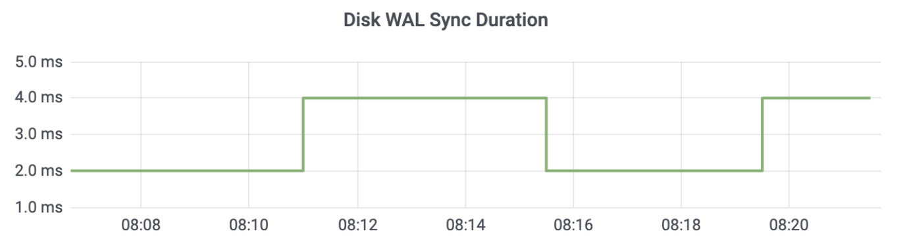

etcd_disk_backend_commit_duration_seconds（简称disk_backend_commit）表示后端boltdb事务提交的延时，一般P99在120ms内

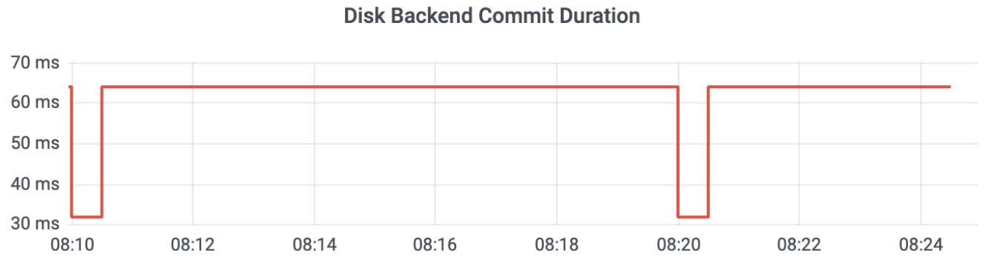

需要注意的是，一般监控显示的磁盘延时都是P99，但实际上etcd对磁盘特别敏感，一次磁盘I/O波动就可能产生Leader切换。如果遇到集群Leader出现切换、请求超时，但是磁盘指标监控显示正常，可以查看P100确认下是不是由于磁盘I/O波动导致的

同时etcd的WAL模块在fdatasync操作超过1秒时，也会在etcd中打印如下的日志，也可以结合日志进一步定位

```go
if took > warnSyncDuration {
   if w.lg != nil {
      w.lg.Warn(
         "slow fdatasync",
         zap.Duration("took", took),
         zap.Duration("expected-duration", warnSyncDuration),
      )
   } else {
      plog.Warningf("sync duration of %v, expected less than %v", took, warnSyncDuration)
   }
}
```

当disk_wal_fsync指标异常的时候，一般是底层硬件出现瓶颈或异常导致。当然也有可能是CPU高负载、cgroup blkio限制导致的

可以通过iostat、blktrace工具分析瓶颈是在应用层还是内核层、硬件层。其中blktrace是blkio层的磁盘I/O分析利器，可记录IO进入通用块层、IO请求生成插入请求队列、IO请求分发到设备驱动、设备驱动处理完成这一系列操作的时间，帮助发现磁盘I/O瓶颈发生的阶段

当disk_backend_commit指标的异常时候，说明事务提交过程中的B+ tree树重平衡、分裂、持久化dirty page、持久化meta page等操作耗费了大量时间

若disk_backend_commit较高、disk_wal_fsync却正常，说明瓶颈可能并非来自磁盘I/O性能，也许是B+ tree的重平衡、分裂过程中的较高时间复杂度逻辑操作导致。比如etcd目前所有stable版本，从freelist中申请和回收若干连续空闲页的时间复杂度是O(N)，当db文件较大、空闲页碎片化分布的时候，则可能导致事务提交高延时

etcd还提供了disk_backend_commit_rebalance_duration和disk_backend_commit_spill_duration两个metrics，分别表示事务提交过程中B+ tree的重平衡和分裂操作耗时分布区间

disk_wal_fsync记录的是WAL文件顺序写入的持久化时间，disk_backend_commit记录的是整个事务提交的耗时。后者涉及的磁盘I/O是随机的，为了保证etcd集群的稳定性，建议使用SSD磁盘以确保事务提交的稳定性

### expensive request
如果磁盘和网络指标都很正常，那么延迟高还有可能是expensive request导致的

一个读写请求经过Raft模块处理后，最终会走到MVCC模块。在kubernetes中，当集群Pod较多的时候，如果频繁执行List Pod，可能会导致etcd出现大量的「apply request took too long」警告日志

对于etcd而言，List Pod请求涉及到大量的key查询，会消耗较多的CPU、内存、网络资源，此类expensive request的QPS如果较大，则很可能导致OOM、丢包

为了提高请求延时分布的可观测性、延时问题的定位效率等，etcd实现了trace特性，详细记录了一个请求在各个阶段的耗时。如果某阶段耗时流程默认的100ms，则会打印一条trace日志。通过trace特性就可以快速定位到高延时读写请求的原因

如果开启了密码鉴权，在连接数量增多、QPS增大后，如果突然出现请求超时，如何确定是鉴权还是查询、更新接口导致的呢？

etcd默认参数并不会采集各个接口的延时数据，可以通过设置etcd的启动参数`-metrics`为expensive来开启，获取每个gRPC接口的延时数据。同时可结合各个gRPC接口的请求数，获得QPS

### 集群容量、节点CPU/Memory瓶颈

如果网络、磁盘IO正常，也没有expensive request，也有可能导致高延时请求😂

首先还是去看trace日志，通过etcd_server_slow_apply_total指标，观察其值快速增长的时间点与高延时请求产生的日志时间点是否吻合

其次检查是否存在大量写请求。线性读需确保本节点数据与Leader数据一样新，如果本节点的数据与Leader差异较大，本节点追赶Leader数据过程会花费一定时间，最终导致高延时的线性读请求产生

**etcd适合读多写少的业务场景，如果写请求较大，很容易出现容量瓶颈，导致高延时的读写请求产生**

最后通过ps/top/mpstat/perf等CPU、Memory性能分析工具，检查etcd节点是否存在CPU、Memory瓶颈。goroutine饥饿、内存不足都会导致高延时请求产生，如果确定CPU和Memory存在异常，可以通过开启debug模式，通过pprof分析CPU和内存瓶颈点

## 为啥etcd内存占用很高？

如果遇到etcd内存占用较高的情况，第一反应: **重启etcd进程** 以及 **开启etcd debug模式**，重启etcd进程等复现，然后采集heap profile分析内存占用

### 分析整体思路

以etcd写请求流程为例，总结可能导致etcd内存占用较高的核心模块与其数据结构

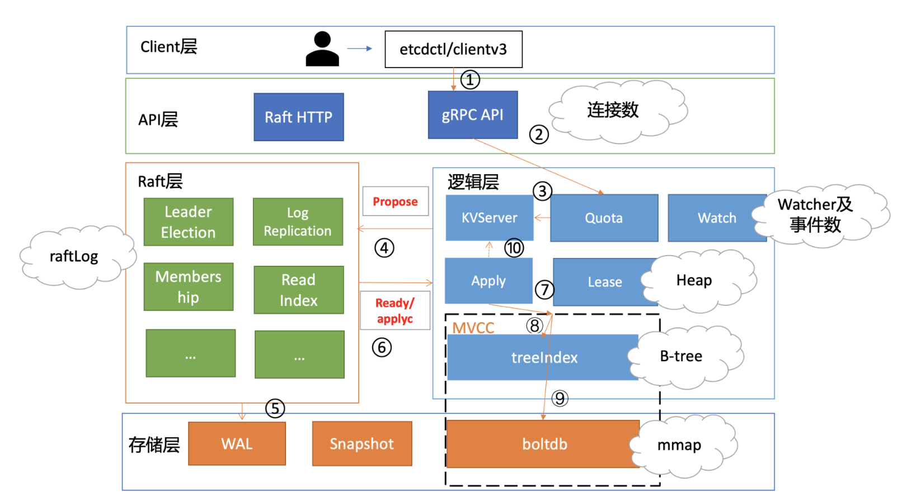

当etcd收到一个写请求后，gRPC Server会先建立连接。连接数量越多，会导致etcd进程的fd、goroutine等资源上涨，因此会占用越来越多内存

etcd需要将此请求的日志条目保存在raftLog里面。etcd raftLog后端实现是内存存储，核心就是数组。因此raftLog使用的内存与其保存的日志条目成正比，它也是内存分析过程中最容易被忽略的一个数据结构

当日志条目被集群多数节点确认后，在应用到状态机的过程中，会在内存treeIndex模块的B-tree中创建、更新key与版本号信息。在这过程中treeIndex模块的B-tree使用的内存与key、历史版本数量成正比

更新完treeIndex模块的索引信息后，etcd将key-value数据持久化存储到boltdb。boltdb使用了mmap技术，将db文件映射到操作系统内存中。因此在未触发操作系统将db对应的内存page换出的情况下，etcd的db文件越大，使用的内存也就越大

一方面，其他client可能会创建若干watcher、监听这个写请求涉及的key， etcd也需要使用一定的内存维护watcher、推送key变化监听的事件

另一方面，如果这个写请求的key还关联了Lease，Lease模块会在内存中使用数据结构Heap来快速淘汰过期的Lease，因此Heap也是一个占用一定内存的数据结构

最后，不仅仅是写请求流程会占用内存，读请求本身也会导致内存上升。尤其是expensive request，当产生大包查询时，MVCC模块需要使用内存保存查询的结果，很容易导致内存突增

### 一个key使用数G内存案例

首先，本机还没有安装Prometheus和Grafana，没可视化看着不太好。先安装这俩

```zsh
brew install prometheus

brew install grafana

# 修改prometheus的配置文件，添加etcd的metrics
vim /opt/homebrew/etc/prometheus.yml

- job_name: 'etcd'
  scrape_interval: 15s
  static_configs:
    - targets: ['localhost:2379']

# 启动
brew services start prometheus
brew services start grafana

# 直接访问 http://localhost:3000 ，登录用户名密码都是admin
```

登录Grafana之后，添加etcd的datasource，然后添加dashboard，选择etcd的模板，就可以看到etcd的metrics了，如下图所示

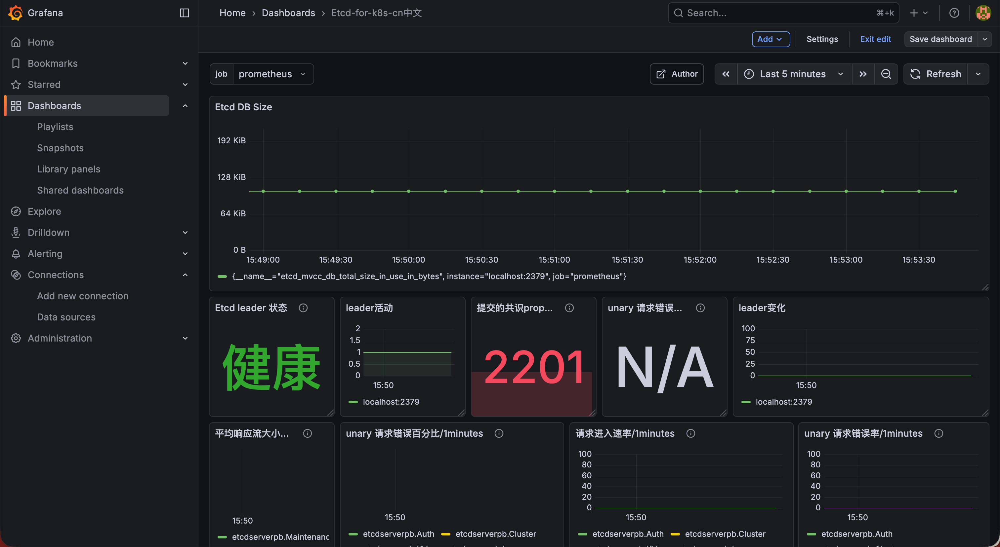

先put同一个key 1000次（之前put不同的key1000次了）

```bash
for i in {1..1000}; do
  echo "第 $i 次 put..."
  dd if=/dev/urandom bs=1024 count=1024 | etcdctl put key && echo "第 $i 次成功" || { echo "失败"; break; }
done
```

执行到第187次就失败了😅，原因是当前下载的是最新官方release（3.6.7），没细看，实际上安装的不是arm64而是amd64😅

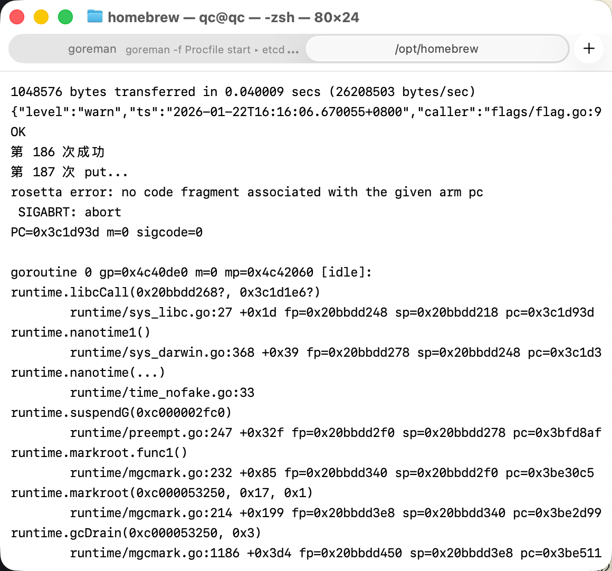

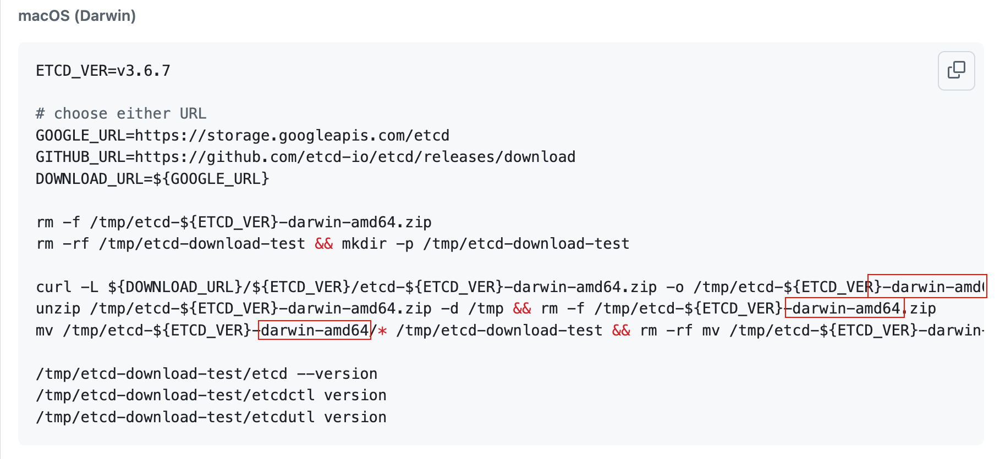

直接把/tmp下的etcd和etcdctl相关文件删除干净，然后`brew install etcd`，完事

Grafana上看DB Size

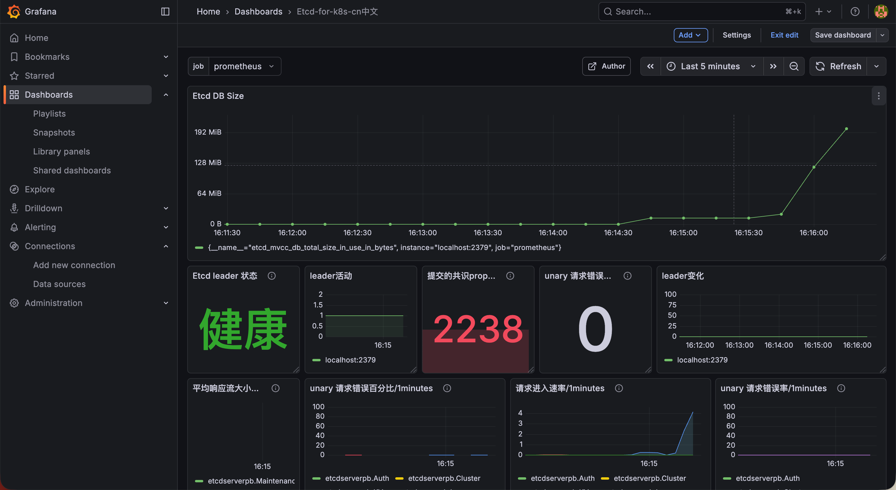

重新执行，1000条全部插入成功

DB Size如下图所示

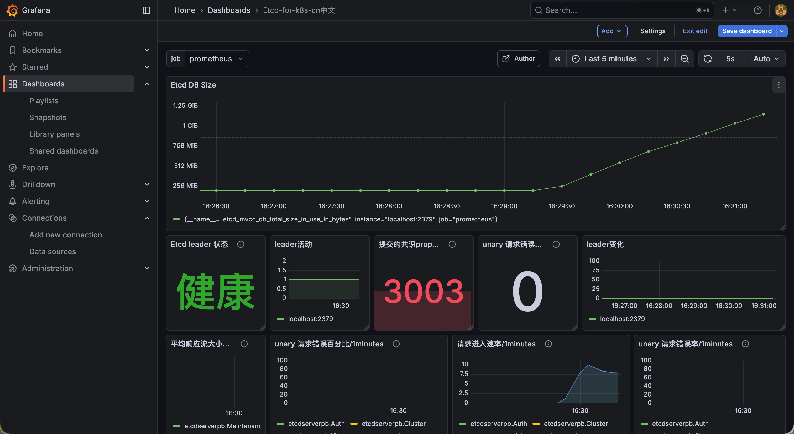

Etcd Process Memory如下图所示，内存峰值给干到2G（单个节点）了

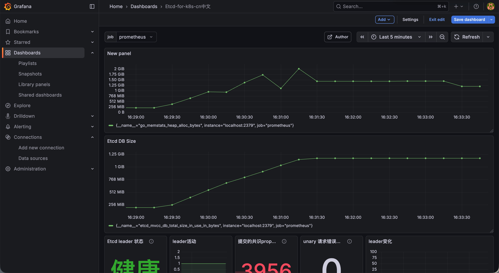

之后获取最新revision，并压缩

```bash
etcdctl compact `(etcdctl endpoint status --write-out="json" | egrep -o '"revision":[0-9]*' | egrep -o '[0-9].*')`
```

压缩成功（之前put不同的key1000次了）

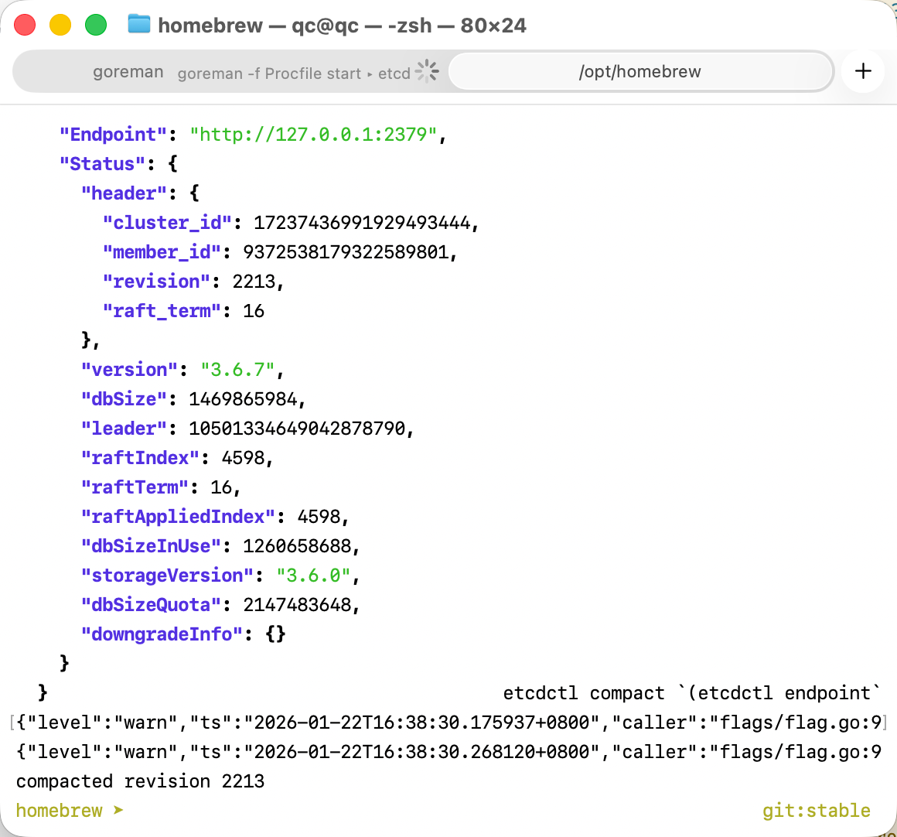

压缩后dbsize明显降低，但是内存占用还是很高

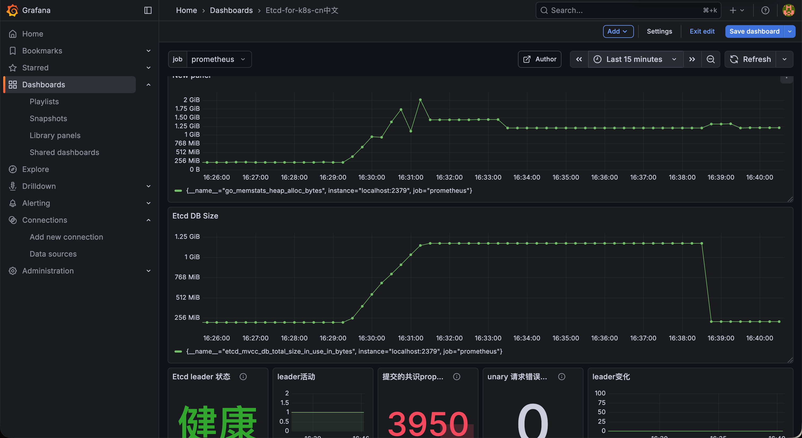

再对集群所有节点进行碎片整理

```bash
etcdctl defrag --cluster
```

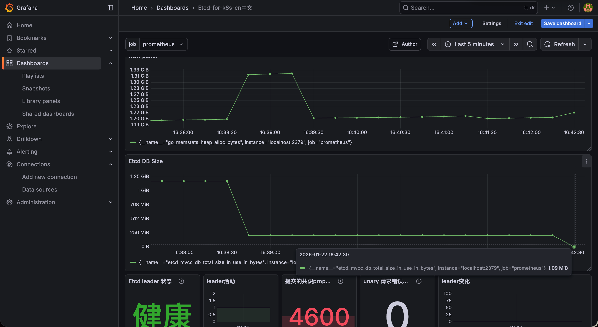

可以看到db Size还可以再降，但是内存还多了一点

**「那么为什么刚才只对1个key做1000次put，etcd占用了这么多内存？」**

#### raftLog

当发起一个请求时，etcd需通过Raft模块将此请求同步到其他节点，详细流程如下所示

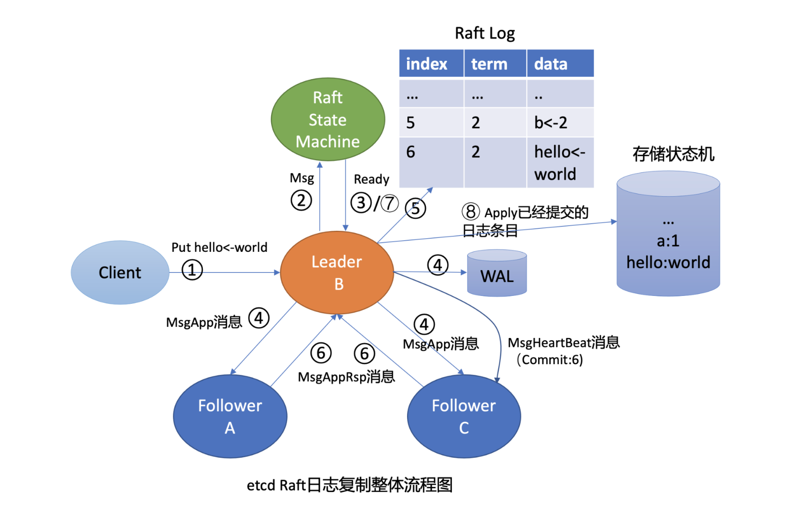

Raft模块的输入是一个消息/Msg，输出统一为Ready结构。etcd会把此请求封装成一个消息，提交到Raft模块

Raft模块收到请求后，会把此消息追加到raftLog的unstable存储的entry内存数组中（流程2），并且将待持久化的此消息封装到Ready结构内，通过管道通知到etcdserver（流程3）

etcdserver取出消息，持久化到WAL中，并追加到raftLog的内存存储storage的entry数组中（流程5）

raftLog的核心数据结构，如下所示。其是由storage、unstable、committed、applied等组成。storage存储已经持久化到WAL中的日志条目，unstable存储未持久化的条目和快照，一旦持久化会及时删除日志条目，因此不存在内存占用的问题

```go
type raftLog struct {
	storage Storage

	unstable unstable

	committed uint64

	applied uint64
}
```

存储稳定的日志条目的storage类型是Storage，Storage定义了存储Raft日志条目的核心API接口，业务应用层可根据实际场景进行定制化实现。etcd使用的Raft算法库本身提供的MemoryStorage，其定义如下，核心是使用了一个数组来存储已经持久化后的日志条目

```go
type MemoryStorage struct {
	sync.Mutex

	hardState pb.HardState
	snapshot pb.Snapshot

	ents []pb.Entry
}
```

随着写请求增多，内存中保留的Raft日志条目会越来越多，为了防止etcd出现OOM，etcd提供了「快照」和「压缩」功能来解决这个问题

可以通过调整`-snapshot-count`参数来控制生成快照的频率，其值默认值为100000，也就是每10万个写请求触发一次快照生成操作

快照生成完之后，etcd会通过压缩来删除旧的日志条目。etcd会保留一部分Raft日志条目，数量由DefaultSnapshotCatchUpEntries参数控制，默认是5000（当前依然不支持自定义配置）

保留一小部分日志条目其实是为了帮助慢的Follower以较低的开销向Leader获取Raft日志条目，以尽快追上Leader进度。如果过raftLog中不保留任何日志条目，就只能发送快照给慢的Follower，这样开销非常大

#### treeIndex

一个put写请求的日志条目被集群多数节点确认提交后，这时候etcdserver就会从Raft模块获取已提交的日志条目，应用到MVCC模块的treeIndex和boltdb

treeIndex是基于google内存btree库实现的一个索引管理模块，在etcd中每个key都会在treeIndex中保存一个索引项（keyIndex），记录key和版本号等信息

```go
type keyIndex struct {
	key 		[]byte
	modified 	revision
	generations []generation
}
```

每次对key的修改、删除操作都会在key的索引项中追加一条修改记录（revision）清理旧版本，防止内存占用过多的方式还是「压缩」，当执行compact命令时，etcd会遍历treeIndex中的各个keyIndex，清理历史版本号记录与已删除的key，释放内存

#### boltdb

在treeIndex模块中创建、更新完keyIndex数据结构后，key-value结构、各种版本号、lease等相关信息会保存到如下的一个 mvccpb.keyValue 结构体中。它是boltdb的value，key则是treeIndex中保存的版本号

```go
kv := mvccpb.KeyValue{
	Key: key,
	Value: value,
	CreateRevision: c,
	ModRevision: rev,
	Version: ver,
	Lease: int64(leaseID),
}
```

etcd在启动时会通过mmap机制，将etcd db文件映射到etcd进程地址空间，并设置mmap的MAP_POPULATE flag，它会告诉Linux内核预读文件，让Linux内核将文件内容拷贝到物理内存中

在节点内存充足的情况下，后续读请求可直接从内存中获取。相比read系统调用，mmap少一次从page cache拷贝到进程内存地址空间的操作，因此具备更高的性能

如果etcd节点内存不足，那么可能导致db文件对应的内存页被换出。当读请求命中的页未在内存中时，就会产生缺页中断，导致读过程中产生磁盘IO。这样虽然避免了etcd OOM，但是会降低读写性能

#### watcher

当创建一个watcher时，client与server建立连接后，会创建一个gRPC Watch Stream，随后通过gRPC Watch Stream发送创建watcher请求。每个gRPC Watch Stream中的etcd WatchServer会分配两个goroutine处理，一个是sendLoop，它负责Watch事件的推送。一个是recvLoop，它负责接收client的创建、取消watcher请求信息

因为watch监听机制耗费的内存跟client连接数、gRPC Stream、watcher数量（watching）有关

- c1表示每个连接耗费的内存
- c2表示每个gRPC Stream耗费的内存
- c3表示每个watcher耗费的内存

```text
memory = c1 * number_of_conn + c2 * avg_number_of_stream_per_conn + c3 * avg_number_of_watch_stream
```

根据etcd社区的压测报告

- 每个client连接消耗大概 17kb （c1）
- 每个gRPC Stream消耗大概 18kb （c2）
- 每个watcher消耗大概 350个字节 （c3）

变更事件较多，服务端、客户端高负载，网络阻塞等情况都可能导致事件堆积

在etcd 3.6.7版本中，每个watcher默认buffer是1024。buffer内保存watch响应结果，如watchID、watch事件（watch事件包含key、value）等

若大量事件堆积，将产生较高昂的内存的开销。可以通过etcd_debugging_mvcc_pending_events_total指标监控堆积的事件数，etcd_debugging_slow_watcher_total指标监控慢的watcher数，来及时发现异常

#### expensive request

如果写入较大的key-value后，如果client频繁查询它，也会产生高昂的内存开销。count-only、limit查询在key百万级以上时，会产生非常大的内存开销。因为在遍历treeIndex的过程中，会将相关key保存在数组里面，当key数量较多时，会占用大量内存

「这时候如何减少内存占用？」

**不重启etcd的情况下，无法完全强制释放所有内存**

1. 多次defrag
	- defrag是 COW 重建文件，每次都能进一步回收残留freelist和fragmentation

```bash
for i in {1..5}; do  # 重复 3-5 次
  etcdctl defrag
  echo "第 $i 次 defrag 完成，检查内存..."
  sleep 10  # 等 OS reclaim
done
```

2. 触发compact到最新的revision

```bash
REV=$(etcdctl endpoint status -w json | grep revision | head -1 | cut -d '"' -f8)
etcdctl compact $REV  # 或 $((REV-1)) 保留最新
etcdctl defrag
```

3. 等待自然GC和OS reclaim

## 如何优化以及扩展etcd性能？

etcd社区线性度压测结果可以达到14w/s，在实际业务场景中有时却只有几千，甚至几百、几十，还会偶尔出现超时、频繁抖动

### 提升读性能

如果说读性能差，其实本质是读请求链路中某些环节出现了瓶颈

#### 性能分析链路

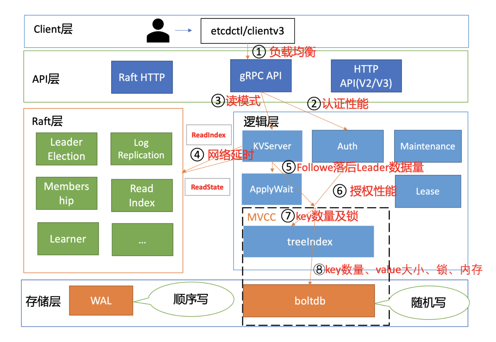

#### 负载均衡

建议通过 Load Balancer 访问后端etcd集群。一方面Load Balancer一般支持配置各种负载均衡算法，如连接数、Round-robin等，可以使集群负载更加均衡，规避etcd client早期的固定连接缺陷，获得集群最佳性能。另一方便，当集群节点需要替换、扩展集群节点的时候，不需要去调整各个cleint访问server的节点配置

#### 合适的鉴权

client通过负载均衡算法为请求选好etcd server节点后，client就可调用server的Range RPC方法，把请求发送给etcd server。在此过程中，如果server启用了鉴权，那么就会返回无权限相关错误给client

如果server使用的是密码鉴权，在创建client时，需指定用户名和密码。etcd clientv3
库发现用户名、密码非空，就会先校验用户名和密码是否正确

client是通过向Server发送Authenticate RPC鉴权请求实现密码认证的，也就是路程2

server节点收到鉴权请求后，会从boltdb获取此用户密码对应的算法版本、salt、cost值，并基于用户的请求明文密码计算出了一个hash值

在得到hash值后，就可以对比db里保存的hash密码是否与其一致了。如果一致，就会返回一个token给client。这个token是client访问server节点的通行证，后续server只需要校验「通行证」是否有效即可，无需每次发起昂贵的 Authenticate RPC请求

如果业务在访问etcd的过程中没有「复用」token，每次访问etcd都发起一次Authenticate调用，这将是一个非常大的性能瓶颈和隐患

**这个Authenticate接口究竟有多慢呢？**

- 压测集群etcd节点配置是16C32G
- 压测方式是通过修改etcd clientv3库、benchmark工具，使benchmark工具支持Authenticate接口压测
- 设置不同的client和connection参数，运行多次，观察结果是否稳定，获取测试结果

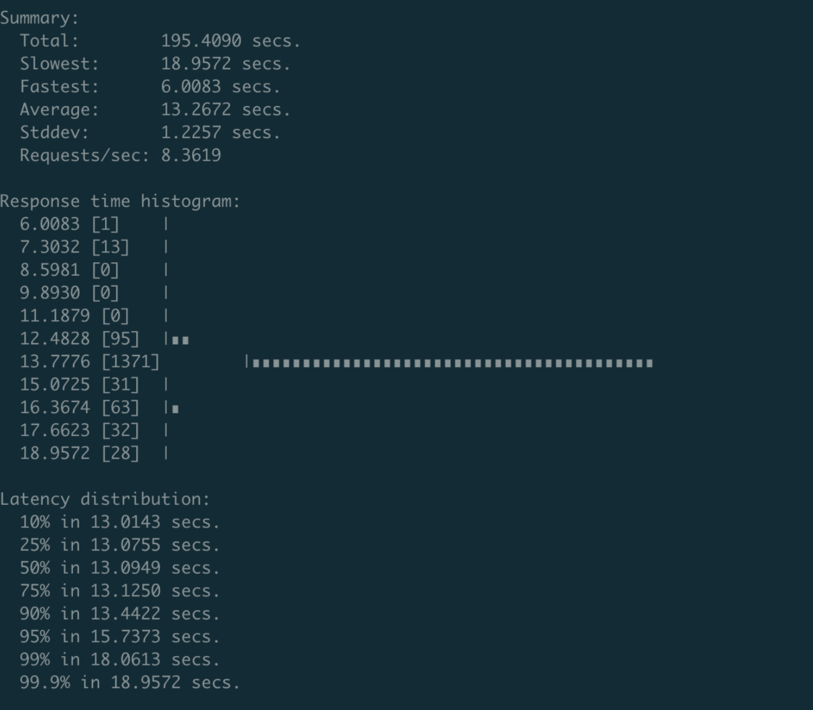

也就是说 3.4 之前，Authenticate接口性能不到16QPS，并且随着client和connection增多，该性能会继续恶化。当client和conneciton的数量达到200个的时候，性能会下降到8QPS，P99延时为18秒，如上图所示

由于导致Authenticate接口性能差的核心瓶颈，是在于密码鉴权使用了bcrpt计算hash值，因此Authenticate性能已接近极限

并且，Authenticate的调用是由clientv3库默默发起的，etcd中也没有任何日志记录其耗时等

为了能够快速发现Authenticate等特殊类型的expensive request，可以通过gPRC拦截器机制（当前社区依然没有实现该功能），当一个请求超过300ms或其他时间，就会打印整个请求信息。但是可以启动`--debug`或者环境变量（ETCD_DEBUG），会打印每个gRPC请求的详细调试信息，etcd有硬编码的慢请求检测（通常阈值在100ms~1s固定编码），当请求处理时间过长时，会自动打印警告日志，如「request took too long to execute」或「slow apply」

从 v3.4 开始，etcd完全重设计了 v3 auth 系统

- 密码验证移到了gPRC API层，可以**并行处理（多个goroutine）**，不再是单线程瓶颈
- 直接解决了早期串行执行的问题，性能大幅提升
- 后续版本 3.5 3.6 虽然无针对 auth 的专用大优化，但继承了这一设计，并有整体稳定性、性能修复

**建议**

1. 如果生产环境中需要开启鉴权，并且读写QPS较大，那么建议不要图省事使用密码鉴权。最好使用证书鉴权，这样能完美避坑认证性能差、token过期等问题，性能几乎无损失

2. 确保业务每次发起请求时都能「复用」token，避免每次访问etcd都发起Authenticate RPC调用

3. 如果使用密码鉴权时遇到性能瓶颈问题，那就升级到最新稳定版本，能适当提升点性能

#### 合适的读模式

client通过server的鉴权后，就可以发起读请求调用了，也就是最上面图中的流程3

读模式对性能有着至关重要的影响。etcd提供「串行读」和「线性读」两种读模式。前者因为不经过ReadIndex模块，具有低延时、高吞吐量的特点；后者在牺牲一点延时和吞吐量的基础上，实现了数据的强一致性读

关于串行读和线性读的性能区别

测试环境:

- 机器配置client 16核32G，三个Server节点8核16G、SSD盘，client与server都在同一可用区
- 各节点之间RTT在0.1ms到0.2ms之间
- etcd v3.4
- 1000个client

```bash
# 串行读
benchmark --endpoints=addr --conns=100 --clients=1000 \
range hello --consistency=s --total=500000

# 线性读
benchmark --endpoints=addr --conns=100 --clients=1000 \
range hello --consistency=l --total=500000
```

串行读压测结果如下所示，32w QPS，平均延时 2.5ms

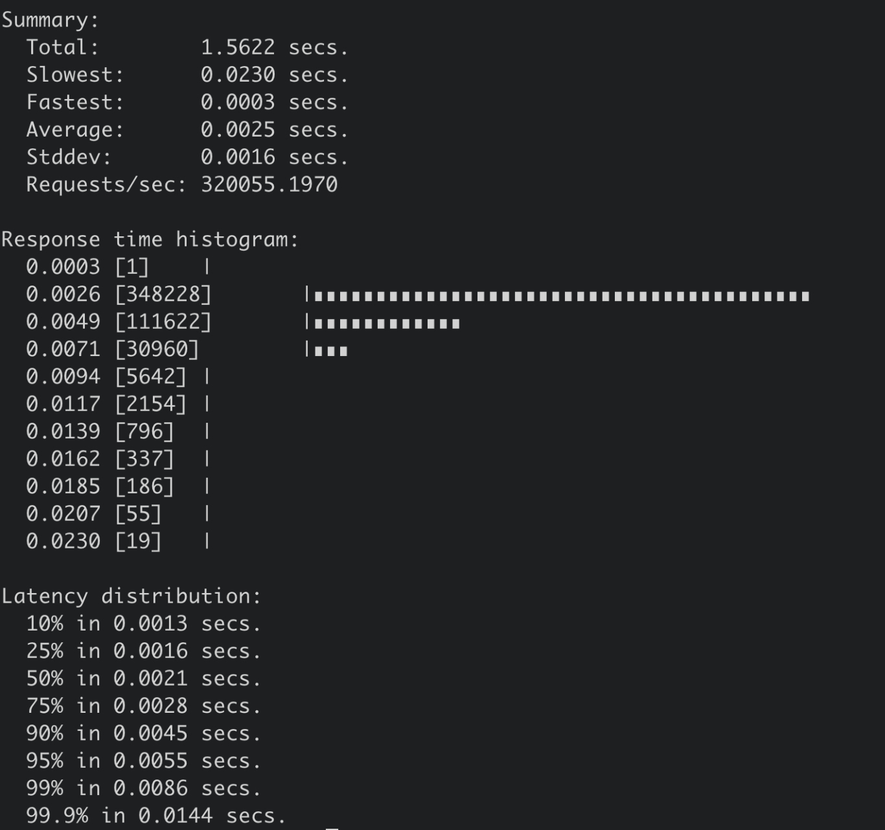

线性读压测结果如下所示，19w QPS，平均延时 4.9ms

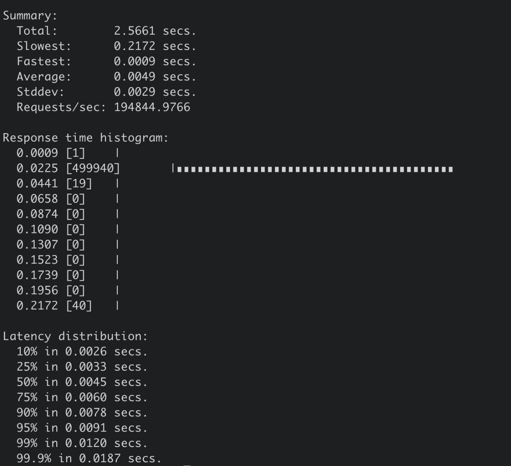

从两个压测结果图中可以看出，在100个连接时，串行读性能比线性读性能高11w/s，串行读请求延时比线性读请求延时低一半

**需要注意的是，以上读性能数据是在1个key、没有任何写请求、同可用区的场景下压测出来的，实际的读性能会随着写请求增多而出现显著下降，这也是实际业务场景性能与社区压测结果存在非常大差距的原因之一**

所以，自己用etcd benchmark工具在当前etcd集群环境中自测一下，也可以参考下面的etcd社区压测结果

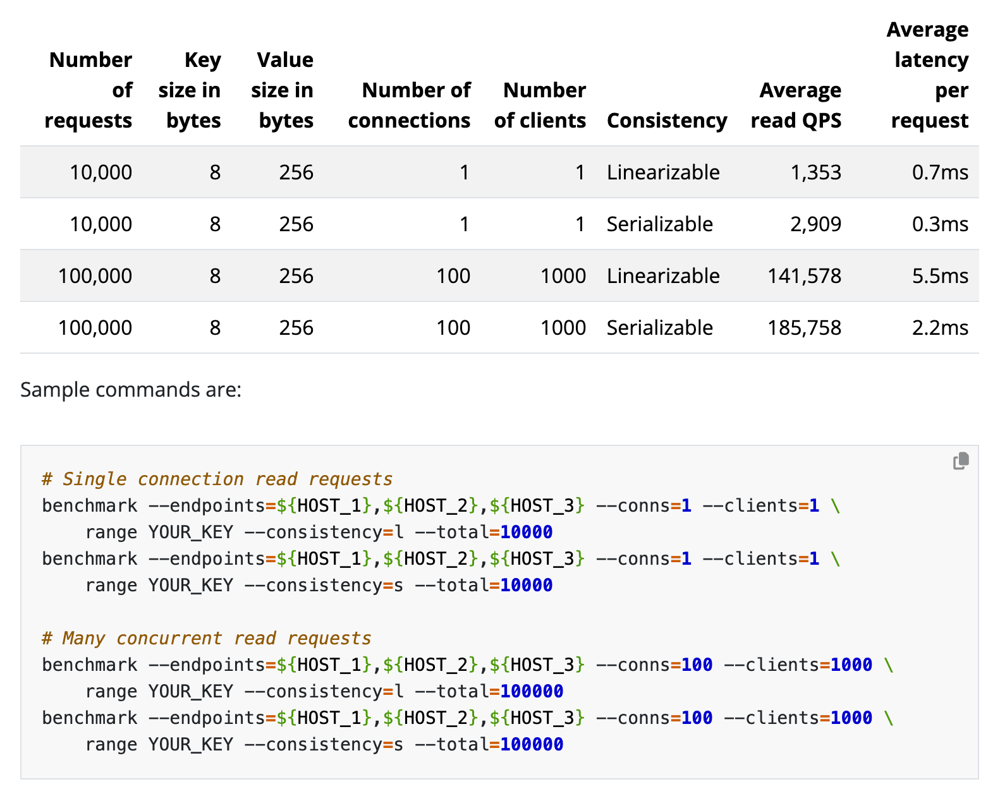

如果业务场景读QPS较大，但是又不想通过etcd proxy等机制来扩展性能，那么可以进一步评估业务场景对数据一致性的要求高不高。如果可以容忍短暂的不一致，那可以通过串行读来提升etcd的读性能，也可以部署Learner节点给可能会产生expensive read request的业务使用，实现cheap/expensive read request 的隔离

#### 线性读实现机制、网络延时

etcd中默认读请求是线性读模式。线性读对应图中的流程4、流程5，其中流程4对应的ReadIndex，流程5对应的是等待本节点数据追上Leader的进度

在早期的etcd 3.0版本中，etcd线性读是基于Raft log read实现的。每次读请求要像写请求一样，生成一个Raft日志条目，然后提交给Raft一致性模块处理，基于Raft日志执行的有序性来实现线性读。因为该过程需要经过磁盘I/O，所以性能较差

为了解决Raft log read的线性读性能瓶颈，etcd 3.1中引入了ReadIndex。ReadIndex仅涉及到各个节点之间网络通信，因此节点之间的RTT延时对其性能有较大影响。虽然同可用区可获取到最佳性能，但是存在单可用区故障风险。如果你想实现高可用区容灾的话，那就必须牺牲一点性能了

跨可用区部署时，各个可用区之间延时一般在2毫秒内。如果跨城部署，服务性能就会下降较大。所以一般场景下不建议跨城部署，可以通过Learner节点实现异地容灾。如果异地的服务对数据一致性要求不高，那么甚至可以通过串行读访问Learner节点，来实现就近访问，低延时

各个节点之间的RTT延时，是决定流程四ReadIndex性能的核心因素之一

#### 磁盘IO性能、写QPS

到了流程5，影响性能的核心因素就是磁盘IO延时和写QPS

流程5是指节点从Leader获取到最新已提交的日志条目索引（rs.Index）后，它需要等待本节点当前已应用的Raft日志索引，大于等于Leader的已提交索引，确保能在本节点状态机中读取到最新数据

```go
if ai := s.getAppliedIndex(); ai < rs.Index {
	select {
		case <- s.applyWait.Wait(rs.Index):
		case <- s.stopping:
			return
	}
}

nr.notify(nil)
```

应用已提交日志条目到状态机的过程又涉及到随机写磁盘

**etcd是一个对磁盘IO性能非常敏感的存储系统，磁盘IO性能不仅会影响Leader稳定性、写性能表现，还会影响读性能。线性读性能会随着写性能的增加而快速下降。如果业务对性能、稳定性有较大要求，那么尽量使用SSD盘**

下表是一个8C16G的三节点集群，在总key数只有一个的情况下，随着写请求增大，线性读性能下降的趋势总结（基于benchmark工具压测结果）

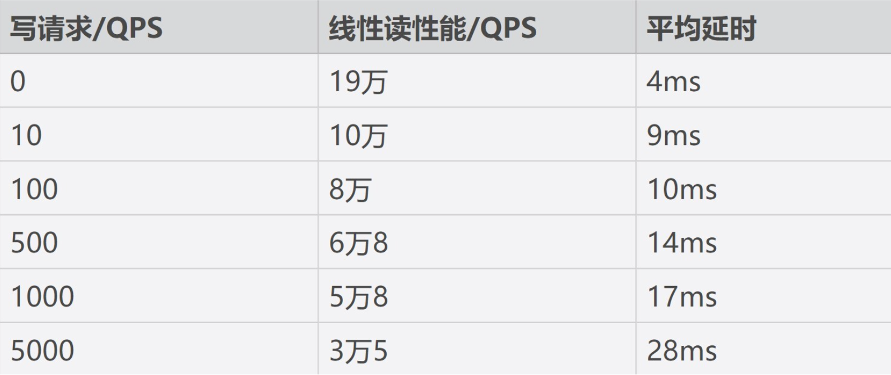

当本节点已应用日志条目索引大于等于Leader已提交的日志条目索引后，读请求就会接到通知，就可通过MVCC模块获取数据

#### RBAC规则数、Auth锁

读请求到了MVCC模块后，首先要通过鉴权模块判断此用户是否有权限访问请求的数据路径，也就是流程6。影响流程6的性能因素是RBAC规则数和锁

首先是RBAC规则数，为了解决快速判断用户对指定key范围是否有权限，etcd为每个用户维护了读写权限区间树。基于区间树判断用户访问的范围是否在用户的读写权限区间内，时间复杂度仅需要O(logN)

另外一个因素则是AuthStore的锁。在etcd 3.4.9之前的，使用较粗粒度的锁（mutex），密码校验（bcrypt）等操作会长时间持有锁，导致Authenticate、AuthEnable等授权相关接口并发时严重阻塞，性能崩盘。3.4之后密码校验完全移到gPRC API层，多goroutine并行处理，不再串行持锁

#### expensive request、treeIndex锁

通过流程6的授权后，则进入流程7，从treeIndex中获取整个查询涉及的key列表版本号信息。在这个流程中，影响其性能的关键因素是treeIdnex的总key数、查询的key数、获取treeIndex锁的耗时

首先，treeIndex中总key数过多会适当增大我们遍历的耗时

其次，若要访问treeIndex我们必须获取到锁，但是可能其他请求如compact操作也会获取锁。早期的时候，它需要遍历所有索引，然后进行数据压缩工作。这就会导致其他请求阻塞，进而增大延时

为了解决这个性能问题，优化方案是compact的时候会将treeIndex克隆一份，以空间来换时间，尽量降低锁阻塞带来的超时问题

**查询key数较多等expensive read request时对性能的影响**

假设我们链路分析图中的请求是查询一个Kubernetes集群所有Pod，当Pod数一百以内的时候可能对etcd影响不大，但是当你Pod数千甚至上万的时候， 流程7、8就会遍历大量的key，导致请求耗时突增、内存上涨、性能急剧下降

如果业务就是有这种expensive read request逻辑，该如何应对呢？

首先我们可以尽量减少expensive read request次数，在程序启动的时候，只List一次全量数据，然后通过etcd Watch机制去获取增量变更数据。比如Kubernetes的Informer机制，就是典型的优化实践

其次，在设计上评估是否能进行一些数据分片、拆分等，不同场景使用不同的etcd prefix前缀。比如在Kubernetes中，不要把Pod全部都部署在default命名空间下，尽量根据业务场景按命名空间拆分部署。即便每个场景全量拉取，也只需要遍历自己命名空间下的资源，数据量上将下降一个数量级

再次，如果觉得Watch改造大、数据也无法分片，开发麻烦，你可以通过分页机制按批拉取，尽量减少一次性拉取数万条数据

最后，如果以上方式都不起作用的话，还可以通过引入cache实现缓存expensive read request的结果，不过应用需维护缓存数据与etcd的一致性

#### 大key-value

从流程7获取到key列表以及版本号信息后，就可以访问boltdb模块，获取key-value信息。在这个流程中，影响其性能表现的，除了上面介绍的expensive read request，还有大key-value和锁

首先是大key-value。etcd设计上定位是个小型的元数据存储，它**没有数据分片机制**，默认db quota只有2G，实践中往往不会超过8G，并且针对每个key-value大小也有限制，默认是1.5MB

大key-value非常容易导致etcd OOM、server节点出现丢包、性能急剧下降等

那么当我们往etcd集群写入一个1MB的key-value时，它的线性读性能会从17wQPS下降到多少呢

```bash
benchmark --endpoints=addr --conns=100 --clients=1000 \
range key --consistency=l --total=10000
```

执行的时候出现了「假死」情况

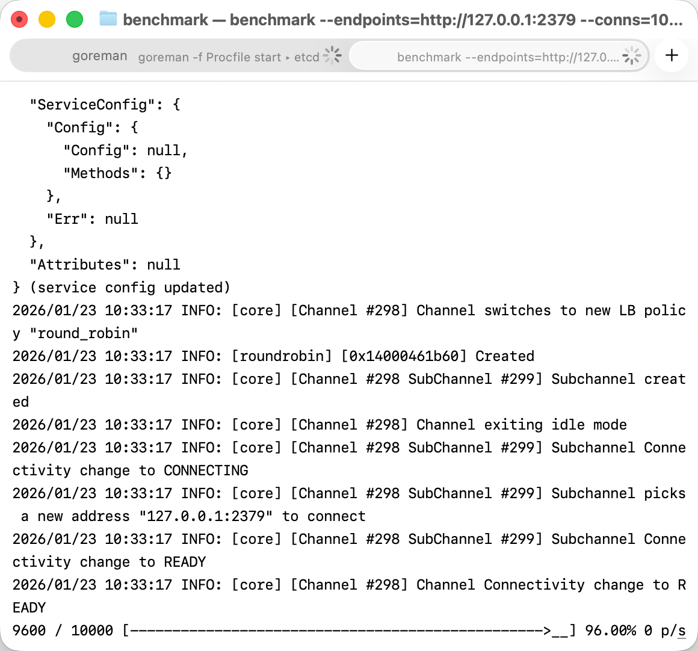

测小规模、读操作没有问题，很快出结果

```bash
benchmark --endpoints=http://127.0.0.1:2379 --conns=10 --clients=100 put --sequential --key-size=8 --val-size=256 --total=10000
```

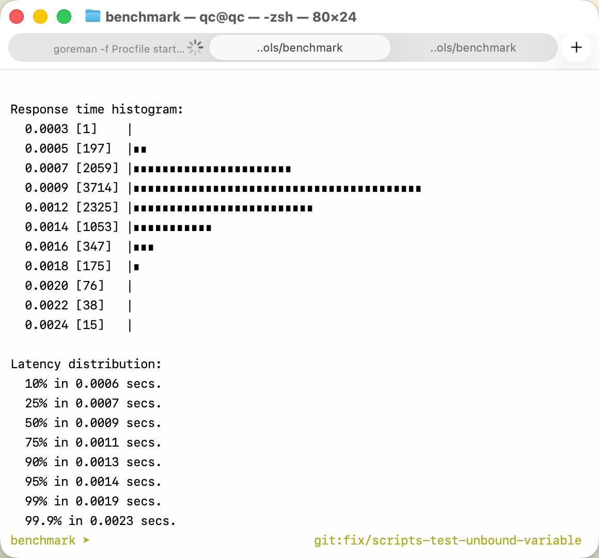

基本就是 etcd 写慢导致的「尾部卡死」。本地 Mac 压测写操作很难打出高 QPS（社区 14w 是 Linux 高配 SSD），属于正常现象，重跑一次就好了

得到结果如下所示，读取一个1MB的key-value，线性读性能QPS下降到2976，平均延时上升到322ms

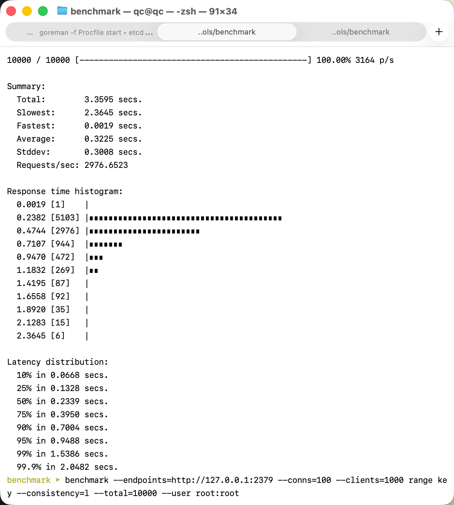

从Grafana的监控图中可以看到，内存会出现突增，如果存在大量大key-value时，etcd内存暴涨，大概率OOM

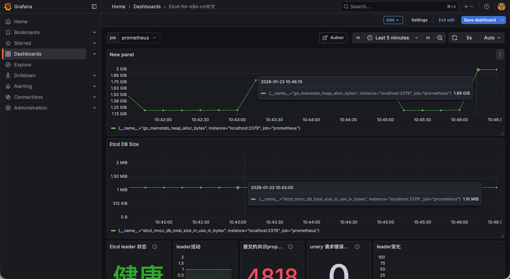

### 提升写性能

当使用etcd写入大量key-value数据的时候，有可能会遇到etcd server返回「etcdserver: too many requests」错误

#### 性能分析链路

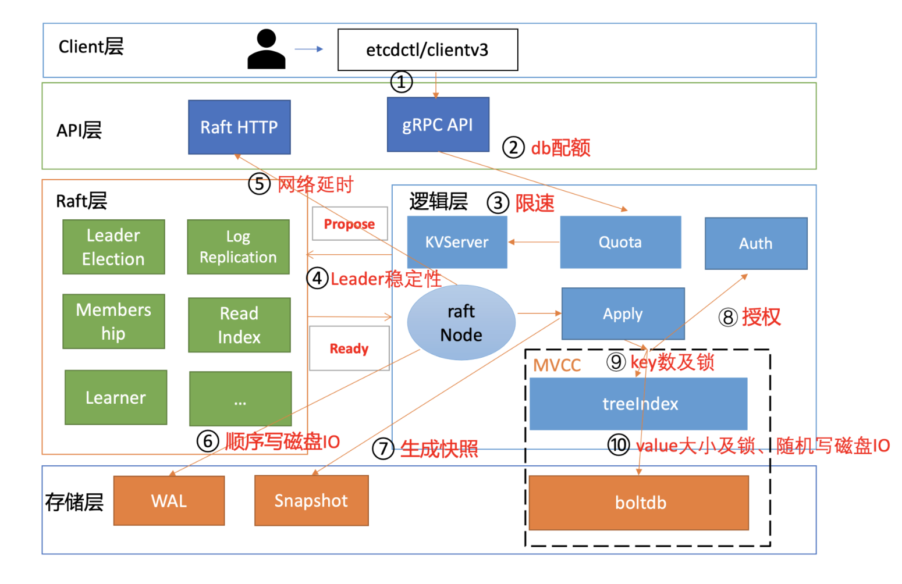

#### db quota

首先是流程一，etcd client会通过clientv3库的Round-robin负载均衡算法，从endpoint列表中轮训选择一个endpoint访问，发起gRPC调用

然后进入流程二，etcd收到gRPC写请求后，首先经过的是Quota模块，它会影响写请求的稳定性，如果db大小超过配额就无法写入

etcd是个小型的元数据存储，默认db quota大小是2G，超过2G就只读无法写入。所以需要根据业务场景，适当调整db quota大小，并配置合适的压缩策略

etcd支持按时间周期性压缩、按版本号压缩两种策略，建议压缩策略不要配置得过于频繁。如果按时间周期压缩，一般情况下5分钟以上压缩一次比较合适，因为压缩过程中会加一系列锁和删除boltdb数据，过于频繁的压缩会对性能有一定影响

一般情况下db大小尽量不要超过8G，过大的db文件和数据量对集群稳定性各方面都有一定的影响

#### 限速

通过流程二的Quota模块之后，请求会进入到流程三，KVServer模块。在这个模块里，影响写性能的核心因素是限速

KVServer模块的写请求在提交Raft模块前，会进行限速判断。如果Raft模块已提交的日志索引（committed index）比已应用到状态机的日志索引（applied index）超过了5000，那么它就会返回一个「etcdserver: too many requests」错误给client

哪些情况会导致committed Index远大于applied Index呢？

1. long expensive read request导致写阻塞（3.4之前长读持有buffer读锁的问题），当前最新版本已经大大缓解，从3.4开始，通过引入**Raft read index**机制优化了linearizable read的实现，读请求不再需要长时间持有锁来等待 apply，而是通过 leader 的 commit index 快速确认读点，避免了旧版本中长读（例如大 range 查询）升级锁阻塞写的严重问题。现在 linearizable read 主要依赖 quorum 共识，而不直接阻塞写路径。expensive read 仍可能消耗 CPU/内存影响整体性能，但不会像旧版本那样直接导致写事务超时和大量 apply lag。etcd 还支持 serializable read（stale read）来进一步卸载 leader 压力。如果集群使用大量 linearizable read，且有极端的超大 range 查询，仍可能间接影响 apply 速率，但远不如 3.4 前严重。

2. etcd定时批量将boltdb写事务提交的时候，需要对B+ tree进行重平衡、分裂，并将freelist、dirty page、meta page持久化到磁盘。此过程需要持有boltdb事务锁，如果磁盘随机写性能较差、瞬间大量写入，则也容易写阻塞，应用已提交的日志条目缓慢

3. 执行defrag等运维操作时，也会导致写阻塞，它们会持有相关锁，导致写性能下降

#### 心跳及选举参数优化

写请求经过KVServer模块后，则会提交到流程四的Raft模块。我们知道etcd写请求需要转发给Leader处理，因此影响此模块性能和稳定性的核心因素之一是集群Leader的稳定性

那么如何判断Leader的稳定性呢？

1. 在使用etcd过程中，很可能见到Leader发送心跳超时的警告日志，可以通过日志判断集群是否有频繁切换Leader的风险

2. 可以通过etcd_server_leader_changes_seen_total metrics来观察已发生Leader切换的次数

那么哪些因素会导致此日志产生以及发生Leader切换呢？

etcd是基于Raft协议实现数据复制和高可用的，各个节点见会选出一个Leader，然后Leader将写请求同步给各个Follower节点。而Follower节点如何感知Leader异常，发起选举，正是依赖Leader的心跳机制

在etcd中，Leader节点会根据heartbeat-interval参数（默认100ms）定时向Follower节点发送心跳。如果两次发送心跳间隔超过2*heartbeat-interval，就会打印警告日志。超过election timeout（默认1000ms），Follower节点就会发起一轮Leader选举

那么哪些因素会导致心跳超时呢？

1. 磁盘IO过慢。因为etcd从Raft的Ready结构获取到相关待提交日志条目后，它需要将此消息写入到WAl日志中持久化。可以通过观察etcd_wal_fsync_duration_seconds_bucket指标来确定写WAL日志的延时。如果延时较大，可以使用SSD硬盘解决

2. CPU使用率过高和网络延时过大导致。CPU使用率较高可能导致发送心跳的goroutine出现饥饿。如果etcd集群跨地域部署，节点之间RTT延时大，可以能导致此问题

如何调整心跳相关参数，以避免频繁Leader选举呢？

etcd默认心跳间隔是100ms，较小的心跳间隔会导致发送频繁的消息，消耗CPU和网络资源。而较大的心跳间隔，又会导致检测到Leader故障不可用耗时过长，影响业务可用性。一般情况下，为了避免频繁Leader切换，建议可以根据实际部署环境、业务场景，将新条件间隔时间调整在100ms到400ms左右，选举超时时间要求至少是心跳间隔的10倍

#### 网络和磁盘IO延时

当集群Leader稳定后，就可以进入Raft日志同步流程

假设收到写请求的节点就是Leader，写请求通过Propose接口提交到Raft模块后，Raft模块会输出一系列消息。etcd server的raftNode goroutine通过Raft模块的输出接口Ready，获取到待发送给Follower的日志条目追加消息和待持久化的日志条目

raftNode goroutine首先通过HTTP协议将日志条目追加消息广播给各个Follower节点，也就是流程五

流程五涉及到各个节点之间网络通信，因此节点之间RTT延时对其性能有较大影响。跨可用区、跨地域部署时性能会出现一定程度的下降，建议结合实际网络环境使用benchmark工具测试一下。etcd Raft网络模块在实现上，也会通过流式发送和pipeline等技术优化来降低延时、提高网络性能

同时，raftNode goroutine也会将待持久化的日志条目追加到WAL中，它可以防止进程crash后数据丢失，也就是流程六。注意此过程需要同步等待数据持久化，因为磁盘顺序写性能决定着性能优异

为了提升写吞吐量，etcd会将一批日志条目批量持久化到磁盘。etcd是个对磁盘IO非常敏感的服务，如果服务对性能、稳定性有较大要求，建议使用SSD盘

那么使用SSD盘的集群和非SSD盘的etcd集群写性能差异有多大呢？

```bash
benchmark --endpoints=addr --conns=100 --clients=1000 \
    put --key-size=8 --sequential-keys --total=10000000 --
val-size=256
```

在本机上执行的结果，如下图所示

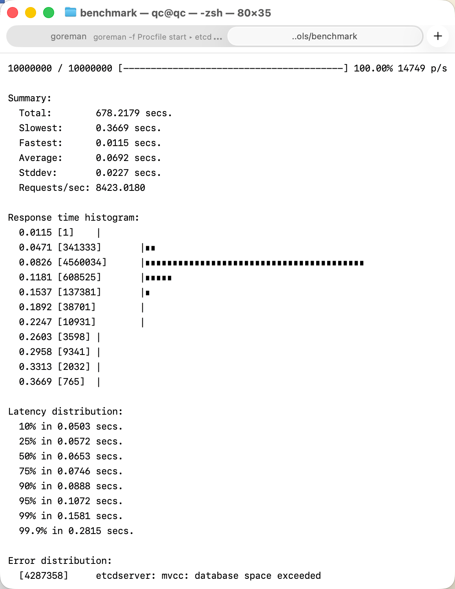

只写了一半多，因为db大小超过quota了（默认2GB）

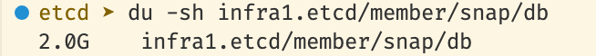

```bash
# 禁用quota
etcd --quota-backend-bytes=0

# 设置更大值
etcd --quota-backend-bytes=50000000000
```
重启etcd生效

第三方非SSD盘集群，执行同样的benchmark命令的压测结果，如下图所示

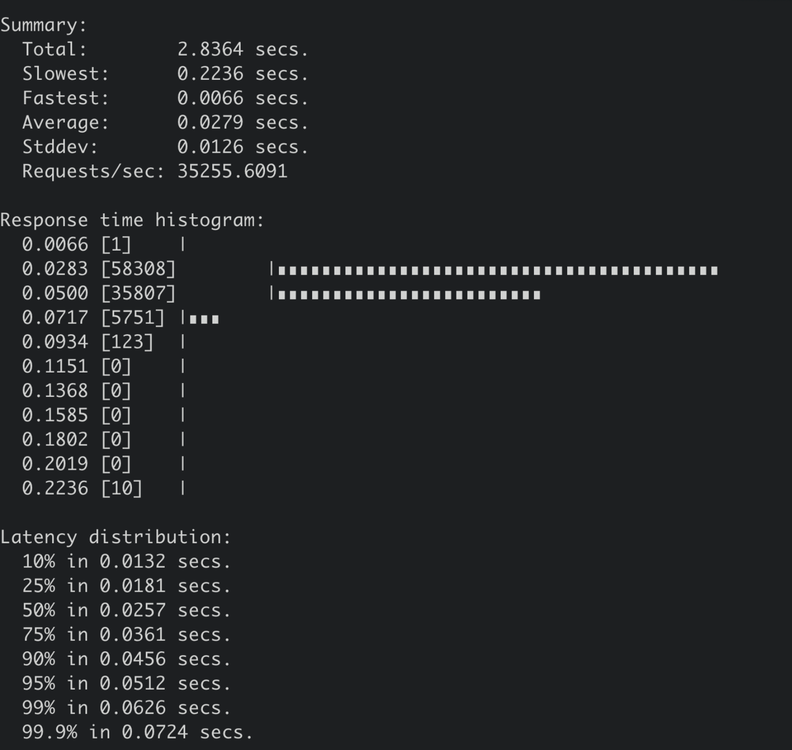

测试完压缩的时候发现一个非常有意思的现象，如下图所示

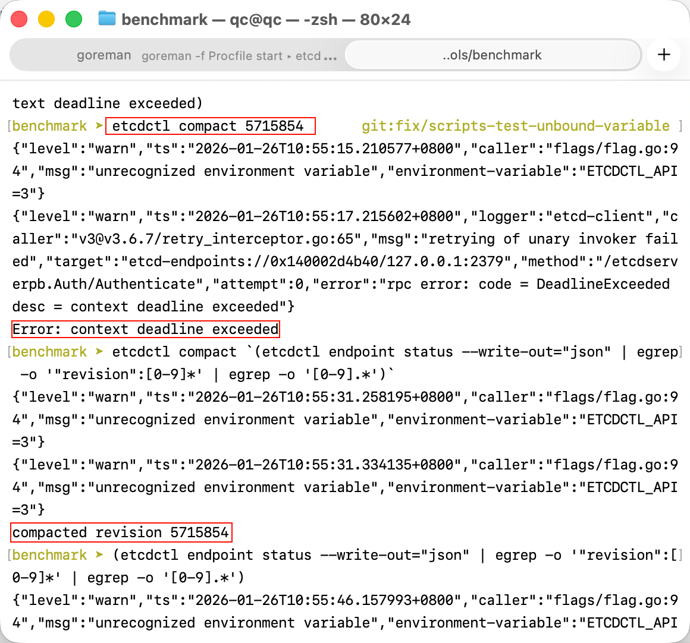

手动直接输入revision来compact会出现deadline exceeded，通过管道的方式就不会

gRPC调用默认deadline较短+server响应延迟，etcdctl基于clientv3的unary RPC（如compact）有默认context deadline。compact操作虽然是「异步触发」，但在**db文件很大**、**高残留负载**、**磁盘IO压力**时，server处理请求的初始化阶段（auth、proposal、raft commit）可能稍慢，超过client deadline，导致「context deadline excedded」

后面的能成功，是因为先执行`endpoint status`这是一个轻量读操作，快速成功，返回当前revision。然后才执行compact，并且revision是**实时新鲜的当前revision（保证<=committed revision）**，避免任何潜在检查开销。同时shell在管道、子命令中顺序执行，先status成功建立了稳定连接（「热身」了gRPC channel），后续compact刚好赶上server响应窗口

可以通过手动添加超时参数来可靠执行`--dial-timeout`、`--keepalive-time`、`--keepalive-timeout`

记住**compact之后必defrag**，`etcdctl defrag`(直接dbsize从2G干到2M)

#### 快照参数优化

在Raft模块中，正常情况下，Leader可快速地将我们的key-value写请求同步给其他Follower节点。但是某Follower节点如果数据落后太多，Leader内存中的Raft日志已经被compact了，那么Leader只能发送一个快照给Follower节点重建恢复

在快照较大的时候，发送快照可能会消耗大量的CPU、Memory、网络资源，那么它就会影响我们的读写性能，也就是图中的流程七

一方面，etcd raft模块引入了流控机制，来解决日志同步过程中可能出现的大量资源开销、导致集群不稳定的问题

另一方面，我们可以通过快照参数优化，去降低Follower节点通过Leader快照重建的概率，使其尽量能通过增量的日志同步保持集群的一致性

etcd提供一个名为`-snapshot-count`的参数来控制快照行为。它是指收到多少个写请求后就触发一次快照，并对Raft日志条目进行压缩。为了帮助slower Follower赶上Leader进度，etcd在生成快照，压缩日志条目的时候也会至少保留5000条日志条目在内存中

那snapshot-count参数设置多少比较合适？

snapshot-count值过大会消耗较多内存，过小的话在某节点数据落后时，如果它请求同步的日志条目Leader已经压缩了，此时就不得不将整个db文件发送给落后节点，然后进行快照重建

快照重建是及其昂贵的操作，对服务质量有较大影响。因此我们需要尽量避免快照重建。官方在 v3.6.0 发布公告中明确--snapshot-count降低默认值回 10000，理由是进一步控制内存/WAL 占用（高 snapshot-count 会让 leader 保留更多 log entry 在内存，增加 OOM 风险或 WAL 膨胀），并优化 follower 追赶效率。结果是保留的 history 更少，单个 snapshot 更小，更频繁但更轻量的 snapshot。

#### 大value

当写请求对应的日志条目被集群多数节点确认后，就可以提交到状态机执行了。etcd的raftNode goroutine就可通过Raft模块的输出接口Ready，获取到已提交的日志条目，然后提交到Apply模块的FIFO待执行队列。因为它是串行应用执行命令，任意请求在应用到状态机时阻塞都会导致写性能下降

当Raft日志条目命令从FIFO队列取出执行后，它会首先通过授权模块校验是否有权限执行对应的写操作，对应图中的流程八。影响其性能因素是RBAC规则数和锁

通过权限检查后，写事务则会从treeIndex模块中查找key、更新key版本号等信息，对应图中的流程九，影响其性能因素是key数和锁

更新完索引之后，就可以把新版本号作为boltdb key，把用户key/value、版本号等信息组合成一个value，写入到boltdb，对应图的中流程十，影响其性能因素是大value、锁

如果在应用中保存1Mb的value，这会对etcd稳定性带来哪些风险？

1. 导致读性能大幅下降、内存突增、网络带宽资源出现瓶颈等。通过benchmark执行命令写入1MB数据的时候`benchmark --endpoints=http://127.0.0.1:2379 --conns=100 --clients=1000 put --key-size=8 --sequential-keys --total=500 --val-size=1024000`，集群（三节点8C16G，非SSD盘），事务提交P99延时高达4秒。将写入的key-value调整为100KB，P99会大幅下降，3、400ms左右

2. etcd底层使用boltdb存储，它是一个基于COW（Copy-on-write）机制实现的嵌入式key-value数据库。较大的value频繁更新，因为boltdb的COW机制，会导致boltdb大小不断膨胀，很容易超过默认db quota值，导致无法写入

那么如何优化呢？

1. 如果业务已经使用了大key，拆分、改造存在一定客观的困难，那么就从问题的根源之一对症下药，尽量不要频繁更新大key，这个etcd db大小就不会快速膨胀

2. 可以从业务场景考虑，判断频繁的更新是否合理，能否做到增量更新

3. 如果写请求降低不了，就必须进行精简、拆分数据结构了。将需要频繁更新的数据查分成小key进行更新等，实现将value值控制在合理范围以内

Kubernetes的Node心跳机制优化就是这块一个非常优秀的实践。早期kubelet会每隔10s上报心跳更新Node资源。但是此资源对象较大，导致db大小不断膨胀，无法支撑更大规模的集群。为了解决这个问题，社区做了数据拆分，将经常变更的数据拆分成非常细粒度的对象，实现了集群稳定性提升，支撑更大规模的k8s集群

#### boltdb锁

boltdb锁从互斥锁优化到读写锁，之后为了实现全并发读，去掉了buffer

并发读特性的核心原理是创建读事务对象时，会全量拷贝当前写事务未提交的buffer数据，并发的读写事务不再阻塞在一个buffer资源锁上，实现了全并发读

写事务也不再因为expensive read request长时间阻塞，有效降低了写请求的延时

#### 扩展性能

当然有不少业务场景即便用最高配的硬件配置，etcd可能还是无法解决所面临的性能问题。etcd社区也考虑到此问题，提供了一个名为`gRPC proxy`的组件，可以用来扩展读、扩展watch、扩展Lease性能的机制

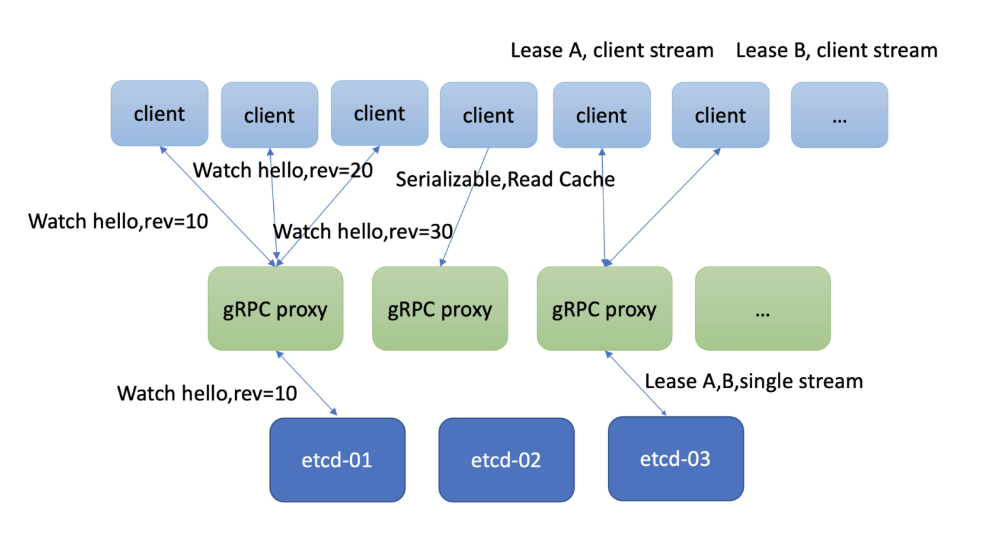

**扩展读**

如果client较多，etcd集群节点连接数量大于2w，或者想平行扩展串行读的性能，那么gRPC proxy就是一个良好的解决方案。它是个无状态节点，提供高性能的读缓存能力。可以根据业务场景需要水平扩容若干节点，同时通过连接复用，降低服务端连接数、负载

它也提供了故障探测和自动切换能力，当后端etcd某个节点失效后，会自动切换到其他正常节点

**扩展Watch**

大量的watcher会显著增大etcd server的负载，导致读写性能下降。etcd为了解决这个问题，gRPC proxy组件里面提供了watcher合并的能力。如果多个client Watch同key或者范围（如上图三个client Watch同key）时，它会尝试将你的watcher进行合并，降低服务端的watcher数。

然后当它收到etcd变更消息时，会根据每个client实际Watch的版本号，将增量的数据变更版本，分发给你的多个client，实现watch性能扩展及提升。

**扩展Lease**

etcd Lease特性，提供了一种客户端活性检测机制。为了确保key不被淘汰，client需要定时发送keepalive心跳给server。当Lease非常多时，这就会导致etcd服务端的负载增加。在这种场景下，gRPC proxy提供了keepalive心跳连接合并的机制，来降低服务端负载


