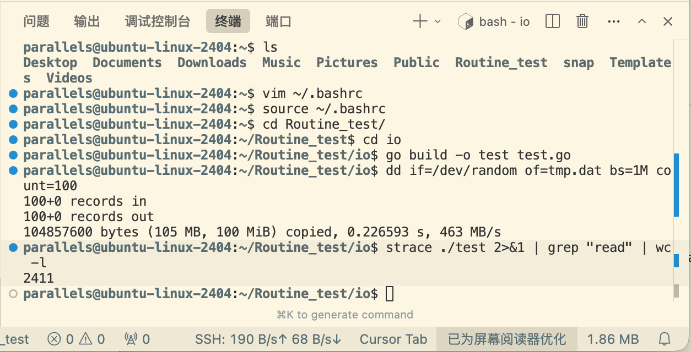
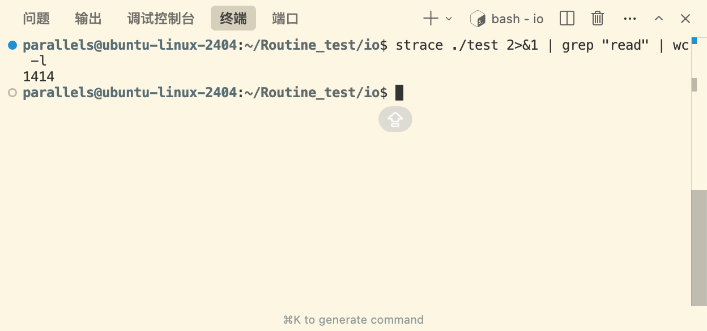

## 文件

### bufio
平台无关的缓冲IO，提升读写性能

```go
package main

import (
	"bufio"
	"io"
	"os"
)

func main() {
	f, _ := os.Open("./tmp.dat")
	defer f.Close()

	// 直接从os.File.Read中读取的话，会导致系统调用非常频繁
	var r io.Reader = f
	// bufio 先从系统调用中预读 8192 字节放到自己的缓存里，然后每次从缓存取512字节，系统调用的次数会大大减少
	// r = bufio.NewReaderSize(r, 8192)

	for {
		buf := make([]byte, 512)
		_, err := r.Read(buf)
		if err == io.EOF {
			break
		}
	}
}
```

```sh
# Data Duplicator，复制数据工具
# if: input file，/dev/random linux中特殊设备文件，随机数生成器
# of: output file，tmp.dat 是我们要创建的文件
# bs: block size， 1M是1MB
# count: 复制的块数，相当于创建了100MB的随机数据文件
dd if=/dev/random of=tmp.dat bs=1M count=100
# 跟踪系统调用，运行程序 ./test
# strace 默认输出到 stderr， 2>&1 将 stderr 重定向到 stdout，方便管道
# 找到所有系统调用中包含 read 的行，惊醒统计行数
strace ./test 2>&1 | grep "read" | wc -l
```

macOS上没有strace使用dtruss，并且苹果官方禁止dtruss追踪用户程序，在Linux上测试

既然mac上不好测，那我们直接打开Parallels Desktop中的Ubuntu，安装好ssh，直接在mac中在cursor中ssh连接之后开测，记得把虚拟机的网络换成桥接模式，要不然两层NAT网络非常慢

原始io


bufio


bufio中默认缓冲区是4KB，不够4KB就往预留的buffer中读，如果超了，直接用系统io读，如果缓冲区是空的，那么就从头开始判断

### bytes
和 strings 组队，分别应对字符串和字节数组

#### Buffer
变长(variable-sized)字节缓冲区

- 预先 `Grow` 足够空间，减少后续内存分配
- 直接或间接调用 `Reset`，复用内存，不回收

```go
func main() {
	buf := bytes.NewBuffer(nil)
	buf.Write([]byte{1, 2, 3})

	fmt.Println(buf.Bytes())
}
```

### io
定义IO基本接口，以及相关组合

- Reader, Writer, Closer, Seeker
- ReaderWriter, ReaderAt, WriterAt, ReaderFrom, WriterTo
- ReadCloser, WriteCloser, ReadWriteCloser
- ByteReader, ByteWriter, StringWriter

```go
package main

import (
	"bufio"
	"log"
	"os"
)

func main() {
	f, err := os.Create("./demo.txt")
	if err != nil {
		log.Fatal(err)
	}
	defer f.Close()
	defer f.Sync()

	w := bufio.NewWriter(f)
	defer w.Flush()

	w.WriteString("hello, world!")
}
```

### 标准库

- bufio.Reader, bufio.Writer: 缓冲IO
- bytes.Reader, bytes.Writer: 字节数组
- strings.Reader, strings.Builder: 字符串
- os.File: 系统文件接口(syscall)
- net.TCPConn, UDPConn: 网络连接
- fmt.Fprint: 格式化

**封装**

- []byte -> bytes.Buffer, bytes.Reader
- string -> strings.Builder, strings.Reader
- channle -> io.Pipe

## 文件系统
引入 io/fs 抽象文件系统，解除 io 和 os 的直接依赖。允许实现抽象只读文件系统，映射到云端、缓存或压缩包内

- os.DirFS: 目录文件系统
- embed.FS: 嵌入式文件系统

```go
package main

import (
	"fmt"
	"io/fs"
	"log"
	"os"
)

func main() {
	var s fs.FS = os.DirFS("/dev")

	f, err := s.Open("random")
	if err != nil {
		log.Fatalln(err)
	}
	defer f.Close()

	buf := make([]byte, 10)
	n, _ := f.Read(buf)
	fmt.Printf("%#v, %d\n", buf, n)
}
```

对了，golang从1.16废弃了 io/ioutil 对应功能由 io 和 os 提供

## pipe
基于内存（channel）实现的无缓冲同步管道，并发安全

- 同步 channel 阻塞，读写匹配
```go
package main

import (
	"fmt"
	"io"
	"os"
)

func Pipe() (r *File, w *File, err error) 	// os.Pipe
func Pipe() (Conn, Conn) 					// net.Pipe

func main() {
	r, w := io.Pipe()

	go func() {
		defer w.Close()
		fmt.Fprint(w, "hello, world!")
	}()

	io.Copy(os.Stdout, r)
}
```